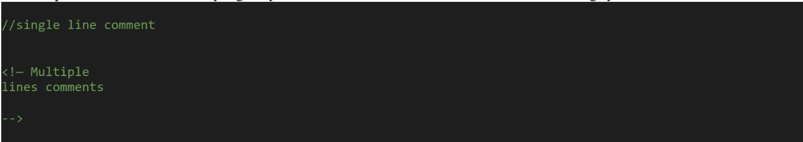
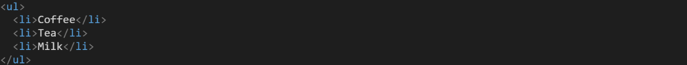
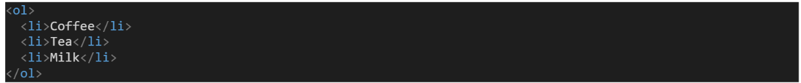

# Content from 1.0 HTML.pdf

## Page 1

Learn HTML
1

Learn HTML

*(Extracted via OCR)*

### Images:

---

## Page 2

Learning Objectives:
1. Introduction to HTML 
2. Basic Structure of an HTML page
3. Text formatting tags in HTML
4. Lists in HTML 
5. HTML Links and navigation 
6. Adding images to web pages
7. Using images as links
8. Image map
9. Adding video to web pages
10. Adding audio to web pages
11. Tables in HTML
12. HTML FORMS
13. HTML5 enhancements in form
14. Write accessible HTML using Semantic HTML tags
2

---

## Page 3

INTERNET AND WEB

INTERNET AND WEB

*(Extracted via OCR)*

---

## Page 4

Internet, Web, HTML, HTTP
Internet
◦Inter-networking: Network of Networks
◦Internet Supports lot of diff Services just one of which is World Wide Web (WWW).
◦URL to locate data/stuff/resources render by a browser as a web page
  ( written by html language ).
◦Web is a virtual space where content is stored that can be accessed through internet 
like a road which takes you at some point.
◦Over the internet using http (protocol) web is accessed.
4

---

## Page 5

Internet, Web, HTML, HTTP
Internet Other Services
◦Non browser based Emails Server: app like outlook using SMTP or POP which lies 
outside of the web.
◦File transfers Schemes using FTP like bittorrent which do not use http and bypass 
entirely web.
◦Other services like Spotify, Other gaming servers, Voice over Internet Protocol (VoIP)
◦Other mobile apps which do not use http port usually port 80
5

---

## Page 6

Now a day
Now a day all the services are available on web like email providers i.e. Hotmail, gmail 
replacing outlook…
Display documents over the internet i.e. Google Scholar website
Provide videos browsing like youtube instead of downloading the video files
Like other apps i.e. Word, google sheet
Web is also now become less popular due to different mobile apps that do not use http
6

---

## Page 7

Introduction to HTML
7

Introduction to HTML

*(Extracted via OCR)*

### Images:

---

## Page 8

What is HTML?
• HTML was first created by Tim Berners-Lee, Robert Cailliau, and others starting in 1989. It 
stands for Hyper Text Markup Language.
• Originally, the Internet was designed as a means for distributing information across a robust, 
non centralized network of computers in a time of national emergency. 
• However, as more organizations and people adopted the Internet, the need grew for easier 
access to resources and for a richer display of information. Publishing HTML-formatted 
documents on the Internet via the World Wide Web proved to be the answer to these needs.
• Hypertext means that the document contains links that allow the reader to jump to other 
places in the document or to another document altogether. The latest version is known as 
HTML5
8

### Images:

---

## Page 9

What is HTML?
• Markup languages prepare design of a page. These are presentational languages, and it 
doesn’t include any kind of logic or algorithm. 
• To do this HTML uses two things: tags and attributes.
• It defines the structure of webpages and determines how data is displayed online.
• HTML is used to indicate what text should be considered a heading, where paragraphs start 
and end, and what images should appear in the document, and to specify links between 
different pages. 
• It Is directly interpreted by the browser.
9

### Images:

---

## Page 10

How HTML works
The code used to make them visually appealing is known as CSS and we shall focus on this in a later lesson. 
For now, we will focus on teaching you how to build rather than design. So basically, it involves formatting 
data, or it controls the presentation of data.
HTML files have .html extension. 
HTML is not case-sensitive, multiple spaces will appear as a single space blank and new lines are ignored.
While getting started with HTML, you will likely encounter new and often strange terms. Over time you will 
become more and more familiar with all of them, but the three common HTML terms you should begin 
with are tags, elements, and attributes.
10

### Images:

---

## Page 11

Tags
•
The use of less-than and greater-than angle brackets surrounding an element creates what is 
known as a tag. 
•
Tags most commonly occur in pairs of opening and closing tags.
•
An opening tag marks the beginning of an element. It consists of a less-than sign followed by an 
element’s name, and then ends with a greater-than sign; for example, 
.
•
A closing tag marks the end of an element. It consists of a less-than sign followed by a forward 
slash and the element’s name, and then ends with a greater-than sign; for example, 
.
•
The content that falls between the opening and closing tags is the content of that element. An 
anchor link, for example, will have an opening tag of <a> and a closing tag of </a>. What falls 
between these two tags will be the content of the anchor link. 
<a>…Content…</a>
11

---

## Page 12

Elements
•
An HTML element is defined by a start tag, some content, and an end tag. 
•
Elements are designators that define the structure and content of objects within a page. 
•
Some of the more frequently used elements include multiple levels of headings (identified 
as <h1> through <h6> elements) and 
•
paragraphs (identified as the 
 element); 
•
the list goes on to include the <a>, 
, , <strong>, and <em> elements, and many 
more.
 

 I am trying to learn web 

12

---

## Page 13

Attributes
Attributes:
•
Attributes are properties used to provide additional information about an element. 
•
The most common attributes include 
•
id attribute, which identifies an element; 
•
class attribute, which classifies an element; 
•
src attribute, which specifies a source for embeddable content; and 
•
href attribute, which provides a hyperlink reference to a linked resource.
 
•
Attributes are defined within the opening tag, after an element’s name. Generally, attributes include a name and a 
value. The format for these attributes consists of the attribute name followed by an equals sign and then a quoted 
attribute value. For example, an <a> element including an href attribute would look like the following:
 
 
<a href="http://somewebsite.com/">Website</a>
 
 
Or
 

•
In this instance, the image source (src) and the alt text (alt) are attributes of the  tag.
13

---

## Page 14

Basic Construction of an HTML Page:
•
<!DOCTYPE html> — All HTML documents must start with a <!DOCTYPE> declaration.
•
The declaration is not an HTML tag. It is an "information" to the browser about what document type to 
expect.
•
In HTML 5, the declaration is simple:
•
<!DOCTYPE html>.
HTML 4.01:
<!DOCTYPE HTML PUBLIC "-//W3C//DTD HTML 4.01 Transitional//EN" "http://www.w3.org/TR/html4/loose.dtd">
The <!DOCTYPE> declaration is NOT case sensitive.
•
<html> — This tag signals that from here on we are going to write in HTML code and signifies the beginning of 
the document.
•
<head> — Inside the <html> element, the <head> element identifies the top of the document, including any 
metadata (accompanying information about the page) goes — stuff mostly meant for search engines and 
other computer programs. The content inside the <head> element is not displayed on the web page itself. 
Instead, it may include the document title (which is displayed on the title bar in the browser window), links to 
any external files, or any other beneficial metadata.
•
<body> — This is where the visible content of the page goes.
14

### Images:

---

## Page 15

Basic Construction of an HTML Page:
•
Further Tags:
•
Inside the <head> tag, there is one tag that is always included: <title>, but there are others that are just as important:
•
<title> - This is where we insert the page name as it will appear at the top of the browser window or tab.
•
<meta> - This is where information about the document is stored: character encoding, name (page context), description.
•
The charset attribute specifies the character encoding for the HTML document. The HTML5 specification encourages web 
developers to use the UTF-8 character set, which covers almost all of the characters and symbols in the world
15

### Images:

---

## Page 16

Basic Construction of an HTML Page:
16
How to Add HTML Headings To Your Web Page:
In HTML, headings are written in the following elements:
●
As you might have guessed <h1> and <h2> should be used for the most important titles, while the 
remaining tags should be used for sub-headings and less important text.
●
Search engine bots use this order when deciphering which information is most important on a page.
●
We will save this file as “index.html” in a new folder called “my webpage.”

---

## Page 17

Basic 
Construction 
of an HTML 
Page:
How To Add Text In HTML:
•
Adding text to our HTML page is simple using an element opened with the 
tag 
 which creates a new paragraph. We place all of our regular text 
inside the element 
.
•
When we write text in HTML, we also have a number of other elements we 
can use to control the text or make it appear in a certain way.
Note:
•
Because both the heading and paragraph are nested within the <body> 
element, they are visible on the web page.
•
When an element is placed inside of another element, also known as 
nested, it is a good idea to indent that element to keep the document 
structure well organized and legible. 
•
In the previous code, both the <head> and <body> elements were nested 
and indented inside the <html> element. The pattern of indenting for 
elements continues as new elements are added inside the <head> and 
<body> elements.
17

---

## Page 18

Other key elements
MEAN/MERN Stack
18
Element
Meaning
Purpose
<b>
Bold
Highlight important information
<strong>
Strong
Similarly to bold, to highlight key text
<i>
Italic
To denote text
<em>
Emphasised Text
Usually used as image captions
<mark>
Marked Text
Highlight the background of the text
<small>
Small Text
To shrink the text
<strike>
Striked Out Text
To place a horizontal line across the text
<u>
Underlined Text
Used for links or text highlights
<ins>
Inserted Text
Displayed with an underline to show an inserted text

Subscript Text
Typographical stylistic choice

Superscript Text
Another typographical presentation style
These tags must be opened 
and closed around the text 
in question.

---

## Page 19

Basic Construction of an HTML 
Page:
Special Characters:
• We can add special characters or symbol entities using 
Html as many mathematical, technical, and currency 
symbols, are not present on a normal keyboard.
19

### Images:

---

## Page 20

Basic Construction of an HTML Page:
20
Special Characters:
• We can add special characters or symbol 
entities using Html as many mathematical, 
technical, and currency symbols, are not 
present on a normal keyboard.
 
Char
Entity
Description
&nbsp;
Non-breaking space
∀
&forall;
FOR ALL
∂
&part;
PARTIAL DIFFERENTIAL
∃
&exist;
THERE EXISTS
∅
&empty;
EMPTY SETS
Α
&Alpha;
GREEK CAPITAL LETTER ALPHA
Β
&Beta;
GREEK CAPITAL LETTER BETA
Γ
&Gamma;
GREEK CAPITAL LETTER GAMMA
Δ
&Delta;
GREEK CAPITAL LETTER DELTA
©
&copy;
COPYRIGHT SIGN
®
&reg;
REGISTERED SIGN
€
&euro;
EURO SIGN
&trade;
TRADEMARK
>
&gt; 
Greater-than sign

### Images:

---

## Page 21

Basic Construction of an HTML Page:
21
Comments:
You can put comments between any tags in your HTML documents. Comments use the following syntax: 
Anything after will not be displayed. It can still be seen in the source code for the document, but it is not 
shown on screen. 
Note: 
●
It is good practice to comment your code, especially in complex documents
●
Comments help you and others understand your code.

### Images:

---

## Page 22

Basic Construction of an HTML Page:
22
Lists in HTML:
Html has tags and attributes to create un-ordered and ordered lists.
A. Un-ordered Lists:
➔Starting Tag   <ul>, Ending Tag </ul> 
➔List Items   <li>
    
 
 
 
 
 
 
 
Type (FILLROUND, SQUARE)

### Images:

---

## Page 23

Basic Construction of an HTML Page:
23
B. Ordered Lists:
●
Starting Tag <ol>, Ending Tag </ol>
●
List Items <li>
○
Type (“1”, “A”, “a”, ”I”, ”i”)
○
Start (Alerts the numbering Sequence)
○
Value (Changes the number sequence in the middle of an ordered list)
○
reveresed

### Images:

---
