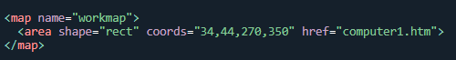
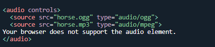

# Content from 1.1 HTML.pdf

## Page 1

Basic Construction of an HTML Page:
1
HTML Links and navigation
Internal Links: When you link to another page in your own website, the link is known as an internal link. 
Links pointing to other pages of the same website will have a relative path, which does not include the 
domain (.com, .org, .edu, etc.) in the href attribute value. Because the link is pointing to another page on 
the same website, the href attribute value needs to include only the filename of the page being linked to: 
pagename.html
External Links: When you link to a different site, it is known as an external link. Linking to other websites 
outside of the current one requires an absolute path, where the href attribute value must include the full 
domain. A link to Google would need the href attribute value of http://google.com, starting with http and 
including the domain, .com in this case.
How to link pages?
Anything between the opening <a> tag and the closing </a> tag becomes part of the link that users can 
click in a browser. To link another page, href attribute of opening tag of <a> is used the value of the href 
attribute is the name of the file you are linking to. For example: <a href=“abc.html”>Click here</a>

---

## Page 2

• Scrolling

• Open in a new tab: target="_blank"
2

---

## Page 3

Basic Construction of an HTML Page:
3
Adding images to web pages
Images are usually added to a site using the  element. It must carry the src attribute indicating the 
source of the image and an alt attribute whose value is an alternate description (alt) for the image in case 
it does not load or the user has a visual impairment.
The  tag is empty, it contains attributes only, and does not have a closing tag.
The  tag has two required attributes:
●
src - Specifies the path to the image
●
alt - Specifies an alternate text for the image
SRC attribute of the  tag is used to indicate the source of the image

### Images:

---

## Page 4

Basic Construction of an HTML Page:
4
Adding images to web pages as links
We can put images between <a> and </a > tags instead of text to link other documents or portions of the page
Image map:
1. Image maps allow you to add multiple links to the same image
2. Each link can point to a different page
3. Each of these clickable areas is known as a hotspot

### Images:

---

## Page 5

Basic Construction of an HTML Page:
5
<!DOCTYPE html>
<html>
<body>
<h2>Image Maps</h2>

Click on the computer, the phone, or the cup of coffee to go to a new page and read more about the 
topic:

<map name="workmap">
  <area shape="rect" coords="34,44,270,350" href="computer.html">
  <area shape="rect" coords="290,172,333,250" href="phone.html">
  <area shape="circle" coords="337,300,44" href="coffee.html">
</map>
</body>
</html>
Example:

---

## Page 6

Basic Construction of an HTML Page:
6
Adding video to web pages
1. The <video> tag is used to add a video to a web page
2. This tag is provided in HTML5
3. We can add a video to our page as

### Images:

---

## Page 7

Example
<video width="320" height="240" controls autoplay>
  <source src="movie.mp4" type="video/mp4">
  <source src="movie.ogg" type="video/ogg">
  Your browser does not support the video tag.
</video>
7
5.
Attributes of <video> tag:
–
Controls
–
autoplay
–
Muted
–
Loop

---

## Page 8

Basic Construction of an HTML Page:
8
Adding audio to web pages:
1. The <audio> tab is used to add an audio to a web page
2. This tag is provided in HTML5
3. We can add a audio to our page as

### Images:

---

## Page 9

Example
9
<audio controls>
  <source src="horse.ogg" type="audio/ogg">
  <source src="horse.mp3" type="audio/mpeg">
Your browser does not support the audio element.
</audio>
Attributes of <audio> tag:
•
Controls
•
Auto-play
•
muted
•
Loop

---
