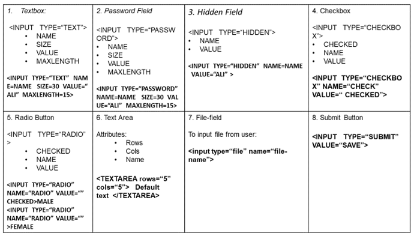
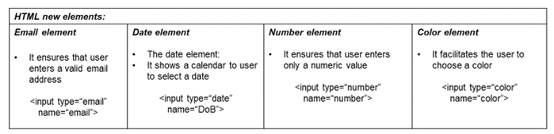
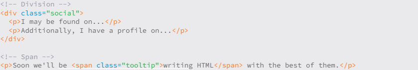
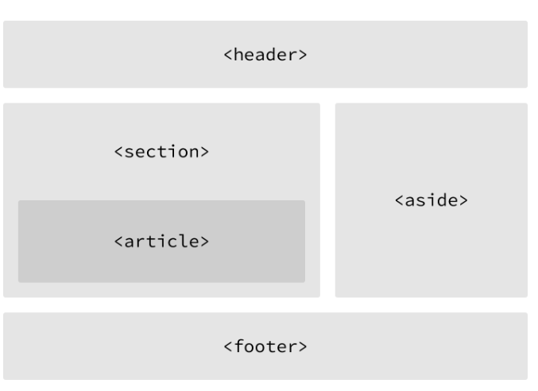
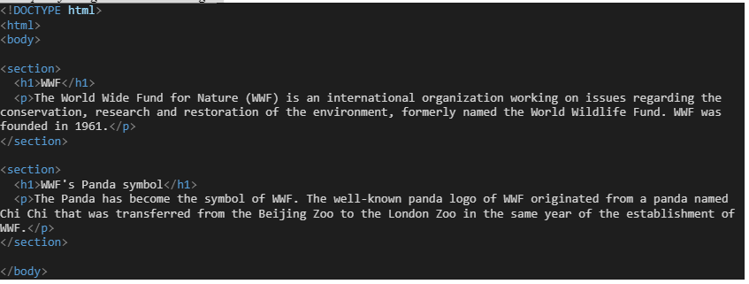

# Content from 1.2 HTML.pdf

## Page 1

Basic Construction of an HTML Page:
1
Tables in HTML
•
How to create tables
•
Table attributes
•
Page lay-out using tables
Creating Html tables:
1. Tables display information in rows and columns. Tables are commonly used to display all manner of 
data that fits in a grid such as train schedules, television listings, financial reports etc.
2. <table> tag is used to start a table while </table> tag indicates the end of the table.
Table Structure
➔<tr> tag starts a row of the table and </tr> ends the row
➔<td> is used to create a cell inside the row while </td> ends the cell.
➔The contents of the cell are written between <td> and </td> tags
➔<th> tag is used to declare the cell of the heading row of the table

---

## Page 2

Basic Construction of an HTML Page:
Table level attributes:
Row level attributes:
●
The Border Attribute: Indicates the presence of the 
border around the table: <table border=“1”>
●
The align Attribute: <table align= “center, right or 
left”>
●
The bgcolor Attribute: sets the background color
of the table: <table bgcolor=“gray”>
●
The background Attribute: sets the specified image 
at the background of the table: <table 
background=“image-title”>
●
The height and width Attributes:
●
The cellpadding Attribute: The cellpadding 
attribute is used to create a gap between the 
edges of a cell and its contents: <table 
cellpadding=“50”>
●
The valign Attributes: 
 
           <tr valign=“center,top or bottom”>
●
The align Attribute: 
<tr align=“center,right or left”>
●
The bgcolor Attribute:
<tr bgcolor=“gray”>
●
The background Attribute:
<tr background=“image-name”>
●
The height and width Attributes:
<tr  height=“20”  widht=“20”>
MEAN/MERN Stack
2
Table attributes:
1.
Table level attributes
2.
Row level attributes
3.
Cell level attributes

---

## Page 3

Basic Construction of an HTML Page:
Cell level attributes:
●
The align Attribute: 
<td align=“center,right or left”>
●
The bgcolor Attribute: 
●
The height and width Attributes:
●
The valign Attributes: 
●
a)The rowspan Attributes: used when a cell should span across more than one rows. 
●
b)The colspan Attribute: used when a cell should span across more than one column
Adding caption to the table:
➔<caption> tag is used to add a caption of the table
➔We usually add caption before the first row of the table
MEAN/MERN Stack
3

---

## Page 4

Basic Construction of an HTML Page:
HTML FORMS
●
Forms provide a means of submitting information from the client to the server
●
HTML supports tags for creating forms, however, it does not process the information
●
Use server-side script to process form information
●
Server-side script runs on the Web server and receives data from a form and uses it to perform a set of tasks
●
HTML FORMS elements
➔form> tag is used to start a form
➔</form> tag is used to end a form
➔Between <form> and </form>, form elements are placed
➔We can declare a form as: <form attributes>
form elements and layout tags: </form>
●
A single page can include several different forms, but you cannot nest one form  inside another
●
Common Form Attributes:
•
action - gives the URL of the application that is to receive and process the forms data
•
method - sets the HTTP method that the browser uses to send the form's data to the server for processing; 
Either POST or GET
•
name – name of the form
MEAN/MERN Stack
4

---

## Page 5

Basic Construction of an HTML Page:
5
HTML Forms and their 
elements

### Images found on this page:

---

## Page 6

Basic Construction of an HTML Page:
6
HTML Forms and their 
elements

### Images found on this page:

---

## Page 7

Basic Construction of an HTML Page:
7
Enhancements in 
forms
HTML5 enhances the 
forms in two ways

### Images found on this page:

---

## Page 8

Basic Construction of an HTML Page:
8

### Images found on this page:

---

## Page 9

Write accessible HTML using Semantic 
HTML tags
9
●
Semantic within HTML is the practice of giving content on the page meaning and structure by using the proper element. 
Semantic code describes the value of content on a page, regardless of the style or appearance of that content. There are several 
benefits to using semantic elements, including enabling computers, screen readers, search engines, and other devices to 
adequately read and understand the content on a web page. Additionally, semantic HTML is easier to manage and work with, as 
it shows clearly what each piece of content is about.
●
Before going into semantic elements, let’s look at two elements 
s and s that don’t hold any semantic value. They 
exist for styling purposes only. 
s, and s are HTML elements that act as containers solely for styling purposes. 
To understand the difference between 
 and span<>, we must know the difference between inline and block elements
Block-level element: Block-level elements begin on a new line, stacking one on top of the other, and occupy any available width. Block-
level elements may be nested inside one another and may wrap inline-level elements. We’ll most commonly see block-level elements 
used for larger pieces of content, such as paragraphs.
Inline-level elements: Inline-level elements do not begin on a new line. They fall into the normal flow of a document, lining up one 
after the other, and only maintain the width of their content. Inline-level elements may be nested inside one another; however, they 
cannot wrap block-level elements. We’ll usually see inline-level elements with smaller pieces of content, such as a few words.

---

## Page 10

Write accessible HTML using Semantic 
HTML tags
10

### Images found on this page:

---

## Page 11

Basic Construction of an HTML Page:
11
●
A 
 is a block-level element that is commonly used to identify large groupings of content, and which helps to build 
a web page’s layout and design.
●
A : It is an inline-level element commonly used to identify smaller groupings of text within a block-level 
element.
For example, if we have a 
 with an orange background that contains social media links, our first thought might be to 
give the 
 a class value of orange. What happens if that orange background is later changed to blue? Having a class 
value of orange no longer makes sense. A more sensible choice for a class value would be social, as it pertains to the 
contents of the 
, not the style.

### Images found on this page:

---

## Page 12

Write accessible HTML using Semantic 
HTML tags
12
Building Structure: 
For the longest time the structure of a web page was built using 
divisions. The problem was that divisions provide no semantic 
value, and it was fairly difficult to determine the intention of 
these divisions. 
Fortunately HTML5 introduced new structurally based elements, 
including the <header>, <nav>, <article>, <section>, <aside>, 
and <footer> elements. All of these new elements are intended 
to give meaning to the organization of our pages and improve 
our structural semantics. 
They are all block-level elements and do not have any implied 
position or style. Additionally, all of these elements may be used 
multiple times per page, so long as each use reflects the proper 
semantic meaning.

### Images found on this page:

---

## Page 13

Write accessible HTML using Semantic 
HTML tags
13
Building Structure: 
●
Main: The main tag defines the primary section in the document 
related to the central content of a document with a <main> tag.
●
Section: It is used to define specific sections in a document such 
as a chapter, header, footer, or any other section, and is specified 
with the <section> tag.
●
Header: The header tag defines the title or heading of a 
document or its section. It is specified with the <header> tag.
●
Footer: The footer tag defines the section of a document that 
contains information such as copyright or author’s information. It 
is designated with the <footer> tag.
●
Article: The article tag represents an independent or self-
contained part of the content of a document with the tag 
<article>.

### Images found on this page:

---

## Page 14

Example of using some semantic tags:
14
Making an html page using Semantics tags: 
Open the  notepad++ or VScode editor, and use some other semantic html tags on the above mentioned 
coding example: i.e. add <header>, <footer>, <aside> etc.

### Images found on this page:

---

## Page 15

Questions ?
MEAN/MERN Stack
15

### Images found on this page:

---
