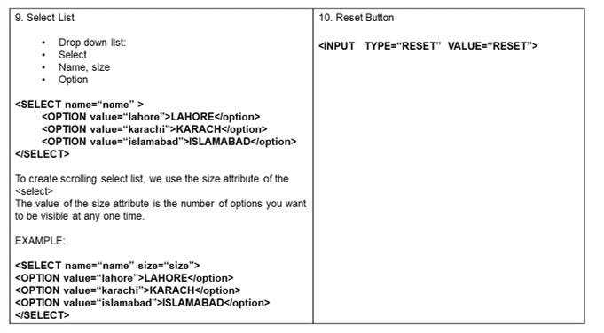
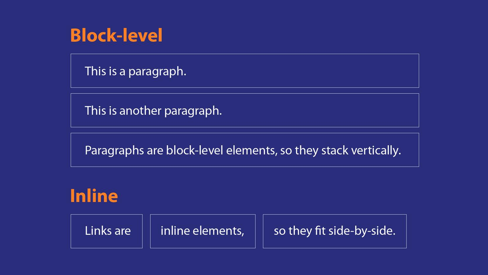

# Chapter: HTML - HyperText Markup Language

This document provides comprehensive teaching notes for HTML, covering everything from basic structure to advanced semantic elements and media integration.

---

## 1. Introduction to HTML
HTML stands for **HyperText Markup Language**. It was created by Tim Berners-Lee in 1989 to distribute information across a network of computers.

- **Hypertext**: Documents contain links that allow jumping to other places or documents.
- **Markup**: Uses tags and attributes to define the structure and presentation of data.
- **Interpretation**: Directly interpreted by the web browser.
- **Case Sensitivity**: HTML is **not** case-sensitive. Multiple spaces are ignored.

---

## 2. Basic Construction of an HTML Page
Every HTML5 document should follow this basic structure:

```html
<!DOCTYPE html>
<html lang="en">
<head>
    <meta charset="UTF-8">
    <title>Page Title</title>
</head>
<body>
    <!-- Content goes here -->
</body>
</html>
```

### Key tags in the structure:
- `<!DOCTYPE html>`: Tells the browser to expect HTML5.
- `<html>`: The root element that wraps all content.
- `<head>`: Contains metadata (title, character set, links to external files) not visible on the page.
- `<body>`: Contains the visible content of the web page.

---

## 3. Elements, Tags, and Attributes
- **Element**: Defined by a start tag, content, and an end tag (e.g., `<p>Text</p>`).
- **Tag**: The angle brackets surrounding an element name. Most occur in pairs (opening and closing).
- **Attribute**: Provides additional information about an element (e.g., `id`, `class`, `src`, `href`). Defined within the opening tag.

---

## 4. Text Formatting and Headings
### Headings
HTML provides six levels of headings from `<h1>` (most important) to `<h6>` (least important). Search engines use these to understand page hierarchy.

### Text Elements
- `<p>`: Paragraph.
- `<b>` or `<strong>`: Bold/Strong importance.
- `<i>` or `<em>`: Italic/Emphasized text.
- `<mark>`: Highlighted text.
- `<small>`: Smaller text.
- `<strike>`: Strikethrough text.
- `<u>` or `<ins>`: Underlined/Inserted text.
- `<sub>` and `<sup>`: Subscript and Superscript.

### Special Characters
Use entities for symbols not on the keyboard:
- `&nbsp;`: Non-breaking space
- `&copy;`: ©
- `&reg;`: ®
- `&euro;`: €
- `&gt;`: >

---

## 5. Lists
### Unordered Lists (`<ul>`)
Used for items where order doesn't matter.
- Each item is wrapped in `<li>`.
- Attributes: `type` (circle, square, disc).

### Ordered Lists (`<ol>`)
Used for sequential data.
- Attributes: `type` (1, A, a, I, i), `start`, `reversed`.

---

## 6. Links and Navigation
### Types of Links
- **Internal Links**: Link to another page in the same website using a **relative path**.
- **External Links**: Link to a different website using an **absolute path** (starting with `http://` or `https://`).

### Implementation
```html
<a href="destination.html" target="_blank">Clickable Text</a>
```
- `href`: The destination URL.
- `target="_blank"`: Opens the link in a new tab.

---

## 7. Media: Images, Video, and Audio
### Images
Uses the `` tag (self-closing).
- `src`: Path to the image file.
- `alt`: Alternative text for accessibility.
- **Image Maps**: Allow multiple links (hotspots) on a single image using `<map>` and `<area>`.

### Video and Audio (HTML5)
```html
<video controls autoplay loop muted>
  <source src="movie.mp4" type="video/mp4">
</video>

<audio controls>
  <source src="song.mp3" type="audio/mpeg">
</audio>
```
Attributes: `controls`, `autoplay`, `muted`, `loop`.

---

## 8. HTML Tables
Used to display data in a grid (rows and columns).

- `<table>`: Starts the table.
- `<tr>`: Table Row.
- `<td>`: Table Data (cell).
- `<th>`: Table Header cell (bold and centered by default).
- `<caption>`: Adds a title to the table.

### Attributes
- `border`, `align`, `bgcolor`.
- `cellpadding`: Gap between cell edges and content.
- `rowspan` and `colspan`: Allow cells to span multiple rows or columns.

---

## 9. HTML Forms
Used to collect user input and send it to a server.

- `<form>`: Wraps the form elements.
  - `action`: URL where data is sent.
  - `method`: `GET` (visible in URL) or `POST` (secure/hidden).
- **Common Elements**:
  - `<input>`: versatile input field (type="text", "password", "submit", etc.).
  - **HTML5 Enhancements**: `type="email"`, `type="date"`, `type="number"`, `type="color"`. These provide built-in validation.

---

## 10. Semantic HTML and Accessibility
Semantic HTML gives meaning to code, helping search engines and screen readers.

### Block vs. Inline
- **Block-level**: Starts on a new line, takes full width (e.g., `<div>`, `<h1>`, `<p>`, `<ul>`).
- **Inline-level**: Stays in the flow, only takes necessary width (e.g., `<span>`, `<a>`, ``).

### Structure Elements (HTML5)
- `<header>`: Introductory content or navigation.
- `<nav>`: Navigation links.
- `<main>`: Primary content of the document.
- `<section>`: Generic section of a document.
- `<article>`: Self-contained composition (blog post, news).
- `<aside>`: Sidebar or content tangentially related to the main content.
- `<footer>`: Footer for its nearest section or document.

---

## Visual Aids from Slides
*(Refer to the extracted images in the folder for diagrams on DOM structure, table layouts, and form elements)*



