# Content from 2.0 CSS.pdf

## Page 1

Web Development Fundamentals 
Learn CSS
1

---

## Page 2

Learning Objectives:
►Explain what CSS is?
►How to use it to style pages?
►Purpose of using CSS
►Writing Style Sheets:
►Style Sheet Strategies: 
►Using Id’s
►Using Classes
►font properties
►text properties
►styling links
►styling background
►styling tables
►What is the box model?
MEAN/MERN Stack
2

---

## Page 3

What is CSS?
MEAN/MERN Stack
3
CSS stands for cascading style sheets:
●
Created by Hakon Lie of MIT in 1994
●
Has become the W3C standard for controlling visual presentation of web pages
●
Cascading style-sheets are powerful mechanism to add style to web document
●
Enforce standards and uniformity
●
Create dynamic effects
●
Works by allowing you to specify rules

---

## Page 4

Purpose of using CSS
MEAN/MERN Stack
4
●
Saves time
●
Easy to change
●
Pages load faster 
●
Keep consistency
●
Give you more control over layout
●
Use styles with JavaScript 
●
Multiple Device Compatibility

---

## Page 5

Writing Style Sheets in CSS:
MEAN/MERN Stack
5
Let us understand the differences among inline, internal, and external style sheets.
In-line styles:
●
Add styles to each tag 
within the HTML file.
●
Use it when you need 
to format just a single 
section in a web page
●
Style attribute is used 
to add style.
Example:
<h1 style=“color:red; font-
family: sans-sarif” > IU </h1>
Embedded/internal styles
●
A style is applied to the entire 
HTML file.
●
Use it when you need to modify 
all instances of particular 
element (e.g., h1) in a web 
page.
Example:

External style sheet
An external style sheet is a text file containing the style definition 
(declaration)
Use it when you need to control the style for an entire website
•
Open a new blank document in Notepad
•
Type style declarations
•
h1 {color:red; font-family:calibri;}
•
Do not include <style> tags
•
Save the document as filename.css
•
Open a HTML file
•
Between <head> and </head> add 
•
<link href=URL rel=“relation_type” type=“link_type”>
•
URL is the file.css
•
Relation_type=“stylesheet”
•
Link_type=“text/css”
•
Save this file and the .css file in the same web server directory.

---

## Page 6

Writing Style Sheets in CSS:
MEAN/MERN Stack
6
Embedded/internal styles

### Images found on this page:

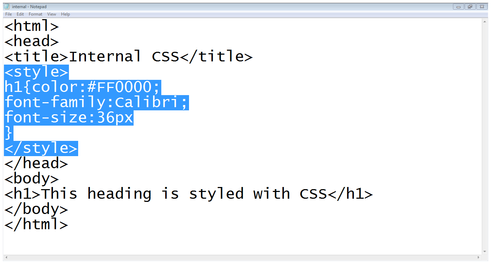

---

## Page 7

Writing Style Sheets in CSS:
MEAN/MERN Stack
7
External style sheet

### Images found on this page:

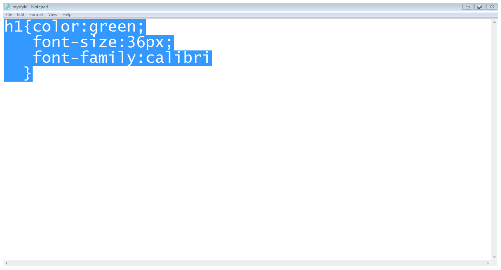

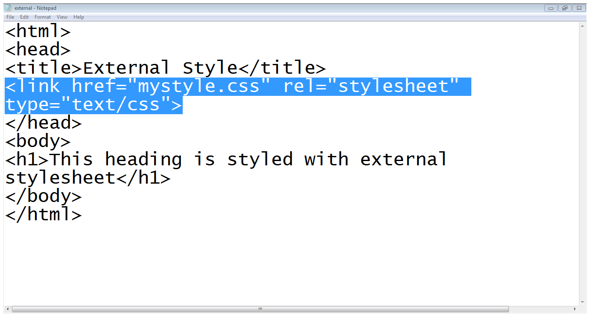

---

## Page 8

Understand how to declare a style:
MEAN/MERN Stack
8
•
A rule consists of 
•
A selector: element or elements the declaration applies to
•
Declaration: how the elements referred to in the selector should be styled
•
property: which is the property of the selected element
•
value: which is a specification for this property
Using Id’s:
•
Use an id to distinguish something, like a paragraph, from the others in a document
•
The id selector is used to specify a style for a single, unique element
•
Create a style Id:
•
#id_name {style attributes and values}
•
Use a style Id:
•
<tag ID=id_name>

### Images found on this page:

---

## Page 9

Understand how to declare a style:
MEAN/MERN Stack
9
Note: HTML requires each id 
be unique– therefore an id 
value can only be used once 
in a document.

### Images found on this page:

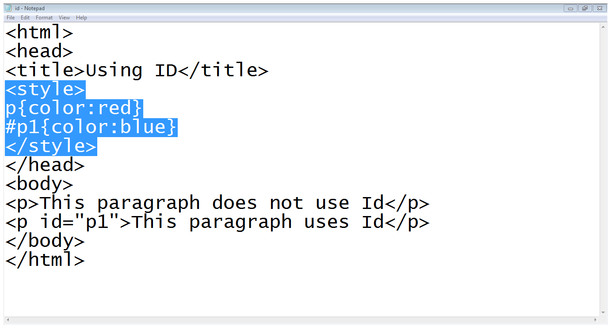

---

## Page 10

Using Classes:
MEAN/MERN Stack
10
•
To create a class
•
tag.class_name {style attributes} 
or
•
.class_name {style attributes}
•
To apply a style 
•
<tag CLASS=class_name>
•
<h1 
CLASS=FirstHeader>IU</h1>

### Images found on this page:

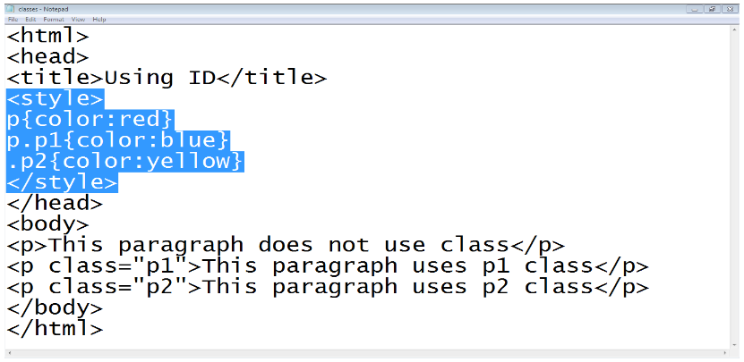

---

## Page 11

Difference between classes and Id’s:
MEAN/MERN Stack
11
•
You can’t have more than one tag with the same ID value
•
You can apply the same Class value to multiple document tags
•
Classes or Id?
•
use ID's for any elements that are simply used once on a page
 
 
 
 
OR
•
only use classes to style websites, but, when you have to use an element in 
JavaScript, use an identifier
•
You can apply a style to many selectors if you like

### Images found on this page:

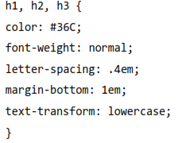

---

## Page 12

CSS properties:
MEAN/MERN Stack
12
Font properties:

### Images found on this page:

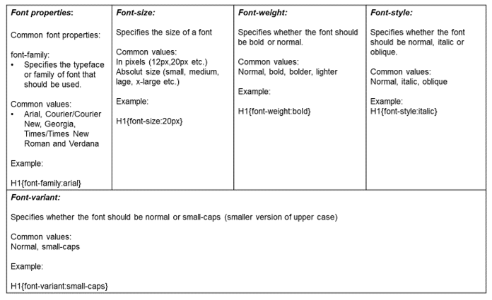

---

## Page 13

CSS properties:
MEAN/MERN Stack
13
Font properties:

### Images found on this page:

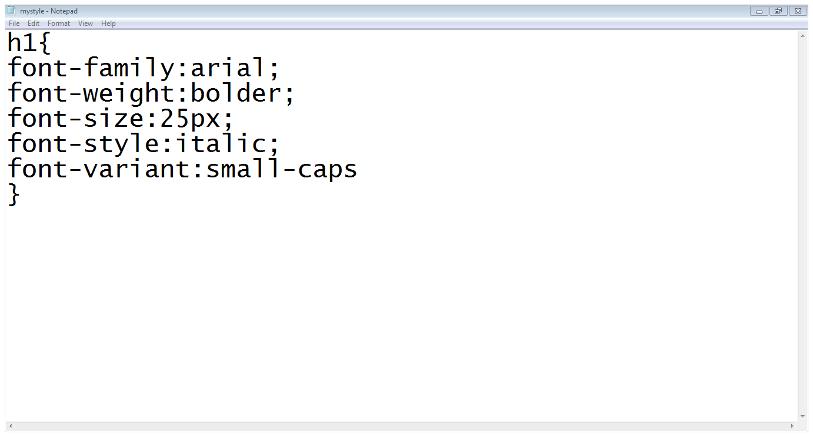

---

## Page 14

CSS properties:
MEAN/MERN Stack
14
TEXT properties:

### Images found on this page:

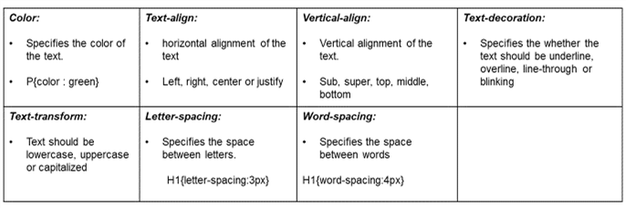

---

## Page 15

CSS properties:
MEAN/MERN Stack
15
Styling links:

### Images found on this page:

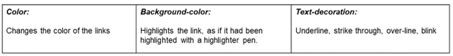

---

## Page 16

CSS properties:
1.
background-color:
•
Specifies the background color 
2.
background-image:
•
Specifies the background image
3.
background-repeat:
•
Specifies whether the image should repeat or 
not
4.
background-position:
•
Where an image should be positioned.
MEAN/MERN Stack
16
Styling Background:

### Images found on this page:

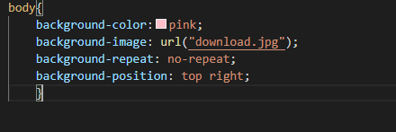

---

## Page 17

CSS properties:
1.
text and font
2.
vertical – align
3.
width 
4.
height 
5.
background - color 
6.
background – image
7.
border:
a.
border-style (solid, dashed, doted, double etc.)
b.
border-color 
c.
border-bottom (solid, dashed, doted, double etc.)
8.
padding 
a.
Padding-left
b.
Padding-right
c.
Padding-top
d.
padding-bottom
MEAN/MERN Stack
17
Styling tables:

### Images found on this page:

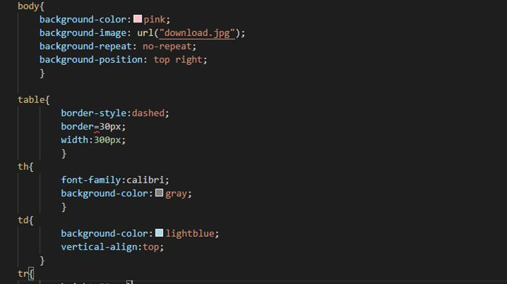

---

## Page 18

CSS properties:
What is the box model?
Every element on a page is a rectangular box and may have 
width, height, padding, borders, and margins.
The box model allows us to add a border around elements, and 
to define space between elements.
•
Content - The content of the box, where text and images 
appear
•
Padding - Clears an area around the content. The 
padding is transparent
•
Border - A border that goes around the padding and 
content
•
Margin - Clears an area outside the border. The margin is 
transparent
MEAN/MERN Stack
18

### Images found on this page:

---

## Page 19

CSS properties:
What is the box model?
Every element on a page is a rectangular box and may have 
width, height, padding, borders, and margins.
The box model allows us to add a border around elements, and 
to define space between elements.
•
Content - The content of the box, where text and images 
appear
•
Padding - Clears an area around the content. The 
padding is transparent
•
Border - A border that goes around the padding and 
content
•
Margin - Clears an area outside the border. The margin is 
transparent
MEAN/MERN Stack
19

### Images found on this page:

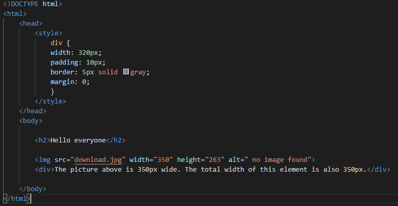

---

## Page 20

Questions ?
MEAN/MERN Stack
20

### Images found on this page:

---
