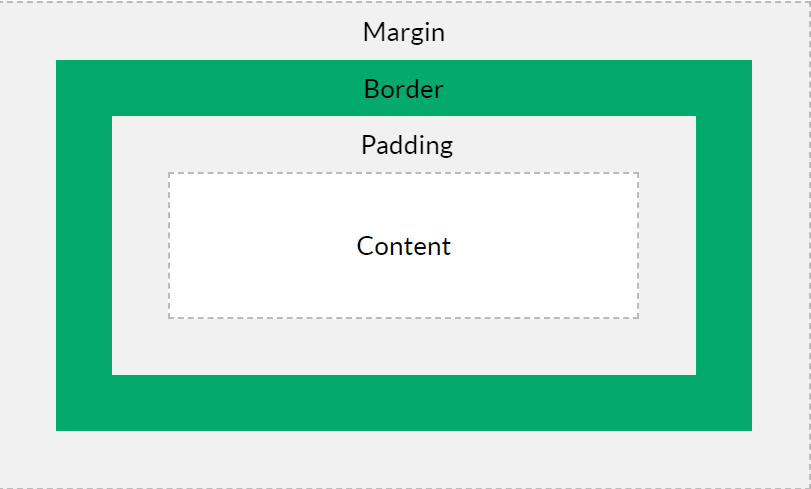
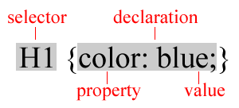

# Chapter: CSS - Cascading Style Sheets

This document covers the fundamentals and advanced properties of CSS, used to control the visual presentation of web pages.

---

## 1. What is CSS?
CSS stands for **Cascading Style Sheets**.
- **History**: Created by Hakon Lie in 1994; now a W3C standard.
- **Purpose**: Controls layout, enforces uniformity, saves time, and enables multiple device compatibility.
- **Rules**: A CSS rule consists of a **Selector** and a **Declaration Block**.
  - `selector { property: value; }`

---

## 2. Inserting CSS
There are three ways to apply CSS to an HTML document:

1. **Inline Styles**: Added directly to an element using the `style` attribute.
   - Example: `<h1 style="color:red;">Title</h1>`
2. **Internal/Embedded Styles**: Defined inside a `<style>` tag within the `<head>` section.
3. **External Style Sheets**: Defined in a separate `.css` file and linked in the `<head>`.
   - Example: `<link rel="stylesheet" type="text/css" href="mystyle.css">`

**Cascading Order**: Inline styles have the highest priority, followed by internal and external style sheets.

---

## 3. Selectors
Selectors tell the browser which elements to style.
- **Tag Selector**: Styles all instances of a tag (e.g., `p { ... }`).
- **ID Selector**: Styles a single, unique element. Uses `#` prefix (e.g., `#header { ... }`).
- **Class Selector**: Styles multiple elements. Uses `.` prefix (e.g., `.center { ... }`).
- **Grouping**: Multiple selectors can share the same style (e.g., `h1, h2, p { color: blue; }`).
- **Attribute Selector**: Styles elements based on their attributes.

---

## 4. The Box Model
Every HTML element is considered a rectangular box. The box model consists of:
1. **Content**: Where text and images appear.
2. **Padding**: Transparent area around the content (inside the border).
3. **Border**: Goes around the padding and content.
4. **Margin**: Transparent area outside the border (space between elements).

---

## 5. Visual Properties
### Colors
Colors can be specified by:
- **Name**: `Tomato`, `DodgerBlue`.
- **RGB**: `rgb(255, 99, 71)`.
- **HEX**: `#ff6347`.

### Fonts and Text
- **Font**: `font-family`, `font-size`, `font-weight`.
- **Text**: `text-align`, `text-decoration`, `text-transform`, `color`.

### Backgrounds
- `background-color`, `background-image`, `background-repeat` (repeat-x, repeat-y, no-repeat).
- `background-attachment` (fixed, scroll).
- `background-position` (e.g., `right top`).
- **Shorthand**: `background: #ffffff url("img.png") no-repeat right top;`

---

## 6. Advanced Styling
### Links
Links can be styled based on their state:
- `a:link`, `a:visited`, `a:hover`, `a:active`.

### Borders and Outlines
- **Borders**: `border-style` (solid, dashed, dotted), `border-width`, `border-color`.
- **Outline**: A line drawn around elements, outside the borders, to make the element "stand out".

### Transitions and Transforms
Create smooth animations when an element changes state (e.g., on hover).
- **Transition**: `transition-property`, `transition-duration`, `transition-delay`, `transition-timing-function`.
- **Transform**: `transform: rotate(180deg);`, `transform: scale(2);`.

```css
div {
  transition: width 2s, height 2s, transform 2s;
}
div:hover {
  width: 300px;
  transform: rotate(180deg);
}
```

---

## Visual Aids from Slides
*(Refer to extracted images in the folder for box model diagrams and transition examples)*



