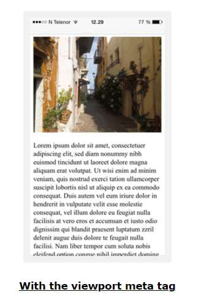

# Content from 3.0 Responsive Design.pdf

## Page 1

CSS Responsive 
 
<meta name="viewport" content="width=device-width, initial-scale=1.0">

### Images:

---

## Page 2

Example Code: 
<!DOCTYPE html> 
<html> 
<head> 
<meta name="viewport" content="width=device-width, initial-scale=1.0"/> 
 
</head> 
<body> 
 

 
Lorem ipsum dolor sit amet, consectetuer adipiscing elit, sed diam nonummy nibh euismod tincidunt ut laoreet 
dolore magna aliquam erat volutpat. 
Ut wisi enim ad minim veniam, quis nostrud exerci tation ullamcorper suscipit lobortis nisl ut aliquip ex ea commodo 
consequat. Duis autem vel eum iriure dolor in hendrerit in vulputate velit esse molestie consequat, vel illum dolore eu 
feugiat nulla facilisis at vero eros et accumsan et iusto odio dignissim qui blandit praesent luptatum zzril delenit 
augue duis dolore te feugait nulla facilisi. Nam liber tempor cum soluta nobis eleifend option congue nihil imperdiet 
doming id quod mazim placerat facer possim assum. 
Nam liber tempor cum soluta nobis eleifend option congue nihil imperdiet doming id quod mazim placerat facer 
possim assum. 

 
</body> 
</html>

---

## Page 3

CSS box-sizing Property 
 
width + padding + border = actual width of an element 
height + padding + border = actual height of an element 
 
<!DOCTYPE html> 
<html> 
<head> 
 
</head>

---

## Page 4

<body> 

Both divs are the same size now!
 
  

Hooray!
 
</body> 
</html> 
 
 
* { 
  box-sizing: border-box; 
} 
 
Responsive Web Design  
Example: 
<!DOCTYPE html> 
<html> 
<head> 
<meta name="viewport" content="width=device-width, initial-scale=1.0"> 
 
</head> 
<body> 

 
  <h1>Chania</h1> 

 

---

## Page 6

<ul> 
    <li>The Flight</li> 
    <li>The City</li> 
    <li>The Island</li> 
    <li>The Food</li> 
  </ul> 

 
 

 
  <h1>The City</h1> 
  
Chania is the capital of the Chania region on the island of Crete. The city can be divided in two 
parts, the old town and the modern city.
 
  
Resize the browser window to see how the content respond to the resizing.
 

 

 
  <h1>The City</h1> 
  
Chania is the capital of the Chania region on the island of Crete. The city can be divided in two 
parts, the old town and the modern city.
 
  
Resize the browser window to see how the content respond to the resizing.
 

 
</body> 
</html>

---

## Page 7

Grid instead of float 
 
<!DOCTYPE html> 
<html lang="en"> 
 <head> 
     
</head>

---

## Page 8

<body> 
    <h2 style="text-align: center;"> 
          Welcome 
</h2> 
    
 
        
Home
 
        
Read
 
        
Write
 
        
About Us
 
        
Contact Us
 
        
Privacy Policy
 
    
 
</body> 
</html>

---

## Page 9

Flex 
<!DOCTYPE html> 
<html lang="en"> 
   
<head> 
     
</head>

---

## Page 10

<body> 
    <h2 style="text-align: center;"> 
          Welcome 
      </h2> 
    
 
        
Home
 
        
Read
 
        
Write
 
        
About Us
 
        
Contact Us
 
        
Privacy Policy
 
    
 
</body> 
   
</html> 
 
Each row should be wrapped in a 
. The number of columns inside a row should always add 
up to 12: 
 
 
  
...
 <!-- 25% --> 
  
...
 <!-- 75% --> 

 
Example: 
<!DOCTYPE html> 
<html> 
<head> 
<meta name="viewport" content="width=device-width, initial-scale=1.0"> 
 
</head> 
<body> 
 

 
  <h1>Chania</h1> 

 
 

 
 

 
  <ul> 
    <li>The Flight</li> 
    <li>The City</li> 
    <li>The Island</li> 
    <li>The Food</li> 
  </ul> 

 
 

 
  <h1>The City</h1> 
  
Chania is the capital of the Chania region on the island of Crete. The city can 
be divided in two parts, the old town and the modern city.

---

## Page 13

Resize the browser window to see how the content respond to the resizing.
 

 

 
  <h1>The City</h1> 
  
Chania is the capital of the Chania region on the island of Crete. The city can 
be divided in two parts, the old town and the modern city.
 
  
Resize the browser window to see how the content respond to the resizing.
 

 
 

 
 
</body> 
</html> 
 
========== 
Another Example now with styling 
<!DOCTYPE html> 
<html> 
<head> 
<meta name="viewport" content="width=device-width, initial-scale=1.0"> 
 
</head> 
<body> 
 

 
  <h1>Chania</h1> 

---

## Page 16

 
  
 
    <ul> 
      <li>The Flight</li> 
      <li>The City</li> 
      <li>The Island</li> 
      <li>The Food</li> 
    </ul> 
  
 
 
  
 
    <h1>The City</h1> 
    
Chania is the capital of the Chania region on the island of Crete. The city 
can be divided in two parts, the old town and the modern city.
 
    
Resize the browser window to see how the content respond to the resizing.
 
  
 

 
 
</body> 
</html> 
 
 
Responsive Web Design - Media Queries 
It uses the @media rule to include a block of CSS properties only if a certain condition is true. 
@media only screen and (max-width: 800px) { 
  body { 
    background-color: lightblue;

---

## Page 17

} 
} 
Example: 
<!DOCTYPE html> 
<html> 
<head> 
<meta name="viewport" content="width=device-width, initial-scale=1.0"> 
 
</head> 
<body> 

Resize the browser window. When the width of this document is 600 pixels or less, the background-
color is "lightblue", otherwise it is "lightgreen".
 
</body> 
</html> 
Another Example: 
<!DOCTYPE html> 
<html>

---

## Page 18

<head> 
<meta name="viewport" content="width=device-width, initial-scale=1.0"> 
 
</head> 
<body> 

 
  <h1>Chania</h1> 

 

 
  
 
    <ul> 
    <li>The Flight</li> 
    <li>The City</li> 
    <li>The Island</li> 
    <li>The Food</li> 
    </ul> 
  
 
  
 
    <h1>The City</h1>

---

## Page 22

Chania is the capital of the Chania region on the island of Crete. The city can be divided in two 
parts, the old town and the modern city.
 
  
 
  
 
    
 
      <h2>What?</h2> 
      
Chania is a city on the island of Crete.
 
      <h2>Where?</h2> 
      
Crete is a Greek island in the Mediterranean Sea.
 
      <h2>How?</h2> 
      
You can reach Chania airport from all over Europe.
 
    
 
  
 

 

 
  
Resize the browser window to see how the content respond to the resizing.
 

 
</body> 
</html> 
Always Design for Mobile First 
/* For mobile phones: */ 
[class*="col-"] { 
  width: 100%; 
} 
 
@media only screen and (min-width: 768px) { 
  /* For desktop: */ 
  .col-1 {width: 8.33%;} 
  .col-2 {width: 16.66%;} 
  .col-3 {width: 25%;}

---

## Page 23

.col-4 {width: 33.33%;} 
  .col-5 {width: 41.66%;} 
  .col-6 {width: 50%;} 
  .col-7 {width: 58.33%;} 
  .col-8 {width: 66.66%;} 
  .col-9 {width: 75%;} 
  .col-10 {width: 83.33%;} 
  .col-11 {width: 91.66%;} 
  .col-12 {width: 100%;} 
} 
Other break points: 
/* For mobile phones: */ 
[class*="col-"] { 
  width: 100%; 
} 
 
@media only screen and (min-width: 600px) { 
  /* For tablets: */ 
  .col-s-1 {width: 8.33%;} 
  .col-s-2 {width: 16.66%;} 
  .col-s-3 {width: 25%;} 
  .col-s-4 {width: 33.33%;} 
  .col-s-5 {width: 41.66%;} 
  .col-s-6 {width: 50%;} 
  .col-s-7 {width: 58.33%;} 
  .col-s-8 {width: 66.66%;} 
  .col-s-9 {width: 75%;} 
  .col-s-10 {width: 83.33%;} 
  .col-s-11 {width: 91.66%;} 
  .col-s-12 {width: 100%;} 
} 
 
@media only screen and (min-width: 768px) { 
  /* For desktop: */ 
  .col-1 {width: 8.33%;} 
  .col-2 {width: 16.66%;} 
  .col-3 {width: 25%;} 
  .col-4 {width: 33.33%;} 
  .col-5 {width: 41.66%;} 
  .col-6 {width: 50%;} 
  .col-7 {width: 58.33%;} 
  .col-8 {width: 66.66%;} 
  .col-9 {width: 75%;} 
  .col-10 {width: 83.33%;} 
  .col-11 {width: 91.66%;}

---

## Page 24

.col-12 {width: 100%;} 
} 
======================== 
Example 
<!DOCTYPE html> 
<html> 
<head> 
<meta name="viewport" content="width=device-width, initial-scale=1.0"> 
 
</head> 
<body> 
 

 
  <h1>Chania</h1> 

---

## Page 28

 
  
 
    <ul> 
      <li>The Flight</li> 
      <li>The City</li> 
      <li>The Island</li> 
      <li>The Food</li> 
    </ul> 
  
 
 
  
 
    <h1>The City</h1> 
    
Chania is the capital of the Chania region on the island of Crete. The city 
can be divided in two parts, the old town and the modern city.
 
  
 
 
  
 
    
 
      <h2>What?</h2> 
      
Chania is a city on the island of Crete.
 
      <h2>Where?</h2> 
      
Crete is a Greek island in the Mediterranean Sea.
 
      <h2>How?</h2> 
      
You can reach Chania airport from all over Europe.
 
    
 
  
 

---

## Page 29

 
  
Resize the browser window to see how the content respond to the resizing.
 

 
 
</body> 
</html> 
------------------------ 
<!DOCTYPE html> 
<html> 
<head> 
<meta name="viewport" content="width=device-width, initial-scale=1.0"> 
 
</head> 
<body> 
 
<h2>Typical Breakpoints</h2> 

Resize the browser window to see how the background color of this 
paragraph changes on different screen sizes.
 
 
</body> 
</html> 
 
 
Orientation: Portrait / Landscape 
@media only screen and (orientation: landscape) { 
  body { 
    background-color: lightblue;

---

## Page 31

} 
} 
Hide Elements With Media Queries 
@media only screen and (max-width: 600px) { 
  div.example { 
    display: none; 
  } 
} 
Change Font Size With Media Queries 
/* If the screen size is 601px or more, set the font-size of 
 to 80px */ 
@media only screen and (min-width: 601px) { 
  div.example { 
    font-size: 80px; 
  } 
} 
/* If the screen size is 600px or less, set the font-size of 
 to 30px */ 
@media only screen and (max-width: 600px) { 
  div.example { 
    font-size: 30px; 
  } 
} 
Change background image With Media Queries 
/* For devices smaller than 400px: */ 
body { 
  background-image: url('img_smallflower.jpg');  
} 
 
/* For devices 400px and larger: */ 
@media only screen and (min-device-width: 400px) { 
  body {  
    background-image: url('img_flowers.jpg');  
  } 
} 
 
Responsive Web Design - Frameworks 
 
<meta name="viewport" content="width=device-width, initial-scale=1">

---

## Page 32

<link href="https://cdn.jsdelivr.net/npm/bootstrap@5.3.2/dist/css/bootstra
p.min.css" rel="stylesheet"> 
 
 
====================== 
<!DOCTYPE html> 
<html lang="en"> 
<head> 
  <title>Bootstrap 5 Example</title> 
  <meta charset="utf-8"> 
  <meta name="viewport" content="width=device-width, initial-scale=1"> 
  <link 
href="https://cdn.jsdelivr.net/npm/bootstrap@5.3.2/dist/css/bootstrap.min.css" 
rel="stylesheet"> 
  <script 
src="https://cdn.jsdelivr.net/npm/bootstrap@5.3.2/dist/js/bootstrap.bundle.min.js"></
script> 
</head> 
<body> 
 

 
  <h1>My First Bootstrap Page</h1> 
  
Resize this responsive page to see the effect!
  

 
   

 
  
 
    
 
      <h3>Column 1</h3> 
      
Lorem ipsum dolor sit amet, consectetur adipisicing elit...

---

## Page 33

Ut enim ad minim veniam, quis nostrud exercitation ullamco laboris...
 
    
 
    
 
      <h3>Column 2</h3> 
      
Lorem ipsum dolor sit amet, consectetur adipisicing elit...
 
      
Ut enim ad minim veniam, quis nostrud exercitation ullamco laboris...
 
    
 
    
 
      <h3>Column 3</h3>         
      
Lorem ipsum dolor sit amet, consectetur adipisicing elit...
 
      
Ut enim ad minim veniam, quis nostrud exercitation ullamco laboris...
 
    
 
  
 

 
 
</body> 
</html>

---
