# Content from 3.1 Bootstrap.pdf

## Page 1

LEARN BOOTSTRAP
MEAN/MERN STACK

### Images found on this page:

---

## Page 2

LEARNING OBJECTIVES:
►Explain the core concept of Bootstrap.
►What is Bootstrap?
►What is Responsive Web Design?
►Get Bootstrap 5
►Layout and style your website using Bootstrap 
►Bootstrap Components
2

### Images found on this page:

---

## Page 3

WHAT IS BOOTSTRAP?
3
●
Bootstrap is a free front-end framework for faster and easier web development
●
Bootstrap includes HTML and CSS based design templates for typography, forms, buttons, tables, navigation, 
modals, image carousels and many other, as well as optional JavaScript plugins
●
Bootstrap also gives you the ability to easily create responsive designs
What is Responsive Web Design?
Responsive web design is about creating web sites which automatically adjust themselves to look good on all devices, from 
small phones to large desktops.

### Images found on this page:

---

## Page 4

WHAT IS BOOTSTRAP?
4
Get Bootstrap 5: 
There are two methods to use Bootstrap:
1.
Download Bootstrap 5 from getbootstrap.com.
2.
Include Bootstrap 5 from a CDN (Content Delivery Network): Adding these two line is you <head> will give you 
access to Bootstrap v5.3.
<!-- Latest compiled and minified CSS -->
<link href="https://cdn.jsdelivr.net/npm/bootstrap@5.3.3/dist/css/bootstrap.min.css" rel="stylesheet">
<!-- Latest compiled JavaScript -->

### Images found on this page:

---

## Page 5

LAYOUT AND STYLE YOUR WEBSITE USING 
BOOTSTRAP 
5
1.
Containers: 
●
.container class: The .container class provides a responsive fixed width container 
●
.container-fluid class: The .container-fluid class provides a full width container, spanning the entire width of the 
viewport
Below image is for your reference to  understand the difference between .container and .container-fluid class.

### Images found on this page:

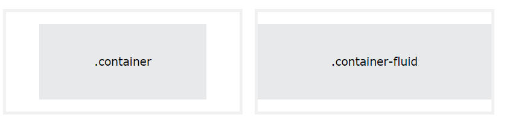

---

## Page 6

LAYOUT AND STYLE YOUR WEBSITE USING 
BOOTSTRAP 
6
2.  Grid:
●
Bootstrap's grid system is built with flexbox and allows up to 12 columns across the page.
●
The grid system is responsive, and the columns will re-arrange automatically depending on the screen size.
●
Make sure that the sum adds up to 12 or fewer (it is not required that you use all 12 available columns).

### Images found on this page:

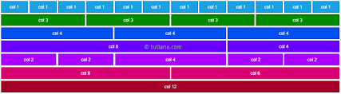

---

## Page 7

LAYOUT AND STYLE YOUR WEBSITE USING 
BOOTSTRAP 
7
2.  Grid:
The Bootstrap 5 grid system has six classes:
●
.col- (extra small devices - screen width less than 576px)
●
.col-sm- (small devices - screen width equal to or greater than 576px)
●
.col-md- (medium devices - screen width equal to or greater than 768px)
●
.col-lg- (large devices - screen width equal to or greater than 992px)
●
.col-xl- (xlarge devices - screen width equal to or greater than 1200px)
●
.col-xxl- (xxlarge devices - screen width equal to or greater than 1400px
Output:

### Images found on this page:

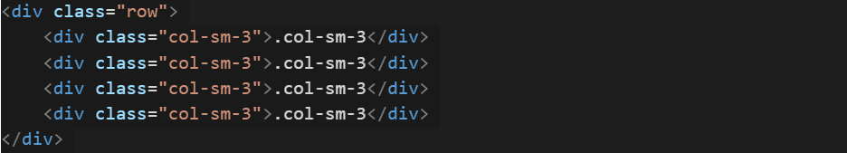

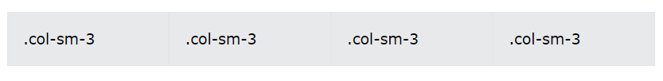

---

## Page 8

LAYOUT AND STYLE YOUR WEBSITE USING 
BOOTSTRAP 
8
3.  Breakpoints:
●
Breakpoints are the building blocks of responsive design. Use them to control when your layout can be adapted at a 
particular viewport or device size.
●
Mobile first, responsive design is the goal. Bootstrap’s CSS aims to apply the bare minimum of styles to make a 
layout work at the smallest breakpoint, and then layers on styles to adjust that design for larger devices. This 
optimizes your CSS, improves rendering time, and provides a great experience for your visitors.
The following tables shows the break points.

### Images found on this page:

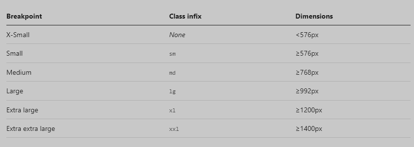

---

## Page 9

LAYOUT AND STYLE YOUR WEBSITE USING 
BOOTSTRAP 
9
3. Gutters
●
Gutters are the padding between your columns, used to responsively 
space and align content in the Bootstrap grid system.
●
Gutters are the gaps between column content, created by horizontal 
padding. We set padding-right and padding-left on each column, and 
use negative margin to offset that at the start and end of each row to 
align content.

### Images found on this page:

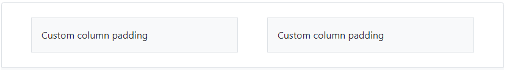

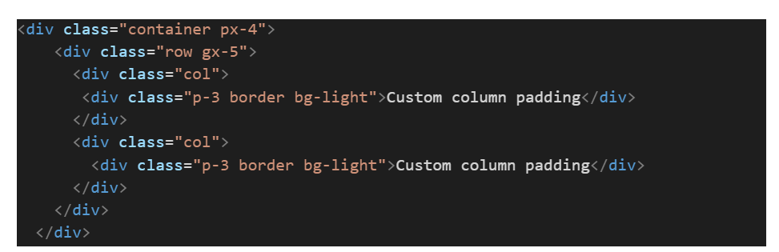

---

## Page 10

COMPONENTS:
10
1.
Alerts:
Provide contextual feedback 
messages for typical user 
actions with the handful of 
available and flexible alert 
messages.
Examples: Alerts are 
available for any length of 
text, as well as an optional 
close button. For proper 
styling, use one of the eight 
required contextual classes 
(e.g., .alert-success).

### Images found on this page:

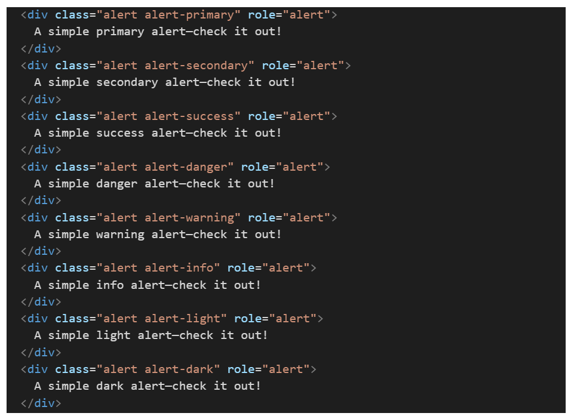

---

## Page 11

COMPONENTS:
11
1.
Alerts:
Provide contextual feedback 
messages for typical user actions 
with the handful of available and 
flexible alert messages.
Examples: Alerts are available for 
any length of text, as well as an 
optional close button. For proper 
styling, use one of the eight required 
contextual classes (e.g., .alert-
success).

### Images found on this page:

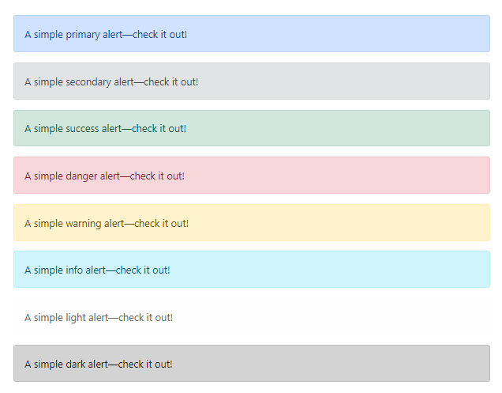

---

## Page 12

COMPONENTS:
12
2. Badge
●
Badges is for small count and labeling 
component.
●
Badges scale to match the size of the 
immediate parent element by using 
relative font sizing and em units. 
Example:

### Images found on this page:

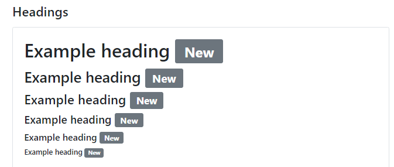

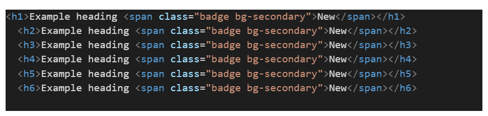

---

## Page 13

COMPONENTS:
13
3.Buttons:
●
Use Bootstrap’s custom button styles for actions in forms, dialogs, and more with support for multiple sizes, states, and 
more. Button class can also be used on <a> and <input> elements.

### Images found on this page:

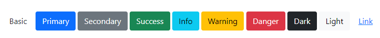

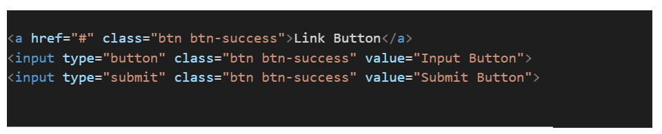

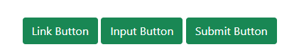

---

## Page 14

COMPONENTS:
14
4. Button group: Group a series of buttons together on a single line or stack them in a vertical column.

### Images found on this page:

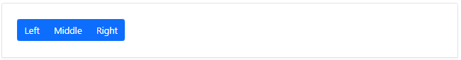

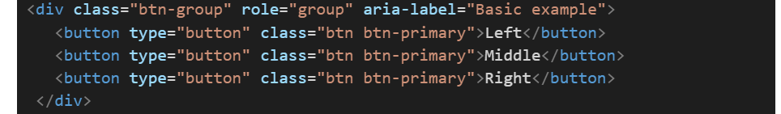

---

## Page 15

COMPONENTS:
15
5. Card
●
Bootstrap’s cards provide a flexible and extensible content container with multiple variants 
and options.
Example:
●
Below is an example of a basic card with mixed content and a fixed width. Cards have no 
fixed width to start, so they’ll naturally fill the full width of its parent element. This is easily 
customized with our various sizing options.

### Images found on this page:

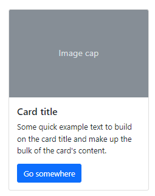

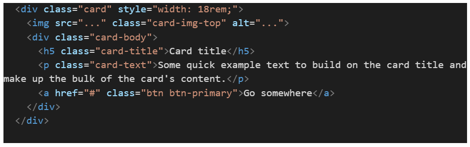

---

## Page 16

COMPONENTS:
16
6. Carousel Slider
: A slideshow component for cycling through elements—images or slides of text—like a carousel.

### Images found on this page:

---

## Page 17

COMPONENTS:
17
8. Collapse:
●
The collapse is used to show and hide content. 
●
Buttons or anchors are used as triggers that are mapped to specific elements you toggle.
●
Collapsing an element will animate the height from its current value to 0.
●
Given how CSS handles animations, you cannot use padding on a .collapse element. Instead, use the class as 
an independent wrapping element.
For examples refer the documentation.
9. Dropdowns
●
Dropdowns are toggleable, contextual overlays for displaying lists of links and more.
●
They’re made interactive with the included Bootstrap dropdown JavaScript plugin.
●
They’re toggled by clicking, not by hovering; this is an intentional design decision.

### Images found on this page:

---

## Page 18

COMPONENTS:
18
10. List group: List groups are a flexible and powerful component for 
displaying a series of content. Modify and extend them to support 
just about any content within.

### Images found on this page:

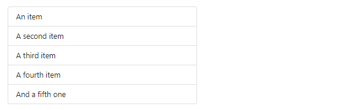

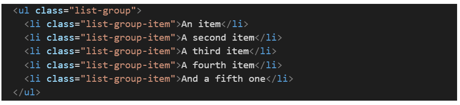

---

## Page 19

COMPONENTS:
19
11. Navbar:
A navigation bar (also called a Navbar) is a user interface 
element within a webpage that contains links to other sections 
of the website.

### Images found on this page:

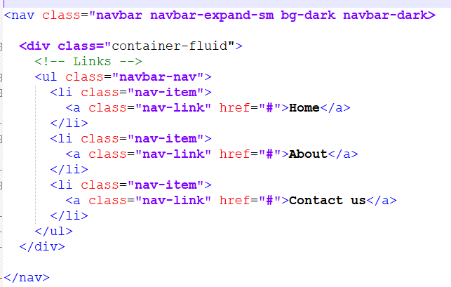

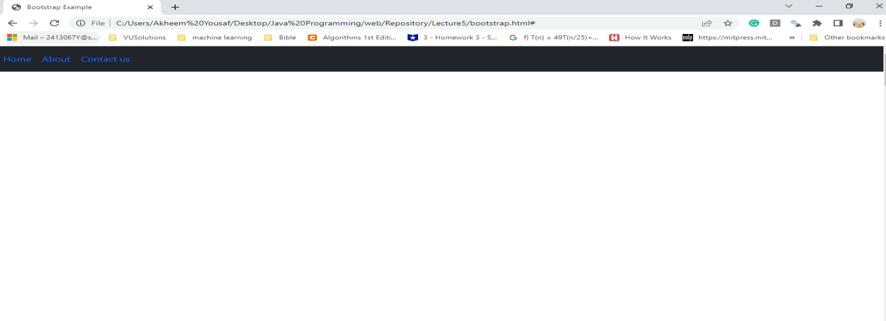

---

## Page 20

COMPONENTS:
20
12. Pagination
●
Pagination is to indicate a series of related content exists across multiple pages.
●
We use a large block of connected links for our pagination, making links hard to miss and easily scalable, all while 
providing large hit areas. 
●
Pagination is built with list HTML elements so screen readers can announce the number of available links.
●
Use a wrapping <nav> element to identify it as a navigation section to screen readers and other assistive 
technologies.
Example:

### Images found on this page:

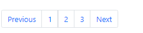

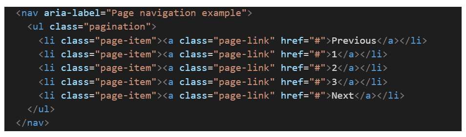

---

## Page 21

COMPONENTS:
21
13. Progress
●
Progress components are built with two HTML elements, some CSS to set the width, and a few attributes.
●
We use the .progress as a wrapper to indicate the max value of the progress bar.
●
We use the inner .progress-bar to indicate the progress so far.
●
The .progress-bar requires an inline style, utility class, or custom CSS to set their width.
●
The .progress-bar also requires some role and aria attributes to make it accessible.
Put that all together, and you have the following examples.

### Images found on this page:

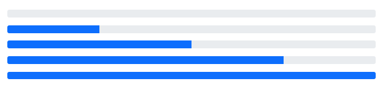

---

## Page 22

COMPONENTS:
22
13. Progress
Put that all together, and you have the following examples.
Adding labels:
●
Add labels to your progress bars by 
placing text within the .progress-bar.

### Images found on this page:

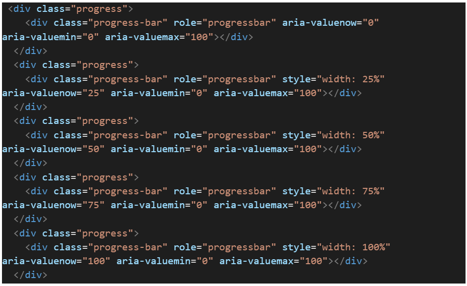

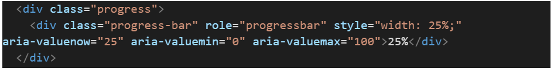

---

## Page 23

COMPONENTS:
23
14. Spinners
●
Indicate the loading state of a component or page with Bootstrap spinners.
●
Their appearance, alignment, and sizing can be easily customized with our amazing utility classes.
●
For accessibility purposes, each loader includes role="status" and a nested Loading....

### Images found on this page:

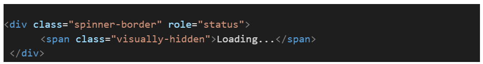

---

## Page 24

COMPONENTS:
24
15. Toasts
●
Push notifications to your visitors with a toast, a lightweight and easily customizable alert message.
●
Toasts are lightweight notifications designed to mimic the push notifications that have been popularized by mobile and 
desktop operating systems.
●
Toasts are opt-in for performance reasons, so you must initialize them yourself.
●
Toasts will automatically hide if you do not specify autohide: false.
●
To encourage extensible and predictable toasts, we recommend a header and body. Toast headers use display: flex, 
allowing easy alignment of content thanks to our margin and flexbox utilities.
●
Toasts are as flexible as you need and have very little required markup. At a minimum, we require a single element to 
contain your “toasted” content and strongly encourage a dismiss button.

### Images found on this page:

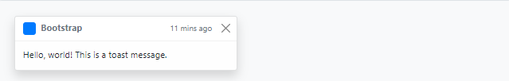

---

## Page 25

COMPONENTS:
25
15. Toasts

### Images found on this page:

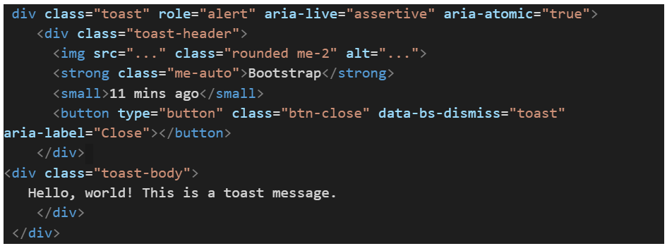

---

## Page 26

QUESTIONS ?
26

### Images found on this page:

---
