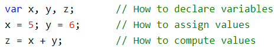
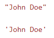
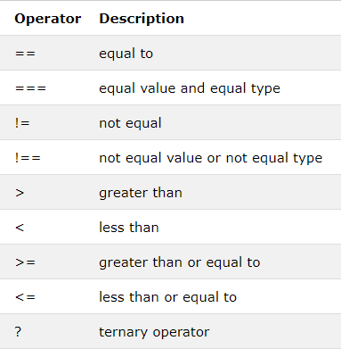
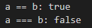
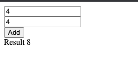

# Content from Lecture 1 - Introduction to JavaScript, Control Structure, String.pdf

## Page 1

Introduction to JavaScript

Introduction to JavaScript

*(Extracted via OCR)*

---

## Page 2

JavaScript
Client Side Language (Vanilla JS, jQuery, React, etc)
Server Side Language (Node.js, MongoDB etc)
Easy to Learn
ES6 (ECMAScript 6) introduced and standardized in 2015

### Images:

---

## Page 3

JavaScript
JavaScript was invented by Brendan Eich in 1995, and became an ECMA standard in 1997.
ECMAScript is the official name of the language.
ECMAScript versions have been abbreviated to ES1, ES2, ES3, ES5, and ES6.
Since 2016, versions are named by year (ECMAScript 2016, 2017, 2018, 2019, 2020).
The 15th edition, ECMAScript 2024, is published in July 2024.

### Images:

---

## Page 4

JS Syntax
• Very similar to other programming languages
• JavaScript uses the var keyword to declare 
variables.
• Universal principle for identifiers 
• Strings are text, written within double or single 
quotes
• Output on console using console.log

### Images:

---

## Page 5

JS Variables
• Can create uninitialized variables or variable declaration (undefined)
• Change type of same variable anytime
• Recreate same variable again
var a; //undefined
var b = a + 10; // NaN
var x = 10
var x = 100
console.log(x) // 100
var x = "I am one hundred"
console.log(x) // I am one hundred

### Images:

---

## Page 6

JS Operators
• Similar to other programming languages 
except === and !==
var a = 10
var b = '10'
console.log("a == b:", a == b)
console.log("a === b:", a === b)

### Images:

---

## Page 7

JS DataTypes
Number, String, Object etc.
• Decimal
var x = 15.56
• Exponential 
var x = 10e5
• Object 
var person = { firstName:"John", 
lastName:"Doe", age:50 };

### Images:

---

## Page 8

JS typeof Operator
• You can use the JavaScript typeof operator to find the type of a JavaScript 
variable.
• The typeof operator returns the type of a variable or an expression:
typeof ""
 
// Returns "string"
typeof "John"
// Returns "string"
typeof "John Doe"
// Returns "string"
typeof 0
 
// Returns "number"
typeof 314
// Returns "number"
typeof 3.14
// Returns "number"
typeof (3)
// Returns "number"
typeof (3 + 4)
// Returns "number"

### Images:

---

## Page 9

JS undefined vs null
In JavaScript null is "nothing". It is supposed to be something that doesn't exist.
• Unfortunately, in JavaScript, the data type of null is an object.
• You can empty an object by setting it to null
undefined and null are equal in value but different in type:
typeof undefined
// undefined
typeof null
// object
null === undefined
// false
null == undefined
// true

### Images:

---

## Page 10

Primitive Data
A primitive data value is a single simple data value with no additional properties and 
methods.
The typeof operator can return one of these primitive types:
• string
• number
• boolean
• Undefined
typeof "John"
// Returns "string"
typeof 3.14
// Returns "number"
typeof true
// Returns "boolean"
typeof false
// Returns "boolean"
typeof x
// Returns "undefined" (if x has no value)

### Images:

---

## Page 11

Complex Data
The typeof operator can return one of two complex types:
• function
• object
The typeof operator returns "object" for objects, arrays, and null.
The typeof operator does not return "object" for functions.
typeof {name:'John', age:34} // Returns "object"
typeof [1,2,3,4]
// Returns "object" (arrays are objects)
typeof null
// Returns "object"
typeof function myFunc(){}
// Returns "function"

### Images:

---

## Page 12

ES6 Variables
var
let
const
Scope
Function
Block
Block
Can change value 
after creation?
Yes
Yes
No

### Images:

---

## Page 13

Variables:
MEAN/MERN Stack
13
●
Camel Case: In this naming convention you should write the first word all lowercase and then the next words first letter should be 
capital.
var full_name;
var fullName;
●
Snake Case: In this naming convention you should write the first word in lowercase followed by a underscore and then second word. If 
there are more than two words use underscore between every word.
var x = 5; 
let y = 5;
const PI = 3.14;
w = 5; 
var x = 10;
// Here x is ?
{
var x = 2;
// Here x is ?
}
// Here x is ?

---

## Page 14

Points to Remember
Variables should be initialized before accessing it. Unassigned variable has 
value undefined.
JavaScript is a loosely-typed language, so a variable can store any type value.
let and const have block scope.
let and const can not be redeclared.
let and const must be declared before use(not hoisted).
14

---

## Page 15

JavaScript with HTML
MEAN/MERN Stack
15
<!DOCTYPE html>
<html lang="en">
  <head>
    
    <title>Our Main Page</title>
    <link rel="stylesheet" href="style.css">
  </head>
  <body>
    <input type="text" name="name" id="numOne" value="0" />
     
    <input type="text" name="name" id="numTwo" value="0" />
     
    <button type="button" onclick="add()">Add</button>
      
    

  
  </body>
</html>

---

## Page 16

Example
MEAN/MERN Stack
16
●
In you main.js make function add() which will be called when we click the button.  
function add(){
var numOne = document.getElementById("numOne").value;
var numTwo = document.getElementById("numTwo").value;
result = parseInt(numOne) + parseInt(numTwo)
document.getElementById("result").innerHTML = “Result “+ result;

### Images:

---

## Page 17

Conditional Statement:
MEAN/MERN Stack
17
// if(condition){
//     code to run if the condition is true
// }
// else{
//     code to run if the condition is false
// }

---

## Page 18

Conditional Statement:
MEAN/MERN Stack
18
if(condition){
    code to run if the condition is true
}
if (condition2){
    code to run if the condition2 is true
}
else if(contidion3){
    code to run if the condition3 is true
}
else{
    code to run if the condition is false
}
●
We care going to change the previous example and incorporate the if … else statement
var numOne = document.getElementById("numOne").value;
var numTwo = document.getElementById("numTwo").value;
result = parseInt(numOne) + parseInt(numTwo)
if (result > 10){
    document.getElementById("result").innerHTML =  result;
}
else{
    document.getElementById("result").innerHTML =  “less than 10”;
}

---

## Page 19

nested if
MEAN/MERN Stack
19
if(condition){
   if (condition2){
    This code will run if condition is true and then condition2
    is true
   }
}
else{
    This code will run if condition is false
}

---

## Page 20

Switch Statement:
MEAN/MERN Stack
20
●
For cases where you just want to set a variable to a certain choice of value or print out a particular statement 
depending on a condition, the syntax can be a bit cumbersome, especially if you've got a large number of 
choices.
●
In such a case, we use switch statements.
●
hey take a single expression/value as an input, and then look through a number of choices until they find one 
that matches that value, executing the corresponding code that goes along with it.
var a = 2
switch (a) {
    case 1:
      alert(“1”)
      break;
  
    case 2:
      alert(a)
      break;
  
    // include as many cases as you like
    default:
      alert("This is default case")
  }

---

## Page 21

String Concat
MEAN/MERN Stack
21
let x  = "This is a string";
let y = 'Here is another exapmle of String';
let z = new String('This is an String object. ');
document.getElementById(“test").innerHTML = z; 
●
String primitives and string objects can be used interchangeably in most situations.
●
There different way you can join two or more than two string. 
●
This is also known as concatenation.
newString = x + y;
●
You can concatenate two or more string with + operator. For strings + will join two strings.
●
Or you can use concat() which joins two or more strings
newString = x.concat(y)

---

## Page 22

String get specific character
MEAN/MERN Stack
22
newString[0]
let letter = newString.charAt(0)
●
To find out the length you can use length 
newString.length

---

## Page 23

String replace…
MEAN/MERN Stack
23
●
The replace() method replaces a specified value with another value in a string:
let text = "Lets complete this task tommorow";
let newText = text.replace("complete", "finsh");
let newTextUpper = text.toUpperCase()
let newTextLower = text.toLowerCase()
●
The trim() method removes whitespace from both sides of a string.
let newTextTrim = text.trim()

---

## Page 24

String split
MEAN/MERN Stack
24
let text = "  Lets complete,this task tommorow  ";
let newtext =text.split(",");
●
A string can be converted to an array with the split() method.
●
If the separator is omitted, the returned array will contain the whole string in index [0].
●
If the separator is "", the returned array will be an array of single characters:

---

## Page 25

Logical Operator: 
Logical operators very same as used in other languages.
MEAN/MERN Stack
25
&&
logical and
||
logical or
!
logical not
if (x < 8 && y > 1) is true
if (x == 5 || y == 5) is false
if !(x == y) is true

---

## Page 26

Arrays:
MEAN/MERN Stack
26
let student = ["Ali" ,"Jona" , "Sarthak" , "Tim" , "Shahid"];
let student = new Array("Ali" ,"Jona" , "Sarthak" , "Tim" , "Shahid")
●
You can access the values by just passing index value in the [] brackets.
●
Also you can change the element of came index
student[2]
student[3] = "Adeem"
●
 toString() converts an array to a string of (comma separated) array values.
student.toString()
●
push() is a method that will add element at the end.
●
pop() is a method that will remove the last element from the array.
student.push("Anish");
student.push("Jona");

---

## Page 27

Arrays:
MEAN/MERN Stack
27
●
You concatenate two array. By using concat() methods.
let student1 = ["Ali" ,"Jona" , "Sarthak" , "Tim" , "Shahid"]; 
let student2  = ["Sameen", "Rashid", "Sam"]
let allStudents  = student1.concat(student2)
●
You can also sort() array in different fashion which can be very handy in different context. 
●
The reverse() method reverses the elements in an array.
let student1 = ["Ali" ,"Jona" , "Sarthak" , "Tim" , "Shahid"]; 
student1.sort()
student1.reverse()

---

## Page 28

Loops:
MEAN/MERN Stack
28
●
Loops  that we can implement in JavaScript are for, do while, while 
for statement:
●
A for loop repeats until a specified condition evaluates to false. The JavaScript for loop is similar to the Java and C for loop.
for ([initialExpression]; [conditionExpression]; [incrementExpression])
  statement
●
Inside a for statement there are three parts. First is to initialize a variable. Second is on what condition it should stop. Third is how 
much to increment or decrement step. It can also define how long step can be.
let student1 = ["Ali" ,"Jona" , "Sarthak" , "Tim" , "Shahid"];
for (var i =0 ; i < student.length ; i++){
   console.log(student1[i])
}
for in:
●
In this statement you loop over an object 
●
Use for keyword followed by parenthesis and inside the parenthesis use a loop variable then in keyword and then object.
for (key in object) {
    // code block to be executed
  }

---

## Page 29

Loops:
MEAN/MERN Stack
29
do while statement:
●
This statement repeats until a specified condition evaluates to false
●
In this statement the loop is run first and then the condition is read.
let i = 0;
  do {
    i++;
    console.log(i);
  } while (i < 10);
while loop
●
This statement executes its statements as long as a specified condition evaluates to true.
●
In this condition is read first then the loop is executed.
llet i = 0;
let j = 0;
while (i < 10) {
  i++;
  j += i;
}

---

## Page 30

Loops:
MEAN/MERN Stack
30
break statement
●
This is used to terminate the loop at any given time.
●
Usually we check a condition then apply break to terminate the loop. This comes in handy in a lot of cases.
for (let i = 0; i < x.length; i++) {
  if (x[i] === val) {
    break;
  }
}
continue statement
●
This statement can be used to move on next iteration.
let i = 0;
let j = 0;
for (i = 0; i < x.length; i++) {
  i++;
  if (i === 3) {
     // continue;
  }
  j += i;
  console.log(n);
}

---
