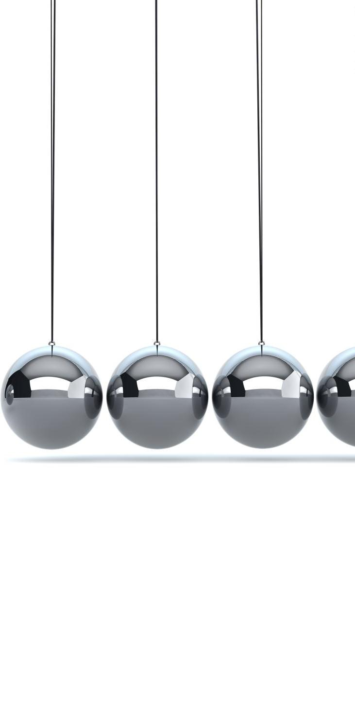

# Content from Lecture 2 - JS arrays.pdf

## Page 1

JavaScript Arrays

---

## Page 2

JS Arrays
• JavaScript arrays are used to store 
multiple values in a single variable.
cars = ["Saab", "Volvo", "BMW"];
//We can use Array with var, let and const

### Images found on this page:

---

## Page 3

concat() function
The concat() method concatenates (joins) two or more arrays.
The concat() method does not change the existing arrays, but returns a new 
array, containing the values of the joined arrays.
Array1.concat(Array2)

### Images found on this page:

---

## Page 4

Example
const shop1 = 
[“Apple",“Mango",“Orange"];
const shop2 = 
[“Banana",“Grapes",“PineApple"];
const total=shop1.concat(shop2);
console.log(total);

---

## Page 5

copyWithin() function
• The copyWithin() method copies array 
elements to another position in an array, 
overwriting the existing values.
• The copyWithin() does not add items to the 
array.
array.copyWithin(target, start, end)

### Images found on this page:

---

## Page 6

Example

Banana,Orange,Apple,Mango,Kiwi,Banana

---

## Page 7

entries() 
function
• The entries() method returns an Array Iterator object 
with key/value pairs.
• For each item in the original array, the new iteration 
object will contain an array with the index as the key, 
and the item value as the value:
const fruits = ["Banana", "Orange", "Apple", "Mango"];
[0, "Banana"]
[1, "Orange"]
[2, "Apple"]
[3, "Mango"]
• entries() does not change the original array.

### Images found on this page:

---

## Page 8

Example
const fruits = ["Banana", "Orange", "Apple", "Mango"];
const f = fruits.entries();
for (let   x of   f) {
console.log(x);
}

### Images found on this page:

---

## Page 9

fill() 
function
The fill() method fills specified 
elements in an array with a 
static value.
You can specify the position of 
where to start and end the 
filling. If not specified, all 
elements will be filled.
array.fill(value, start, end)
• //start and end are optional

---

## Page 10

Example
const array1 = [1, 2, 3, 4];
console.log(array1.fill(0, 2, 3));

### Images found on this page:

---

## Page 11

filter() 
function
The filter() method creates an array 
filled with all array elements that pass a 
test
filter() does not execute the function for 
empty array elements.
filter() does not change the original 
array.

---

## Page 12

Example
const words = ['spray', 'limit', 'elite', 'exuberant', 'destruction', 'present'];
const result = words.filter(word => word.length > 6);
console.log(result);
const ages = [32, 33, 16, 40];
const result = ages.filter(age => age > 18);
console.log(result);

### Images found on this page:

---

## Page 13

find() function 
• The find() method returns the value of the array element 
that passes a test.
• The method executes the function once for each element 
present in the array:
• If it finds an array element where the function returns a true 
value, find() returns the value of that array element (and does 
not check the remaining values)
• Other wise it returns undefined

### Images found on this page:

---

## Page 14

Example
const ages = [32, 33, 16, 40];
const found = ages.find(age => age > 18);
console.log(found);

### Images found on this page:

---

## Page 15

map() function
• The map() method creates a new array with the results of calling a function 
for every array element.
• The map() method calls the provided function once for each element in an 
array, in order.
• map() does not execute the function for empty elements.
• map() does not change the original array.

---

## Page 16

Example
const array1 = [1, 4, 9, 16];
const map1 = array1.map(x => x * 2);
console.log(map1);
2,8,18,32

### Images found on this page:

---

## Page 17

forEach() function
The forEach() method calls a function once for 
each element in an array, in order.
forEach() is not executed for array elements 
without values.

### Images found on this page:

---

## Page 18

Example
const array1 = ['a', '2', 'c'];
array1.forEach(element => console.log(element));

### Images found on this page:

---

## Page 19

Map vs forEach
• forEach: This iterates over a list and applies some operation with side effects 
to each list member (example: saving every list item to the database) and 
does not return anything.
• map: This iterates over a list, transforms each member of that list, and 
returns another list of the same size with the transformed members 
(example: transforming list of strings to uppercase).

### Images found on this page:

---

## Page 20

slice() function
• The slice() method returns selected elements in an array, 
as a new array.
• slice() selects the elements starting at the given start 
argument, and ends at, but does not include, the given 
end argument.
• slice() does not change the original array.
array.slice(start, end)

### Images found on this page:

---

## Page 21

Example
const animals = ['ant', 'owl', 'camel', 'duck', 
'elephant'];
console.log(animals.slice(2));
console.log(animals.slice(2, 4)); 
console.log(animals.slice(1, 5)); 
console.log(animals.slice(-2)); 
console.log(animals.slice(2, -1));

---

## Page 22

pop() function
• The pop() method removes the last element of an 
array.
• pop() returns the element it removes.
• pop() changes the length of the array.
array.pop()
• Use shift() to remove element from first position.

### Images found on this page:

---

## Page 23

Example
const plants = ['broccoli', 'onion', 'cabbage', 'tomato’];
console.log(plants.pop()); 
console.log(plants);
console.log(plants.shift()); 
console.log(plants);

### Images found on this page:

---

## Page 24

push() function
• The push() method adds new items to the 
end of an array.
• push() changes the length of the array and 
returns the new length.
• To add items at the beginning of an array, use 
unshift().
array.push(item1, item2, ..., itemX)

### Images found on this page:

---

## Page 25

Example
const animals = [‘elephants', 'goats', 'sheep’];
const count = animals.push('cows’);
console.log(count);
console.log(animals);
animals.push('chickens', 'cats', 'dogs’);
console.log(animals);
animals.unshift(‘FirstAnimal’);
console.log(animals);

### Images found on this page:

---

## Page 26

flat() 
function
flat() method that creates a new array with 
all the elements of the subarrays 
concatenated to it recursively up to a 
specified depth.
By default, the depth is ‘1’.
We can also use ‘Infinity’ parameter for all 
sub arrays.

### Images found on this page:

---

## Page 27

Example 
(1)
const numbers = [1, 2, [3, 4, 5]];
const flatNumbers = numbers.flat();
console.log(flatNumbers);

### Images found on this page:

---

## Page 28

Example (2)
const numbers = [1, 2, [3, 4, 5, [6, 7]]];
const flatNumbers = numbers.flat(2);
console.log(flatNumbers);
const numbers1 = [1, 2, [3, 4, 5, [6, 7, [8, 9]]]];
const flatNumbers1 = numbers1.flat(Infinity);
console.log(flatNumbers1);

### Images found on this page:

---

## Page 29

sort() 
function
The sort() method sorts 
an array alphabetically.
The reverse() method 
reverses the elements in 
an array.
Both methods changes 
the original array.

---

## Page 30

Example
const fruits = ["Banana", "Orange", "Apple", "Mango"];
console.log(fruits.sort()); 
console.log(fruits.reverse());

### Images found on this page:

---
