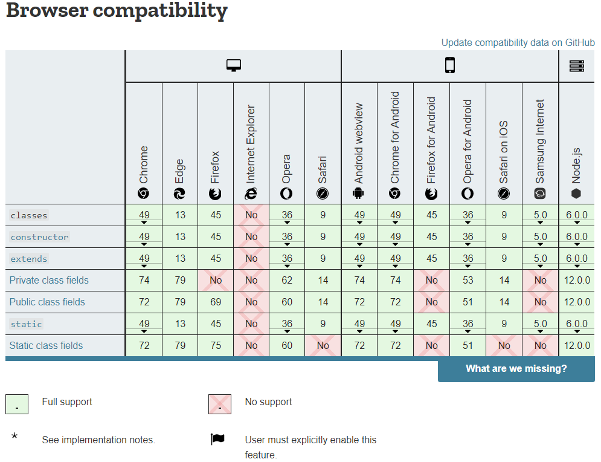

# Content from Lecture 3 - JavaScript Functions and Classes.pdf

## Page 1

JavaScript 
Functions

### Images found on this page:

---

## Page 2

Functions:
MEAN/MERN Stack
2
●
Function is one the most important building block of JavaScript. It is a similar to procedure.
●
It is a set of instructions that will calculate or perform any task. 
●
But this is written separately in a block which can be called again and again to perform that task. 
●
It can take in input or not. You can pass as many inputs. These inputs are known as parameters.  
●
Also it can return a value or not. Function those who don’t return values are known as void function.
●
To use a function, you must define it somewhere in the scope from which you wish to call it.
Function Declaration
●
Making or defining a function is known as a function declaration. 
●
If consists of function keyword followed by the name of the function with parenthesis in which you can pass the parameters as inputs.
●
Then {} brackets in which you can write appropriate instructions. 
/keyword  name parameters
  function add  (a , b) {
  // block of code
  return a + b
}
Function Invocation:
●
For this to work you need to call this function name. 
●
This is also known as invoking the function.
●
If the function has no return statement then you can just call it. 
●
But if has the return value then you have to store the value in an  variable
x = add(5,6)  // calling a function

### Images found on this page:

---

## Page 3

JS Functions
• Block of code designed to perform a particular task.
• A JavaScript function is defined with the function keyword, followed by a 
name, followed by parentheses ().
• Calling:
 myFunction(5,2);
function myFunction(p1, p2) {
return p1 * p2;
// The function returns the product of p1 and p2
}

### Images found on this page:

---

## Page 4

function foo(a) {
console.log("msg1:",a);
}
function foo(a,b,c) {
console.log("msg2:",a,b,c);
}
foo("hello");

### Images found on this page:

---

## Page 5

Function Overloading
• Unlike other programming languages, JavaScript Does not support Function 
Overloading.
function foo(a) {
console.log("msg1",a);
}
function foo(a,b,c) {
console.log("msg2:",a,b,c);
}
foo1("hello");
/* The above function will be
overwritten by the function 
below, and the below 
function 
will be executed for any 
number
and any type of arguments */

### Images found on this page:

---

## Page 6

JS Functions – ES6 Default Parameters
• With default parameters, a manual check in the function body is no longer 
necessary
function multiply(a = 0, b = 1) {
return a * b;
}
multiply();
multiply(5);
multiply(5, 5);

### Images found on this page:

---

## Page 7

function foo(a) {
console.log("msg1",a);
}
function foo(a,b,c) {
console.log("msg2:",a,b,c);
}
function foo() {
console.log("msg3:",a, b);
}
foo("hello");
Less Arguments

### Images found on this page:

---

## Page 8

function foo(a) {
console.log("msg1",a);
}
function foo(a,b,c) {
console.log("msg2:",a,b,c);
}
function foo() {
console.log("msg3:");
}
foo("hello");

### Images found on this page:

---

## Page 9

function foo(a) {
console.log("msg1",a);
}
function foo(a,b,c) {
console.log("msg2:",a,b,c);
}
function foo() {
console.log("msg3:",arguments[0]);
}
foo("hello");

### Images found on this page:

---

## Page 10

function foo(a) {
console.log("msg1",a);
}
function foo(a,b,c) {
console.log("msg2:",a,b,c);
}
function foo() {
console.log("msg3:",arguments[1]);
}
foo("hello");

### Images found on this page:

---

## Page 11

JS Functions – Arguments Object
• The arguments of a function are maintained in an array-like object
• All arguments can be retrieved using arguments object
Note: The arguments variable is "array-like", but not an array. It is array-like in that it has a 
numbered index and a length property. However, it does not possess all of the array-
manipulation methods. 
function myConcat() {
var result = '';
// iterate through arguments
for (let i = 0; i < arguments.length; i++)
result += arguments[i] + " ";
return result;
}
var result = myConcat( 'red', 'orange', 'blue');
console.log(result);
var result = myConcat('elephant', 'giraffe', 'lion', 'cheetah');
console.log(result);
var result = myConcat( 'sage', 'basil', 'oregano', 'pepper', 'parsley');
console.log(result);

### Images found on this page:

---

## Page 12

JS Functions – Rest Parameters
• The rest parameter syntax allows us to represent an indefinite number of 
arguments as an array.
• Rest Parameters are received as an Array and all Array operations can be 
applied
function sumNums(...nums) {
let sum = 0;
console.log(nums.length);
for (let i = 0; i < nums.length; i++)
sum += nums[i];
return sum;
}
console.log(sumNums(1, 1, 1));

### Images found on this page:

---

## Page 13

JS Functions – Rest Parameters
• The rest parameter syntax allows us to represent an indefinite number of 
arguments as an array.
• Rest Parameters are received as an Array and all Array operations can be 
applied
function fun(arg1, ...args) {
return args.length ;
}
console.log(fun(1, 2, 3, 4, 5, 6, 7, 8, 9) + " arguments passed");
// ? arguments passed

### Images found on this page:

---

## Page 14

JS Functions – Rest Parameters
function fun( ...args, arg1) {
return args.length ;
}
console.log(fun(1, 2, 3, 4, 5, 6, 7, 8, 9) + " arguments passed");
// ? arguments passed

### Images found on this page:

---

## Page 15

JS Functions – Pass by Value
• JavaScript is Pass by Value for Primitive Data (Number, String, Boolean)
function sum(n1, n2) {
n1 = n1 + n2;
return n1;
}
var a = 10, b = 10
console.log(a, "+", b, "=", sum(a, b))
function strFun(p1) {
p1 = "Eleven"
}
var a = "Ten"
strFun(a)
console.log(a)

### Images found on this page:

---

## Page 16

JS Functions – Pass by Reference
• Objects are of Reference Type
• Therefore, JavaScript is Pass by Reference for Objects
function strFun(p1) {
p1.value = "Eleven"
}
var a = { value: "Ten" }
strFun(a)
console.log(a.value)
function strFun(p1) {
p1.value = "Eleven"
p1.index++
}
var a = { value: "Ten", index: 0 }
strFun(a)
console.log(a.index)
Visit this link for the detailed discussion:
https://stackoverflow.com/questions/13104494/does-javascript-pass-by-reference

### Images found on this page:

---

## Page 17

JS Functions – Function Expression
• The Javascript Function Expression is used to define a function inside any 
expression. 
• The Function Expression allows us to create an anonymous function that 
doesn’t have any function name which is the main difference between 
Function Expression and Function Declaration.
• A function expression has to be stored in a variable and can be accessed 
using variableName.

### Images found on this page:

---

## Page 18

JS Functions – Function Expression
• Syntax for Function Declaration:
 
 
function functionName(x, y) { statements... return (z) };
• Syntax for Function Expression (anonymous):
• Syntax for Function Expression (named):
let variableName = function(x, y) { statements... return (z) };
let variableName = function functionName (x, y) { 
statements... return (z) };

### Images found on this page:

---

## Page 19

JS Functions – Function Expression
• However, a name can be provided with a function expression. Providing a 
name allows the function to refer to itself
const factorial = function fac(n) { return n < 2 ? 1 : n * fac(n - 1) }
console.log(factorial(3))

### Images found on this page:

---

## Page 20

JS Arrow Functions
• Arrow functions were introduced in ES6
• An arrow function expression has a shorter syntax compared to function 
expressions
let variableName = (x, y) => { statements... return (z) };

### Images found on this page:

---

## Page 21

Code for Function Declaration
• function callAdd(x, y) {
•  let z = x + y;
•  return z;
• }
• console.log("Addition : " + callAdd(7, 4));

### Images found on this page:

---

## Page 22

Code for Function Expression (anonymous)
• let calSub = function (x, y) {
•  let z = x - y;
•  return z;
• }
• console.log("Subtraction : " + calSub(7, 4));

### Images found on this page:

---

## Page 23

Code for Function Expression (named)
• let calMul = function Mul(x, y) {
•  let z = x * y;
•  return z;
• }
• console.log("Multiplication : " + calMul(7, 4));

### Images found on this page:

---

## Page 24

Code for Arrow Function
• let calDiv = (x, y) => {
•  let z = x / y;
•  return z;
• }
• console.log("Division : " + calDiv(24, 4));

### Images found on this page:

---

## Page 25

Self Exercises: What is Expected Output?
const mult = (a, b) => a = a !== undefined ? a : 0; b = b !== undefined ? b : 1; a * b;
console.log(mult(2, 3))
const mult = () => {
a = a !== undefined ? a : 0;
b = b !== undefined ? b : 1;
return a * b;
}
console.log(mult(2, 3))
const mult = () => {
var a = a !== undefined ? a : 0;
var b = b !== undefined ? b : 1;
  
a * b;
}
console.log(mult(2, 3))
const mult = () => {
var a = a !== undefined ? a : 0;
var b = b !== undefined ? b : 1;
return a * b;
}
console.log(mult(2, 3))
const mult = (a, b) => {
a = a !== undefined ? a : 0;
b = b !== undefined ? b : 1;
return a * b;
}
console.log(mult(2, 3))

### Images found on this page:

---

## Page 26

JavaScript Classes

### Images found on this page:

---

## Page 27

ES6 Classes
• JavaScript classes, introduced in ECMAScript 2015, 
are primarily syntactical sugar over JavaScript's 
existing prototype-based inheritance
• The class syntax does not introduce a new object-
oriented inheritance model to JavaScript
• Classes are in fact "special functions", and just as 
you can define function expressions and function 
declarations
• Class syntax has two components: 
• class expressions
• class declarations

### Images found on this page:

---

## Page 28

Class Declarations
• One way to define a class is using a class declaration. To declare a class, you 
use the class keyword
class Rectangle {
constructor(height, width) {
this.height = height;
this.width = width;
}
}
const rect1 = new Rectangle(10, 10);
const rect2 = new Rectangle();
rect1.height = 20;
rect2 = rect1; // can do?

### Images found on this page:

---

## Page 29

Class Expression
• A class expression is another way to define a class. Class expressions can be 
named or unnamed
// unnamed
let Rectangle = class {
constructor(height, width) {
this.height = height;
this.width = width;
}
};
const rect1 = new Rectangle(10, 10);
console.log(Rectangle.name);
// output: "Rectangle"
console.log(rect1.height);
// named
let Rectangle = class Rectangle2 {
constructor(height, width) {
this.height = height;
this.width = width;
}
};
const rect1 = new Rectangle(10, 10);
console.log(Rectangle.name);
// output: "Rectangle2“
console.log(rect1.height);

### Images found on this page:

---

## Page 30

Constructor
• The constructor method is a special method for creating and initializing an 
object created with a class
• There can only be one special method with the name "constructor" in a 
class
• A SyntaxError will be thrown if the class contains more than one occurrence 
of a constructor method.
• A constructor can use the super keyword to call the constructor of the 
super class.

### Images found on this page:

---

## Page 31

Getters, Methods
• Get keyword is used for creating 
Getter
• Getter is called as a property or field 
name instead of function
• E.g. square.area and not 
square.area()
class Rectangle {
constructor(height, width) {
this.height = height;
this.width = width;
}
// Getter
get area() {
return this.calcArea();
}
// Method
calcArea() {
return this.height * this.width;
}
}
const square = new Rectangle(10, 10);
console.log(square.area); // 100
console.log(square.calcArea());

### Images found on this page:

---

## Page 32

Getters, Methods – Another Example
• Height is a getter and used as 
rect.Height
Set Heightt is a setter and used as 
rect.Heightt = 20;
class Rectangle {
constructor(height, width) {
this.height = height;
this.width = width;
}
get Height() {
return this.height;
}
set Heightt(height) {
this.height = height;
}
}
var rect = new Rectangle(10, 15);
console.log(rect.Height); // 10
rect.Heightt = 20;
console.log(rect.Height); // 20

### Images found on this page:

---

## Page 33

Static Method
• The static keyword defines a static 
method for a class
• Static methods are called without 
instantiating their class and cannot be 
called through a class instance
• Static methods are often used to create 
utility functions for an application.
class Point {
constructor(x, y) {
this.x = x;
this.y = y;
}
static distance(a, b) {
const dx = a.x - b.x;
const dy = a.y - b.y;
return Math.hypot(dx, dy);
}
}
const p1 = new Point(5, 5);
const p2 = new Point(10, 10);
console.log(Point.distance(p1, p2));

### Images found on this page:

---

## Page 34

Private Field Declarations
class Rectangle {
#height = 0;
#width;
constructor(height, width) {
this.#height = height;
this.#width = width;
}
get Height() {
return this.#height;
}
setHeight(height) {
this.#height = height;
}
}
var rect = new Rectangle(10, 15);
console.log(`Height of Rectangle is ${rect.height} cm`)
console.log(rect.Height);
rect.setHeight(20);
//rect.Height=20;
console.log(rect.Height);

### Images found on this page:

---

## Page 35

Inheritance
• The extends keyword is used 
in class declarations or class 
expressions to create a class as 
a child of another class.
class Animal {
constructor(name) {
this.name = name;
}
speak() {
console.log(`${this.name} makes a noise.`);
}
}
class Dog extends Animal {
constructor(name) {
super(name);  // call the super class constru
ctor and pass in the name parameter
}
speak() {
console.log(`${this.name} barks.`);
}
}
let d = new Dog('Random dog');
d.speak(); // Random dog barks.

### Images found on this page:

---

## Page 36

Hoisting (1/4)
• Hoisting is JavaScript's default behavior of moving declarations to the top.
• In JavaScript, a variable can be declared after it has been used.
• In other words; a variable can be used before it has been declared.
var x;
x = 5;
console.log(x); // 5
x = 5;
var x;
console.log(x); // 5
fName = "Ali"
lName = "Zafar"
var fName, lName
console.log(fName, lName); // Ali Zafar
var fName, lName
fName = "Ali"
lName = "Zafar"
console.log(fName, lName); // Ali Zafar

### Images found on this page:

---

## Page 37

Hoisting (2/4)
• Variables and constants declared with let or const are not hoisted!
x = 5
let x
console.log(x)
// ReferenceError: Cannot access 'x' before initialization
x = 5
const x
console.log(x)
// SyntaxError: Missing initializer in const declaration

### Images found on this page:

---

## Page 38

Hoisting (3/4)
• JavaScript only hoists declarations, not 
initializations.
• only the declaration (var y), not the initialization 
(=7) is hoisted to the top.
var x = 5; // Initialize x
var y = 7; // Initialize y
console.log(x + y) // 12
var x = 5; // Initialize x
console.log(x + y) // NaN
var y = 7; // Initialize y
var x = 5;
// Initialize x
var y;
// Declare y
console.log(x + y); // NaN
y = 7;
// Initialize y
var x = 5;
// Initialize x
y = 7;
// Initialize y
console.log(x + y); // 12
var y;
// Declare y

### Images found on this page:

---

## Page 39

Hoisting (4/4)
• An important difference between function declarations and class 
declarations is that function declarations are hoisted and class 
declarations are not
var rect = new Rectangle();
class Rectangle { }
// ReferenceError
var sqr = Square();
function Square() { }

### Images found on this page:

---

## Page 40

### Images found on this page:

---

## Page 41

Exercise: Implement following scenario in ES6 Classes

### Images found on this page:

---

## Page 42

References
• MDN Web Docs: Details of the object model 
(https://developer.mozilla.org/en-
US/docs/Web/JavaScript/Guide/Details_of_the_Object_Model)
• W3Schools React ES6 (https://www.w3schools.com/react/react_es6.asp)

### Images found on this page:

---

## Page 43

References
• MDN Web Docs: Details of the object model 
(https://developer.mozilla.org/en-
US/docs/Web/JavaScript/Guide/Details_of_the_Object_Model)
• MDN Web Docs: Classes (https://developer.mozilla.org/en-
US/docs/Web/JavaScript/Reference/Classes)
• W3Schools React ES6 (https://www.w3schools.com/react/react_es6.asp)

### Images found on this page:

---
