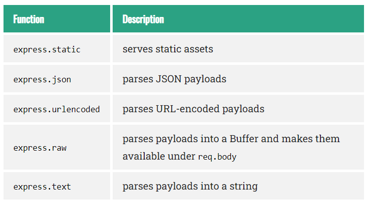

# Content from 1.Express JS.pdf

## Page 1

MEAN/MERN STACK
Node.js Http 
Module

### Images found on this page:

---

## Page 2

Learning Objectives:
►Introduction
►Basics Server setup
►Middlewares
►Types of middleware
►Application-level middleware
►Router level / Built-in / Third party middleware
►Error Handling middleware 
MEAN/MERN Stack
2

### Images found on this page:

---

## Page 3

Introduction to Express JS
MEAN/MERN Stack
3
The Express website describes Express as “a minimal and flexible node.js web application framework, providing a robust set of features for 
building single and multipage and hybrid web applications.” What does that really mean, though? Let’s break that description down:
▪
Minimal: This is one of the most appealing aspects of Express. Many times, framework developers forget that usually “less is more.” 
The Express philosophy is to provide the minimal layer between your brain and the server. That doesn’t mean that it’s not robust, or that 
it doesn’t have enough useful features. It means that it gets in your way less, allowing you full expression of your ideas, while at the 
same time providing something useful.
▪
Flexible: Another key aspect of the Express philosophy is that Express is extensible. Express provides you a very minimal framework, 
and you can add in different parts of Express functionality as needed, replacing whatever doesn’t meet your needs. This is a breath of 
fresh air. So many frameworks give you everything, leaving you with a bloated, mysterious, and complex project before you’ve even 
written a single line of code. Very often, the first task is to waste time carving off unneeded functionality, or replacing the functionality 
that doesn’t meet requirements. Express takes the opposite approach, allowing you to add what you need when you need it.

### Images found on this page:

---

## Page 4

Introduction to Express JS
MEAN/MERN Stack
4
Introduction:
●
Express was initially released in November 2010 and is currently on stable version 5.0.0 (2024-09-10).
●
Is Express Opinionated?
●
Web frameworks often refer to themselves as "opinionated" or "unopinionated".
●
Express is unopinionated. You can insert almost any compatible middleware you like into the request handling chain, in 
almost any order you like. You can structure the app in one file or multiple files, and using any directory structure. You may 
sometimes feel that you have too many choices!

### Images found on this page:

---

## Page 5

Introduction to Express JS
MEAN/MERN Stack
5
Introduction:
What does Express code look like?
●
In a traditional data-driven website, a web application waits for HTTP requests from the web 
browser (or other client). When a request is received the application works out what action is needed 
based on the URL pattern and possibly associated information contained in POST data or GET data. 
Depending on what is required it may then read or write information from a database or perform 
other tasks required to satisfy the request. The application will then return a response to the web 
browser, often dynamically creating an HTML page for the browser to display by inserting the 
retrieved data into placeholders in an HTML template.
●
Express provides methods to specify what function is called for a particular HTTP verb (GET, 
POST, SET, etc.) and URL pattern ("Route"), and methods to specify what template ("view") 
engine is used, where template files are located, and what template to use to render a response.

### Images found on this page:

---

## Page 6

Basic Server Setup 
MEAN/MERN Stack
6
●
Assuming you’ve already installed Node.js, create a directory to hold your application, and make that you’re working directory.
$ mkdir myapp
$ cd myapp
●
Use the npm init command to create a package.json file for your application. For more information on how package.json works, see Specifics 
of npm’s package.json handling.
$ npm init
●
This command prompts you for a number of things, such as the name and version of your application. For now, you can simply hit RETURN 
to accept the defaults for most of them, with the following exception:
●
entry point: (index.js)
●
Enter app.js, or whatever you want the name of the main file to be. If you want it to be index.js, hit RETURN to accept the suggested default 
file name.
●
Now install Express in the myapp directory and save it in the dependencies list. For example:
$ npm install express
●
To install Express temporarily and not add it to the dependencies list:
$ npm install express --no-save

### Images found on this page:

---

## Page 7

Introduction to Express JS
MEAN/MERN Stack
7
●
The following sections explain some of the common things you'll see when working with Express and Node code.
●
Helloworld Express
●
First lets’ consider the standard Express Hello World example (we discuss each part of this below, and in the following sections).
●
If you have Node and Express already installed, you can save this code in a text file called app.js and run it in a bash command prompt by calling:
node ./app.js
const express = require('express');
const app = express();
const port = 3000;
app.get('/', function(req, res) {
 res.send('Hello World!')
});
app.listen(port, function() {
 console.log(`Example app listening on port ${port}!`)
});
●
The first two lines require() (import) the express module and create an Express application. This object, which is traditionally named app, has methods for routing 
HTTP requests, configuring middleware, rendering HTML views, registering a template engine, and modifying application settings that control how the application 
behaves.

### Images found on this page:

---

## Page 8

Introduction to Express JS
MEAN/MERN Stack
8
●
The middle part of the code (the three lines starting with app.get) shows a route definition. The app.get() method specifies a callback function 
that will be invoked whenever there is an HTTP GET request with a path ('/') relative to the site root. The callback function takes a request and 
a response object as arguments, and calls send() on the response to return the string "Hello World!"
●
The final block starts up the server on a specified port ('3000') and prints a log comment to the console. With the server running, you could go 
to localhost:3000 in your browser to see the example response returned.
●
A module is a JavaScript library/file that you can import into other code using Node's require() function. Express itself is a module, as are the 
middleware and database libraries that we use in our Express applications.
●
The code below shows how we import a module by name, using the Express framework as an example. First we invoke the require() function, 
specifying the name of the module as a string ('express'), and calling the returned object to create an Express application. We can then access 
the properties and functions of the application object.
const express = require('express');
const app = express();
●
You can also create your own modules that can be imported in the same way.
●
You will want to create your own modules, because this allows you to organize your code into manageable parts — a monolithic single-file 
application is hard to understand and maintain. Using modules also helps you manage your namespace, because only the variables you 
explicitly export are imported when you use a module.
●
To make objects available outside of a module you just need to expose them as additional properties on the exports object. For example, the 
square.js module below is a file that exports area() and perimeter() methods:
exports.area = function(width) { return width * width; };
exports.perimeter = function(width) { return 4 * width; };

### Images found on this page:

---

## Page 9

Introduction to Express JS
MEAN/MERN Stack
9
●
We can import this module using require(), and then call the exported method(s) as shown
const square = require('./square'); // Here we require() the name of the file without the (optional) .js file extension
console.log('The area of a square with a width of 4 is ' + square.area(4));
●
If you want to export a complete object in one assignment instead of building it one property at a time, assign it to module.exports as shown 
below (you can also do this to make the root of the exports object a constructor or other function):
module.exports = {
 area: function(width) {
  return width * width;
 },
 perimeter: function(width) {
  return 4 * width;
 }
};
●
You can think of exports as a shortcut to module.exports within a given module. In fact, exports is just a variable that gets initialized to the 
value of module.exports before the module is evaluated. That value is a reference to an object (empty object in this case). This means that 
exports holds a reference to the same object referenced by module.exports. It also means that by assigning another value to exports it's no 
longer bound to module.exports.

### Images found on this page:

---

## Page 10

Introduction to Express JS
MEAN/MERN Stack
10
Using asynchronous API
●
JavaScript code frequently uses asynchronous rather than synchronous APIs for operations that may take some time to complete. A synchronous API is one in which 
each operation must complete before the next operation can start. For example, the following log functions are synchronous, and will print the text to the console in 
order (First, Second).
console.log('First');
console.log('Second');
●
By contrast, an asynchronous API is one in which the API will start an operation and immediately return (before the operation is complete). Once the operation 
finishes, the API will use some mechanism to perform additional operations. For example, the code below will print out "Second, First" because even though 
setTimeout() method is called first, and returns immediately, the operation doesn't complete for several seconds.
setTimeout(function() {
 console.log('First');
 }, 3000);
console.log('Second');
●
Using non-blocking asynchronous APIs is even more important on Node than in the browser because Node is a single-threaded event-driven execution environment. 
"Single threaded" means that all requests to the server are run on the same thread (rather than being spawned off into separate processes). This model is extremely 
efficient in terms of speed and server resources, but it does mean that if any of your functions call synchronous methods that take a long time to complete, they will 
block not just the current request, but every other request being handled by your web application.
●
There are a number of ways for an asynchronous API to notify your application that it has completed. The most common way is to register a callback function when 
you invoke the asynchronous API, that will be called back when the operation completes. This is the approach used above.

### Images found on this page:

---

## Page 11

Introduction to Express JS
MEAN/MERN Stack
11
●
Using callbacks can be quite "messy" if you have a sequence of dependent asynchronous operations that must be performed in order because 
this results in multiple levels of nested callbacks. This problem is commonly known as "callback hell". This problem can be reduced by good 
coding practices (see http://callbackhell.com/), using a module like async, or even moving to ES6 features like Promises.
●
A common convention for Node and Express is to use error-first callbacks. In this convention, the first value in your callback functions is an 
error value, while subsequent arguments contain success data. There is a good explanation of why this approach is useful in this blog: The 
Node.js Way - Understanding Error-First Callbacks.
Creating route handlers
●
In our Hello World Express example (see above), we defined a (callback) route handler function for HTTP GET requests to the site root ('/').
app.get('/', function(req, res) {
 res.send('Hello World!')
});
●
The callback function takes a request and a response object as arguments. In this case, the method calls send() on the response to return the 
string "Hello World!" There are a number of other response methods for ending the request/response cycle, for example, you could call 
res.json() to send a JSON response or res.sendFile() to send a file.
●
You can use any argument names you like in the callback functions; when the callback is invoked the first argument will always be the request 
and the second will always be the response. It makes sense to name them such that you can identify the object you're working with in the body 
of the callback.

### Images found on this page:

---

## Page 12

Introduction to Express JS
MEAN/MERN Stack
12
●
The Express application object also provides methods to define route handlers for all the other HTTP verbs, which are mostly used in exactly the same way:
●
checkout(), copy(), delete(), get(), head(), lock(), merge(), mkactivity(), mkcol(), move(), m-
search(), notify(), options(), patch(), post(), purge(), put(), report(), search(), subscribe(), trace(), unlock(), unsubscribe().
●
There is a special routing method, app.all(), which will be called in response to any HTTP method. This is used for loading middleware functions at a particular path 
for all request methods. The following example (from the Express documentation) shows a handler that will be executed for requests to /secret irrespective of the 
HTTP verb used (provided it is supported by the http module).
app.all('/secret', function(req, res, next) {
 console.log('Accessing the secret section ...');
 next(); // pass control to the next handler
});
●
Routes allow you to match particular patterns of characters in a URL, and extract some values from the URL and pass them as parameters to the route handler (as 
attributes of the request object passed as a parameter).
●
Often it is useful to group route handlers for a particular part of a site together and access them using a common route-prefix (e.g. a site with a Wiki might have all 
wiki-related routes in one file and have them accessed with a route prefix of /wiki/). In Express this is achieved by using the express.Router object. For example, we 
can create our wiki route in a module named wiki.js, and then export the Router object, as shown below:
// wiki.js - Wiki route module
const express = require('express');
const router = express.Router();
// Home page route
router.get('/', function(req, res) {
 res.send('Wiki home page');
});
// About page route
router.get('/about', function(req, res) {
 res.send('About this wiki');
});
module.exports = router;

### Images found on this page:

---

## Page 13

Introduction to Express JS
MEAN/MERN Stack
13
●
Adding routes to the Router object is just like adding routes to the app object (as shown previously).
●
To use the router in our main app file we would then require() the route module (wiki.js), then call use() on the Express application to add the Router to 
the middleware handling path. The two routes will then be accessible from /wiki/ and /wiki/about/
const wiki = require('./wiki.js');
// ...
app.use('/wiki', wiki);
Middlewares
●
Conceptually, middleware is a way to encapsulate functionality: specifically, functionality that operates on an HTTP request to your application. 
Practically, a middleware is simply a function that takes three arguments: a request object, a response object, and a “next” function, which will be 
explained shortly.
●
Middleware is executed in what’s known as a pipeline. You can imagine a physical pipe, carrying water. The water gets pumped in at one end, and then 
there are gauges and valves before the water gets where it’s going. The important part about this analogy is that order matters: if you put a pressure gauge 
before a valve, it has a different effect than if you put the pressure gauge after the valve.
●
Similarly, if you have a valve that injects something into the water, everything “downstream” from that valve will contain the added ingredient. In an 
Express app, you insert middleware into the pipeline by calling app.use.
●
Middleware is used extensively in Express apps, for tasks from serving static files to error handling, to compressing HTTP responses. Whereas route 
functions end the HTTP request-response cycle by returning some response to the HTTP client, middleware functions typically perform some operation 
on the request or response and then call the next function in the "stack", which might be more middleware or a route handler. The order in which 
middleware is called is up to the app developer.
●
The middleware can perform any operation, execute any code, make changes to the request and response object, and it can also end the request-response 
cycle. If it does not end the cycle then it must call next() to pass control to the next middleware function (or the request will be left hanging).

### Images found on this page:

---

## Page 14

Introduction to Express JS
MEAN/MERN Stack
14
●
In Express 5.0, middleware and route handlers are invoked in the order in which they were linked in, making it much clearer what the 
sequence is.
●
It’s common practice to have the very last middleware in your pipeline be a “catch all” handler for any request that doesn’t match any other 
routes. This middleware usually returns a status code of 404 (Not Found).
●
So how is a request “terminated” in the pipeline? That’s what the next function passed to each middleware does: if you don’t call next(), the 
request terminates with that middleware.
●
Learning how to think flexibly about middleware and route handlers is key to under‐ standing how Express works. Here are the things you 
should keep in mind:
▪
Route handlers (app.get, app.post, etc.—often referred to collectively as app.VERB) can be thought of as middleware that handle only a 
specific HTTP verb (GET, POST, etc.). Conversely, middleware can be thought of as a route handler that handles all HTTP verbs (this is 
essentially equivalent to app.all, which handles any HTTP verb).
▪
Route handlers require a path as their first parameter. If you want that path to match any route, simply use /*. Middleware can also take 
a path as its first parameter, but it is optional (if it is omitted, it will match any path, as if you had specified /\*).
▪
Route handlers and middleware take a callback function that takes two, three, or four parameters (technically, you could also have zero 
or one parameters, but there is no sensible use for these forms). If there are two or three parameters, the first two parameters are the 
request and response objects, and the third paramater is the next function. If there are four parameters, it becomes an error-handling 
middle‐ ware.
▪
If you don’t call next(), the pipeline will be terminated, and no more route handlers or middleware will be processed. If you don’t call 
next(), you should send a response to the client (res.send, res.json, res.render, etc.); if you don’t, the client will hang and eventually time 
out.

### Images found on this page:

---

## Page 15

Introduction to Express JS
MEAN/MERN Stack
15
▪
If you do call next(), it’s generally inadvisable to send a response to the client. If you do, middleware or route handlers 
further down the pipeline will be executed, but any client responses they send will be ignored.
app.use(function(req, res, next){
 console.log('processing request for "' + req.url + '"....');
 next();
});
app.use(function(req, res, next){
 console.log('terminating request');
 res.send('thanks for playing!');
 // note that we do NOT call next() here...this terminates the request
});
app.use(function(req, res, next){
 console.log('whoops, i\'ll never get called!');
});
●
Here we have three middlewares. The first one simply logs a message to the console before passing on the request to the 
next middleware in the pipeline by calling next(). Then the next middleware actually handles the request. Note that if we 
omitted the res.send here, no response would ever be returned to the client. Eventually the client would time out. The last 
middleware will never execute, because all requests are terminated in the prior middleware.

### Images found on this page:

---

## Page 16

MEAN/MERN Stack
16
var app = require('express')();
app.use(function(req, res, next)
{
console.log('\n\nALLWAYS');
next();
});
app.get('/a', function(req, res)
{
console.log('/a: route terminated');
res.send('a');
});
app.get('/a', function(req, res)
{
console.log('/a: never called');
});
app.get('/b', function(req, res, next)
{
console.log('/b: route not terminated');
next();
});
app.use(function(req, res, next)
{
console.log('SOMETIMES');
next();
});
app.get('/b', function(req, res, next)
{
console.log('/b (part 2): error thrown' );
throw new Error('b failed');
});
app.use('/b', function(err, req, res, next)
{
 console.log('/b error detected and passed on');
 next(err);
});
app.get('/c', function(err, req)
{
 console.log('/c: error thrown');
 throw new Error('c failed');
});
app.use('/c', function(err, req, res, next)
{
 console.log('/c: error deteccted but not passed on');
 next();
});
app.use(function(err, req, res, next)
{
 console.log('unhandled error detected: ' + err.message);
 res.send('500 - server error');
});
app.use(function(req, res)
{
 console.log('route not handled');
 res.send('404 - not found');
});
app.listen(3000, function()
{
 console.log('listening on 3000');
});

### Images found on this page:

---

## Page 17

Introduction to Express JS
MEAN/MERN Stack
17
Types of middleware
●
Middleware functions in Express are of the following types:
-
Application-level middleware
▪
runs for all routes in an app object
-
Router-level middleware
▪
runs for all routes in a router object
-
Error-handling middleware
▪
for handling errors
-
Built-in middleware
▪
provided by Express like express.static, express.json, express.urlencoded
-
Third-party middleware
▪
maintained by the community
●
You can load application-level and router-level middleware with an optional mount path. You can also load a series of middleware functions 
together, which creates a sub-stack of the middleware system at a mount point.
Application-level middleware
●
Bind application-level middleware to an instance of the app object by using the app.use() and app.METHOD() functions, where METHOD is 
the HTTP method of the request that the middleware function handles (such as GET, PUT, or POST) in lowercase.
●
This example shows a middleware function with no mount path. The function is executed every time the app receives a request.

### Images found on this page:

---

## Page 18

Introduction to Express JS
MEAN/MERN Stack
18
const express = require('express')
const app = express()
app.use((req, res, next) => {
 console.log('Time:', Date.now())
 next()
})
●
This example shows a middleware function mounted on the /user/:id path. The function is executed for any type of HTTP 
request on the /user/:id path.
app.use('/user/:id', (req, res, next) => {
 console.log('Request Type:', req.method)
 next()
})
●
This example shows a route and its handler function (middleware system). The function handles GET requests to the 
/user/:id path.
app.get('/user/:id', (req, res, next) => {
 res.send('USER')
})

### Images found on this page:

---

## Page 19

Introduction to Express JS
MEAN/MERN Stack
19
●
Here is an example of loading a series of middleware functions at a mount point, with a mount path. It illustrates a middleware sub-stack that prints request info for 
any type of HTTP request to the /user/:id path.
app.use('/user/:id', (req, res, next) => {
 console.log('Request URL:', req.originalUrl)
 next()
}, (req, res, next) => {
 console.log('Request Type:', req.method)
 next()
})
●
Route handlers enable you to define multiple routes for a path. The example below defines two routes for GET requests to the /user/:id path. The second route will not 
cause any problems, but it will never get called because the first route ends the request-response cycle.
●
This example shows a middleware sub-stack that handles GET requests to the /user/:id path.
app.get('/user/:id', (req, res, next) => {
 console.log('ID:', req.params.id)
 next()
}, (req, res, next) => {
 res.send('User Info')
})
// handler for the /user/:id path, which prints the user ID
app.get('/user/:id', (req, res, next) => {
 res.send(req.params.id)
})

### Images found on this page:

---

## Page 20

Introduction to Express JS
MEAN/MERN Stack
20
●
To skip the rest of the middleware functions from a router middleware stack, call next('route') to pass control to the next route. 
●
NOTE: next('route') will work only in middleware functions that were loaded by using the app.METHOD() or router.METHOD() functions.
●
This example shows a middleware sub-stack that handles GET requests to the /user/:id path.
app.get('/user/:id', (req, res, next) => {
 // if the user ID is 0, skip to the next route
 if (req.params.id === '0') next('route')
 // otherwise pass the control to the next middleware function in this stack
 else next()
}, (req, res, next) => {
 // send a regular response
 res.send('regular')
})
// handler for the /user/:id path, which sends a special response
app.get('/user/:id', (req, res, next) => {
 res.send('special')
})

### Images found on this page:

---

## Page 21

Introduction to Express JS
MEAN/MERN Stack
21
Router-level middleware
●
Router-level middleware works in the same way as application-level middleware, except it is bound to an instance of express.Router().
const router = express.Router()
●
Load router-level middleware by using the router.use() and router.METHOD() functions.
●
The following example code replicates the middleware system that is shown above for application-level middleware, by using router-level 
middleware:

### Images found on this page:

---

## Page 22

Introduction to Express JS
MEAN/MERN Stack
22
const express = require('express')
const app = express()
const router = express.Router()
// a middleware function with no mount path. This code is executed for every request to the 
router
router.use((req, res, next) => {
 console.log('Time:', Date.now())
 next()
})
// a middleware sub-stack shows request info for any type of HTTP request to the /user/:id path
router.use('/user/:id', (req, res, next) => {
 console.log('Request URL:', req.originalUrl)
 next()
}, (req, res, next) => {
 console.log('Request Type:', req.method)
 next()
})
// a middleware sub-stack that handles GET requests to the /user/:id path
router.get('/user/:id', (req, res, next) => {
 // if the user ID is 0, skip to the next router
 if (req.params.id === '0') next('route')
 // otherwise pass control to the next middleware function in this stack
 else next()
}, (req, res, next) => {
 // render a regular page
 res.render('regular')
})
// handler for the /user/:id path, which 
renders a special page
router.get('/user/:id', (req, res, next) => {
 console.log(req.params.id)
 res.render('special')
})
// mount the router on the app
app.use('/', router)

### Images found on this page:

---

## Page 23

Introduction to Express JS
MEAN/MERN Stack
23
●
To skip the rest of the router’s middleware functions, call next('router') to pass control back out of the router instance.
●
This example shows a middleware sub-stack that handles GET requests to the /user/:id path.
const express = require('express')
const app = express()
const router = express.Router()
// predicate the router with a check and bail out when needed
router.use((req, res, next) => {
 if (!req.headers['x-auth']) return next('router')
 next()
})
router.get('/user/:id', (req, res) => {
 res.send('hello, user!')
})
// use the router and 401 anything falling through
app.use('/admin', router, (req, res) => {
 res.sendStatus(401)
})

### Images found on this page:

---

## Page 24

Introduction to Express JS
MEAN/MERN Stack
24
Built-in middleware
●
Built-in middleware functions are bundled with Express so we do not need to install any additional modules for using them.
●
Express provides the following Built-in middleware functions:

### Images found on this page:

---

## Page 25

Introduction to Express JS
MEAN/MERN Stack
25
●
Let us see some examples of their use.
●
Using express.static for Serving Static Assets
●
We use the express.static built-in middleware function to serve static files such as images, CSS files, and JavaScript files. Here is an example of using express.static 
to serve our HTML and image files:
const express = require('express');
const app = express();
app.use(express.static('images')) 
app.use(express.static('htmls'))  
app.get('product', (request, response)=>{
 response.sendFile("productsample.html")
})
●
Here we have defined two static paths named images and htmls to represent two folders of the same name in our root directory. We have also defined multiple static 
assets directories by calling the express.static() middleware function multiple times.
●
Our root directory structure looks like this:
.
├── htmls
│   └── productsample.html
├── images
│   └── sample.jpg
├── index.js
├── node_modules

### Images found on this page:

---

## Page 26

Introduction to Express JS
MEAN/MERN Stack
26
●
Express looks for the files in the order in which we set the static directories with the express.static middleware function.
●
In our example, we have defined the images directory before htmls. So Express will look for the file: productsample.html in the images directory first. If the file is not found in the images 
directory, Express looks for the file in the htmls directory.
●
Next we have defined a route with url product to serve the static HTML file productsample.html. The HTML file contains an image referred only with the image name sample.jpg:
<html>
<body>
  <h2>My sample product page</h2>
  </img>
</body>
</html>
●
Express looks up the files relative to the static directory, so the name of the static directory is not part of the URL.
●
Using express.json for Parsing JSON Payloads
●
We use the express.json built-in middleware function to JSON content received from the incoming requests.
●
Let us suppose the route with URL /products in our Express application accepts product data from the request object in JSON format. So we will use Express' built-in middleware express.json 
for parsing the incoming JSON payload and attach it to our router object as shown in this code snippet:
.const express = require('express');
const app = express();
// Attach the express.json middleware to route "/products"
app.use('/products', express.json({ limit: 100 }))
// handle post request for path /products
app.post('/products', (request, response) => {
...
...
 response.json(...)
})

### Images found on this page:

---

## Page 27

Introduction to Express JS
MEAN/MERN Stack
27
●
Here we are attaching the express.json middleware by calling the use() function on the app object. We have also configured a maximum size of 100 bytes for the JSON request.
●
We have used a slightly different signature of the use() function than the signature of the function used before. The use() function invoked on the app object here takes the URL of 
the route: /products to which the middleware function will get attached, as the first parameter. Due to this, this middleware function will be called only for this route.
●
Now we can extract the fields from the JSON payload sent in the request body as shown in this route definition:
const express = require('express')
const app = express()
// Attach the express.json middleware to route "/products"
app.use('/products', express.json({ limit: 100 }))
// handle post request for path /products
app.post('/products', (request, response) => {
 const products = []
 // sample JSON request
 // {"name":"furniture", "brand":"century", "price":1067.67}
 // JSON payload is parsed to extract the fields name, brand, and category
 // Extract name of product
 const name = request.body.name        
 // Extract brand of product
 const brand = request.body.brand
 
// Extract category of product
 const category = request.body.category
 console.log(name + " " + brand + " " + 
category)
 
...
...
 response.json(...)
})

### Images found on this page:

---

## Page 28

Introduction to Express JS
MEAN/MERN Stack
28
●
Here we are extracting the contents of the JSON request by calling request.body.FIELD_NAME before using those fields for adding a new product.
●
Similarly we can use express' built-in middleware express.urlencoded() to process URL encoded fields submitted through a HTTP form object:
app.use(express.urlencoded({ extended: false }));
●
Then we can use the same code for extracting the fields as we had used before for extracting the fields from a JSON payload.
Third-party middleware
●
We can also use third-party middleware to add functionality built by the community to our Express applications. These are usually available as npm modules which 
we install by running the npm install command in our terminal window. 
●
The following example illustrates installing and loading a third-party middleware named Morgan which is an HTTP request logging middleware for Node.js.
npm install morgan
●
After installing the module containing the third-party middleware, we need to load the middleware function in our Express application as shown below:
const express = require('express')
const morgan = require('morgan')
const app = express()
app.use(morgan('tiny'))
●
Here we are loading the middleware function morgan by calling require() and then attaching the function to our routes with the use() method of the app instance.
●
Let us see another example of third-party middleware.
●
The following example illustrates installing and loading the cookie-parsing middleware function cookie-parser.

### Images found on this page:

---

## Page 29

Introduction to Express JS
MEAN/MERN Stack
29
npm install cookie-parser
const express = require('express')
const app = express()
const cookieParser = require('cookie-parser')
// load the cookie-parsing middleware
app.use(cookieParser())
●
For a partial list of third-party middleware functions that are commonly used with Express, see: Third-party middleware.
Error handling middleware
●
Express comes with a default error handler that takes care of any errors that might be encountered in the application. The default error handler is added as a middleware function at the end of 
the middleware function stack.
●
We can change this default error handling behavior by adding a custom error handler which is a middleware function that takes an error parameter in addition to the parameters: request, 
response, and the next() function. The error handling middleware functions are attached after the route definitions.
●
The basic signature of an error-handling middleware function in Express looks like this:
function customErrorHandler(error, request, response, next) {
 // Error handling middleware functionality
}
●
Error-handling middleware always takes four arguments. You must provide four arguments to identify it as an error-handling middleware function. Even if you don’t need to use the next 
object, you must specify it to maintain the signature. Otherwise, the next object will be interpreted as regular middleware and will fail to handle errors.
●
When we want to call an error-handling middleware, we pass on the error object by calling the next() function with the error argument like this
const errorLogger = (error, request, response, next) => {
 console.log( `error ${err.message}`) 
 next(error) // calling next middleware
}

### Images found on this page:

---

## Page 30

Introduction to Express JS
MEAN/MERN Stack
30
●
Let us define three middleware error handling functions and add them to our routes. We have also added a new route that will throw an error as shown below:
// Error handling Middleware functions
const errorLogger = (error, request, response, next) => {
 console.log( `error ${error.message}`) 
 next(error) // calling next middleware
}
const errorResponder = (error, request, response, next) => {
 response.header("Content-Type", 'application/json')
  
 const status = error.status || 400
 response.status(status).send(error.message)
}
const invalidPathHandler = (request, response, next) => {
 response.status(400)
 response.send('invalid path')
}
 
app.get('product', (request, response)=>{
 response.sendFile("productsample.html")
})
// handle get request for path /
app.get('/', (request, response) => {
 response.send('response for GET request');
})
app.get('/productswitherror', (request, 
response) => {
 let error = new Error(`processing error in 
request at ${request.url}`)
 error.statusCode = 400
 throw error
})
app.use(errorLogger)
app.use(errorResponder)
app.use(invalidPathHandler)
app.listen(PORT, () => {
 console.log(`Server listening at 
http://localhost:${PORT}`)
})

### Images found on this page:

---

## Page 31

Introduction to Express JS
MEAN/MERN Stack
31
●
These middleware error handling functions perform different tasks: errorLogger logs the error 
message,errorResponder sends the error response to the client, and invalidPathHandler responds 
with a message for invalid path when a non-existing route is requested.
●
We have next attached these three middleware functions for handling errors to the app object by 
calling the use() method after the route definitions.
●
To test how our application handles errors with the help of these error handling functions, let us 
invoke the route with URL: localhost:3000/productswitherror.
●
Now instead of the default error handler, the first two error handlers get triggered. The first one logs 
the error message to the console and the second one sends the error message in the response.
●
When we request a non-existent route, the third error handler is invoked giving us an error message: 
invalid path.
●
For details about error-handling middleware, see: Error handling

### Images found on this page:

---

## Page 32

Questions?
MEAN/MERN Stack
32

### Images found on this page:

---
