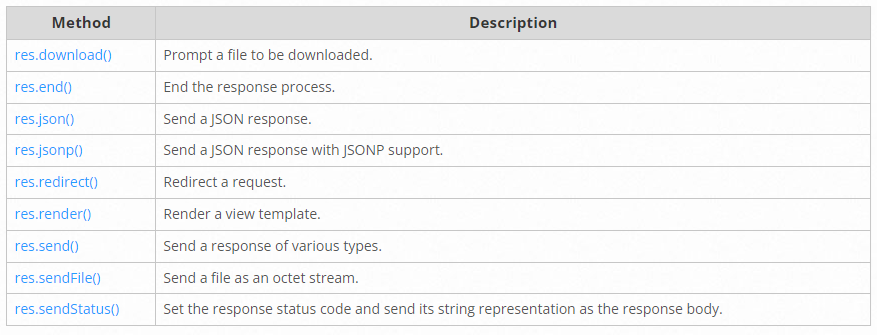
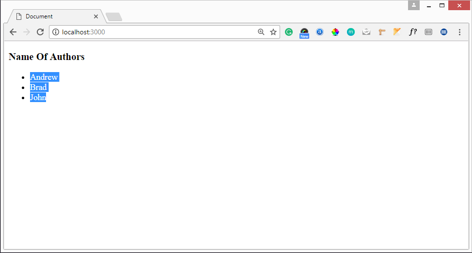
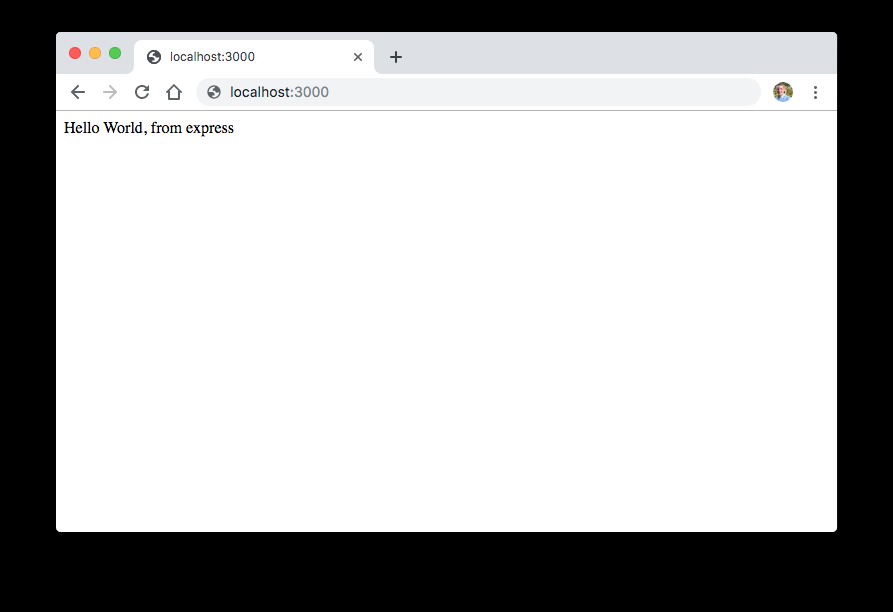
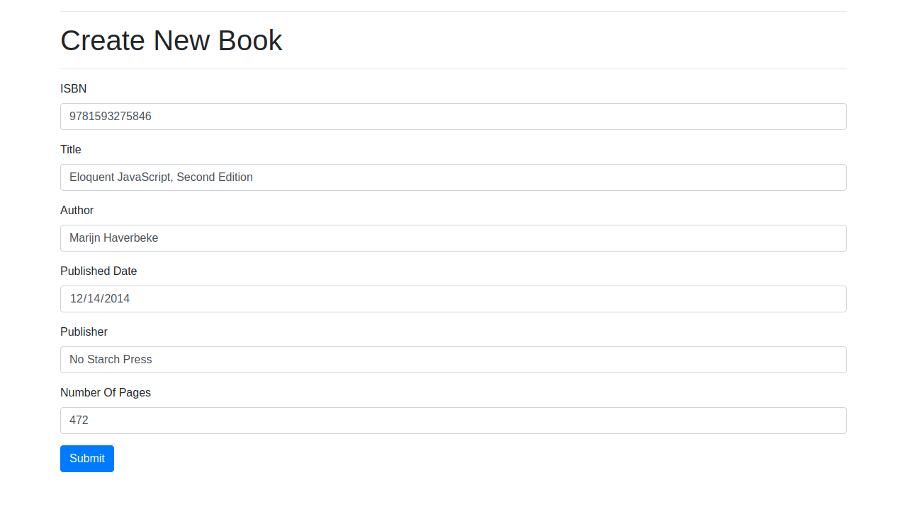

# Content from 2.Express JS-2.pdf

## Page 1

Express JS
MEAN/MERN STACK

### Images found on this page:

---

## Page 2

Learning Objectives:
►Routing
►static files
►Templating
►Restful API
►Authentication and Authorization with JWT token 
MEAN/MERN Stack
2

---

## Page 3

Introduction to Express JS
MEAN/MERN Stack
3
Routing:
●
Routing refers to determining how an application responds to a client request to a particular endpoint, which is a URI (or path) and a 
specific HTTP request method (GET, POST, and so on).
●
Each route can have one or more handler functions, which are executed when the route is matched.
●
Route definition takes the following structure:
app.METHOD(PATH, HANDLER)
●
Where:
▪
app is an instance of express.
▪
METHOD is an HTTP request method, in lowercase.
▪
PATH is a path on the server.
▪
HANDLER is the function executed when the route is matched.
●
It is assumed that an instance of express named app is created and the server is running
●
The following examples illustrate defining simple routes.
app.get('/', (req, res) => {
 res.send('Hello World!')
})
●
Respond to POST request on the root route (/), the application’s home page:
app.post('/', (req, res) => {
 res.send('Got a POST request')
})

---

## Page 4

Introduction to Express JS
MEAN/MERN Stack
4
●
Respond to a PUT request to the /user route:
app.put('/user', (req, res) => {
 res.send('Got a PUT request at /user')
})
●
Respond to a DELETE request to the /user route:
app.delete('/user', (req, res) => {
 res.send('Got a DELETE request at /user')
})
●
Routing refers to how an application’s endpoints (URIs) respond to client requests.
●
You define routing using methods of the Express app object that correspond to HTTP methods; for example, app.get() to handle GET 
requests and app.post to handle POST requests. For a full list, see app.METHOD.
●
You can also use app.all() to handle all HTTP methods and app.use() to specify middleware as the callback function.
●
These routing methods specify a callback function (sometimes called “handler functions”) called when the application receives a 
request to the specified route (endpoint) and HTTP method. In other words, the application “listens” for requests that match the 
specified route(s) and method(s), and when it detects a match, it calls the specified callback function.
●
In fact, the routing methods can have more than one callback function as arguments. With multiple callback functions, it is important 
to provide next as an argument to the callback function and then call next() within the body of the function to hand off control to the 
next callback.

---

## Page 5

Introduction to Express JS
MEAN/MERN Stack
5
app.all('/secret', (req, res, next) => {
 console.log('Accessing the secret section ...')
 next() // pass control to the next handler
})
Route paths
●
Route paths, in combination with a request method, define the endpoints at which requests can be made. Route paths 
can be strings, string patterns, or regular expressions.
●
The characters ?, +, *, and () are subsets of their regular expression counterparts. The hyphen (-) and the dot (.) are 
interpreted literally by string-based paths.
●
If you need to use the dollar character ($) in a path string, enclose it escaped within ([ and ]). For example, the path 
string for requests at “/data/$book”, would be “/data/([\$])book”.
●
Here are some examples of route paths based on strings. This route path will match requests to the root route, /.
app.get('/', (req, res) => {
 res.send('root')
})
●
This route path will match requests to /about.
app.get('/about', (req, res) => {
 res.send('about')
})

---

## Page 6

Introduction to Express JS
MEAN/MERN Stack
6
●
This route path will match requests to /random.text.
app.get('/random.text', (req, res) => {
 res.send('random.text')
})
●
Here are some examples of route paths based on string patterns.
●
This route path will match acd and abcd.
app.get('/ab?cd', (req, res) => {
 res.send('ab?cd')
})
●
This route path will match abcd, abbcd, abbbcd, and so on.
app.get('/ab+cd', (req, res) => {
 res.send('ab+cd')
})
●
This route path will match abcd, abxcd, abRANDOMcd, ab123cd, and so on.
app.get('/ab*cd', (req, res) => {
 res.send('ab*cd')
})

---

## Page 7

Introduction to Express JS
MEAN/MERN Stack
7
●
This route path will match /abe and /abcde.
app.get('/ab(cd)?e', (req, res) => {
 res.send('ab(cd)?e')
})
●
Examples of route paths based on regular expressions:
●
This route path will match anything with an “a” in it.
app.get(/a/, (req, res) => {
 res.send('/a/')
})
●
This route path will match butterfly and dragonfly, but not butterflyman, dragonflyman, and so on.
app.get(/.*fly$/, (req, res) => {
 res.send('/.*fly$/')
})
Route parameters
●
Route parameters are named URL segments that are used to capture the values specified at their position in the URL. The captured values are populated in 
the req.params object, with the name of the route parameter specified in the path as their respective keys.
Route path: /users/:userId/books/:bookId
Request URL: http://localhost:3000/users/34/books/8989
req.params: { "userId": "34", "bookId": "8989" }

---

## Page 8

Introduction to Express JS
MEAN/MERN Stack
8
●
To define routes with route parameters, simply specify the route parameters in the path of the route as shown below.
app.get('/users/:userId/books/:bookId', (req, res) => {
 res.send(req.params)
})
●
The name of route parameters must be made up of “word characters” ([A-Za-z0-9_]).
●
Since the hyphen (-) and the dot (.) are interpreted literally, they can be used along with route parameters for useful purposes.
Route path: /flights/:from-:to
Request URL: http://localhost:3000/flights/LAX-SFO
req.params: { "from": "LAX", "to": "SFO" }
Route path: /plantae/:genus.:species
Request URL: http://localhost:3000/plantae/Prunus.persica
req.params: { "genus": "Prunus", "species": "persica" }
●
To have more control over the exact string that can be matched by a route parameter, you can append a regular expression in parentheses (()):
Route path: /user/:userId(\d+)
Request URL: http://localhost:3000/user/42
req.params: {"userId": "42"}
●
Because the regular expression is usually part of a literal string, be sure to escape any \ characters with an additional backslash, for example \\d+.

---

## Page 9

Introduction to Express JS
MEAN/MERN Stack
9
Route handlers
●
You can provide multiple callback functions that behave like middleware to handle a request. The only exception is that these 
callbacks might invoke next('route') to bypass the remaining route callbacks. You can use this mechanism to impose pre-conditions 
on a route, then pass control to subsequent routes if there’s no reason to proceed with the current route.
●
Route handlers can be in the form of a function, an array of functions, or combinations of both, as shown in the following examples.
●
A single callback function can handle a route. For example:
app.get('/example/a', (req, res) => {
 res.send('Hello from A!')
})
●
More than one callback function can handle a route (make sure you specify the next object). For example:
app.get('/example/b', (req, res, next) => {
 console.log('the response will be sent by the next function ...')
 next()
}, (req, res) => {
 res.send('Hello from B!')
})
●
An array of callback functions can handle a route. For example:

---

## Page 10

Introduction to Express JS
MEAN/MERN Stack
10
const cb0 = function (req, res, next) {
 console.log('CB0')
 next()
}
const cb1 = function (req, res, next) {
 console.log('CB1')
 next()
}
const cb2 = function (req, res) {
 res.send('Hello from C!')
}
app.get('/example/c', [cb0, cb1, cb2])
●
A combination of independent functions and arrays of functions can handle a 
route. For example:
const cb0 = function (req, res, next) {
 console.log('CB0')
 next()
}
const cb1 = function (req, res, next) {
 console.log('CB1')
 next()
}
app.get('/example/d', [cb0, cb1], (req, res, next) => {
 console.log('the response will be sent by the next function ...')
 next()
}, (req, res) => {
 res.send('Hello from D!')
})

---

## Page 11

Introduction to Express JS
MEAN/MERN Stack
11
Response methods
●
The methods on the response object (res) in the following table can send a response to the client, and terminate the 
request-response cycle. If none of these methods are called from a route handler, the client request will be left 
hanging.

### Images found on this page:

---

## Page 12

Introduction to Express JS
MEAN/MERN Stack
12
app.route()
●
You can create chainable route handlers for a route path by using app.route(). Because the path is specified at a single location, 
creating modular routes is helpful, as is reducing redundancy and typos. 
●
Here is an example of chained route handlers that are defined by using app.route().
app.route('/book')
 .get((req, res) => {
  res.send('Get a random book')
 })
 .post((req, res) => {
  res.send('Add a book')
 })
 .put((req, res) => {
  res.send('Update the book')
 })

---

## Page 13

Introduction to Express JS
MEAN/MERN Stack
13
Templating
●
What is template engine?
●
The Template Engine is used to merge HTML page with the data from your program. The engine is simple and powerful.
●
At runtime, it replaces variables in a template file with actual values and transforms the template into an HTML file sent to the client.
Welcome <%= username %>
●
Here username is a variable.It will replace the username with the value received from the backend. Say username variable contains  “John”  value  then the 
output will be:-
Welcome John
●
here are number of template engines available some of them are given below:-
▪
EJS
▪
Jade(pug)
▪
Vash
▪
Mustache
▪
Dust.js
▪
Nunjucks
▪
Handlebars
▪
ATPL
▪
HAML
●
In this section, we are going to learn about EJS Template Engine. EJS Stands for Embedded JavaScript.

---

## Page 14

Introduction to Express JS
MEAN/MERN Stack
14
npm install --save ejs
●
Create a folder named  “Views”  in project’s root directory Because by default Express.js searches all the views(templates) in the 
views folder under the root folder. If you don’t want your folder to be named as views you can change name using views property in 
express.
●
eg : the name of your folder is myviews then in our main file in this case app.js we write  app.set(‘views’,./myviews); 
●
All the templates file are saved with template engine’s extension and in views folder. Here we are using EJS so all templates are 
saved with .ejs extension in views folder.
●
EJS files are simple to write because in this file we write simple HTML and write logic, backend variables between these tags:-
▪
<% %>(to write logics)
▪
<%= %>( when we want to display content use this)
▪
<%- %>
●
Here in this tutorial, we have two files one is main JS file i.e.  app.js  , which creates a server and one template file( display.ejs ).
●
In app.js first create a basic server like this:
var express = require("express"); //requiring express module
var app = express(); //creating express instance
app.get("/", function(req, res) {
 res.send("hello");
});
app.listen(3000, function() {
 console.log("Node server is running..");
});

---

## Page 15

Introduction to Express JS
MEAN/MERN Stack
15
●
Now to send templates to frontend, first we set the view engine as follows:-
app.set("view engine","ejs");
●
Add the following line to app.js
1.
After setting the view engine we create a simple display.ejs file in view folder with a simple ‘hello user’ message in it.
<!DOCTYPE html>
<html lang="en">
<head>
 <meta charset="UTF-8">
 <meta name="viewport" content="width=device-width, initial-scale=1.0">
 <meta http-equiv="X-UA-Compatible" content="ie=edge">
 <title>templates</title>
</head>
<body>
 
Hello <%= User =>

</body>
</html>
1.
Now to send the file to frontend we have a function called i.e.  res.render() , it renders a view and sends the rendered HTML string to 
the client. To render our file in previous code we replace res.send(“hello”); with  res.render(‘display’) ;

---

## Page 16

Introduction to Express JS
MEAN/MERN Stack
16
var express = require('express');
var app = express();
app.set("view engine","ejs")
app.get('/', function (req, res) {
//rendering our ejs template
res.render('demo');
});
var server = app.listen(3000, function () {
 console.log('Node server is running..');
});
1.
Run the following code as “node app.js” in terminal and press enter:-
c:\Express-project\project>node app.js
1.
The server is now started you can see the message in terminal
c:\Express-project\project>node app.js
Node server is running..
●
point your browser to http://localhost:3000 and you will see the message “Hello User”.

---

## Page 17

Introduction to Express JS
MEAN/MERN Stack
17
Sending variables to EJS and show on frontend
●
If we want to send data from backend and use it in EJS file we can do this in the following manner:-
●
Here instead of user in our display.ejs file I want to specify the name of the user. We can send data where we are 
rendering the file. Eg:- res.render(‘display’,{variable_name:’value’});
●
Say the username is ‘Rahul’ then our code will be:-
res.render('display',{user:'John'});
1.
And to display this on front end we write this user variable inside <%= %> like this:-

Hello <%= user%>

●
Now restart the server and run the code again and on refreshing the page you will see Hello Rahul instead of Hello 
User.
●
Sending Arrays or Objects(JSON data)
●
We can send any sort of data to the frontend. Suppose if I have a JSON data having an array named authors[] of 
author object having name and article, and I want to display it on frontend via a list, I can send an array to EJS and 
then loop through it and display the data.
●
For this follow the given example:-

---

## Page 18

Introduction to Express JS
MEAN/MERN Stack
18
app.set("view engine", "ejs");
var authors = [
{
 name: "Andrew",
 article: "node.js"
},
{
 name: "Brad",
 article: "express.js"
},
{
 name: "John",
 article: "mongoose"
}
];
app.get("/", function(req, res) {
res.render("display", { authors });
});
var server = app.listen(3000, function() {
console.log("Node server is running..");
});

---

## Page 19

Introduction to Express JS
MEAN/MERN Stack
19
●
Copy and paste this code in your app.js file here I have created an array named “authors” and I have rendered it with the ejs file. Note:- you can send the 
data by assigning it to a variable{values: data} or directly{data} in direct case you can access it with data and by assigning it you can access it with 
whatever variable you have assigned in given example by values.
●
Now to access the author array in EJS follow the below EJS code:-
<!DOCTYPE html>
<html lang="en">
<head>
 <meta charset="UTF-8">
 <meta name="viewport" content="width=device-width, initial-scale=1.0">
 <meta http-equiv="X-UA-Compatible" content="ie=edge">
 <title>Document</title>
</head>
<body>
 <h3>Name Of Authors</h3>
 <ul>
   <!-- looping through authors array -->
   <% authors.forEach(function(author){ %>
     <li>
       <%= author.name %>
     </li>
   <% }) %>
 </ul>
</body>
</html>

---

## Page 20

Introduction to Express JS
MEAN/MERN Stack
20
●
Here In the above EJS code, we have used a forEach loop to iterate through “authors” array and to access data of 
authors array one by one.
●
Save app.js and display.ejs with the following code and then run the code, now as you refresh the web 
page(http://localhost:3000) you will see the following output.

### Images found on this page:

---

## Page 21

Introduction to Express JS
MEAN/MERN Stack
21
REST API
●
REST APIs are an industry-standard way for web services to send and receive data. They use HTTP request methods to facilitate the 
request-response cycle and typically transfer data using JSON, and more rarely - HTML, XML and other formats.
●
For the sake of simplicity, we won't be using a database, so you don't need experience using one. We will use a simple JavaScript 
array to store our data instead.
●
What is a REST API?
●
REST (Representational State Transfer) is a standard architecture for building and communicating with web services. It typically 
mandates resources on the web are represented in a text format (like JSON, HTML, or XML) and can be accessed or modified by a 
predetermined set of operations. Given that we typically build REST APIs to leverage with HTTP instead of other protocols, these 
operations correspond to HTTP methods like GET, POST, or PUT.
●
On a collection of data, like books for example, there are a few actions we'll need to perform frequently, which boil down to - Create, 
Read, Update and Delete (also known as CRUD Functionality).
●
An API (Application Programming Interface), as the name suggests, is an interface that defines the interaction between different 
software components. Web APIs define what requests can be made to a component (for example, an endpoint to get a list of books), 
how to make them (for example, a GET request), and their expected responses.
●
For REST APIs, ExpressJS is one of the most popular HTTP server libraries for Node.js, which by default isn't as friendly for API 
development. Using Express, we simplify API development by abstracting away the boilerplate needed to set up a server, which 
makes development faster, more readable and simpler. You can spin up a prototype API in seconds and a couple of lines of code.
●
Although it's primary use was to simplify things with sensible defaults, it's highly customizable using functions called "middleware".
●
Even though we are only going to build a REST API in this guide, the ExpressJS framework is not limited to just that - hosting static 
files, performing server-side rendering, or even using it as a proxy server isn't uncommon and the sky's the limit with additional 
middleware.

---

## Page 22

Introduction to Express JS
MEAN/MERN Stack
22
HTTP Request Types
●
There are a few types of HTTP methods that we need to grasp before building a REST API. These are the methods 
that correspond to the CRUD tasks:
▪
POST: Used to submit data, typically used to create new entities or edit already existing entities.
▪
GET: Used to request data from the server, typically used to read data.
▪
PUT: Used to completely replace the resource with the submitted resource, typically used to update data.
▪
DELETE: Used to delete an entity from the server.
●
Let's create a simple app to store information about books. In this app, we will store information about the ISBN of 
the book, title, author, published date, publisher and number of pages.
●
Naturally, the basic functionality of the API will be CRUD functionality. We'll want to be able to send requests to it 
to create, read, update and delete Book entities. Of course, an API may do much more than this - provide users with 
an enpoint to get statistical data, summaries, call other APIs, etc.
●
To avoid making up book data - let's use a dataset from GitHub to get some sample details about books.
Setting Up the Project
●
First, let's initialize a new Node.js project:
$ npm init

---

## Page 23

Introduction to Express JS
MEAN/MERN Stack
24
●
Oftentimes, there's a start alias that masks one or more processes that should be run when we want to start an application. In the basic form - we just run 
the index page with node:
{
 "name": "app",
 "version": "1.0.0",
 "main": "index.js",
 "scripts": {
  "test": "echo \"Error: no test specified\" && exit 1",
  "start": "node index.js"
 },
 "author": "",
 "license": "ISC",
 "keywords": [],
 "description": ""
}
●
You can put any number of commands besides node index.js as the start script and when you run npm start - they'll all run:
$ test npm start  
> app@1.0.0 start /Users/XYZ/Desktop/app
> node index.js
●
Since we only have one command in the starting script, it's functionally equivalent to just calling $ node index.js in the command line to start the 
application.
●
Now that you're familiar with the project, let's install Express!

---

## Page 24

Introduction to Express JS
MEAN/MERN Stack
25
$ npm install --save express
●
A new file is created in the directory, alongside a node_modules directory. The package-lock.json file keeps track of your dependencies and contains their 
versions and names:
{
 "name": "app",
 "version": "1.0.0",
 "lockfileVersion": 1,
 "requires": true,
 "dependencies": {
  "accepts": {
   "version": "1.3.7",
   "resolved": "https://registry.npmjs.org/accepts/-/accepts-1.3.7.tgz",
   "integrity": "sha512-Il80Qs2WjYlJIBNzNkK6KYqlVMTbZLXgHx2oT0pU/fjRHyEp+PEfEPY0R3WCwAGVOtauxh1hOxNgIf5bv7dQpA==",
   "requires": {
    "mime-types": "~2.1.24",
    "negotiator": "0.6.2"
   }
  },
  ...

---

## Page 25

Introduction to Express JS
MEAN/MERN Stack
26
●
The node_modules directory actually hosts the code of the dependencies, and can get quite large very quickly. Just by installing Express, we've already got 
a hefty number of modules installed and tracked in the package-lock.json file.
●
These modules are, factually, small so it's not an issue by any means. By using the package-lock.json file, another client can know which dependencies to 
download and which versions to use to correctly be able to start up your application.
●
When doing version control with tools like Git - it's considered a good practice not to version the source code of the modules you use in the application. In 
practical terms - don't keep track or push node_modules to a repository. Others can download the dependencies based on the crucial package-lock.json 
which happens automatically when they run the application with npm.
Creating a Simple Endpoint
●
Now, let's start building a simple "Hello World" app. It'll have a single simple endpoint that just returns a message as a response to our request to get the 
home page.
●
First, let's create a file called hello-world.js. Then, let's import the Express framework within it:
const express = require('express');
●
Next, we'll want to instantiate the Express app:
const app = express();
●
And set our port:
const port = 3000;

---

## Page 26

Introduction to Express JS
MEAN/MERN Stack
27
●
The port will be used a bit later, when we tell the app to listen to requests. These three lines are boilerplate - but the 
great thing is, that's all the boilerplate there is!
●
Now, we can create a simple GET endpoint right beneath the boilerplate. When a user hits the endpoint with a GET 
request, the message "Hello World, from express" will be returned (and rendered in the browser or displayed on the 
console).
●
We'd like to set it to be on the home page, so the URL for the endpoint is /:
app.get('/', (req, res) => {
 res.send('Hello World, from express');
});
●
At this point, let's start our clients:
app.listen(port, () => console.log(`Hello world app listening on port ${port}!`))
●
Let's run the application and visit the only endpoint we have via our browser:
$ node hello-world.js
Hello world app listening on port 3000!

---

## Page 27

Introduction to Express JS
MEAN/MERN Stack
28

### Images found on this page:

---

## Page 28

Introduction to Express JS
MEAN/MERN Stack
29
●
This is technically a working API! Though, this endpoint doesn't really do much. Let's take a look at some common 
middleware that'll be useful for further work and create some more useful endpoints.
●
As mentioned above - ExpressJS is a simple HTTP server and it does not come with a lot of features out of the box. 
Middleware act almost like extensions for the Express server and provide additional functionalities in the "middle" 
of a request. Many third-party extensions like morgan for logging, multer for handling file uploads, are used 
routinely.
●
For now, to get started, we need to install a middleware called body-parser, which helps us decode the body from an 
HTTP request:
$ npm install --save body-parser
●
It parses the body of the request and lets us react to it accordingly.
●
Since we are calling the API from different locations by hitting endpoints in the browser. We also have to install the 
CORS middleware.
●
If you're not yet familiar with cross-origin resource sharing, it is okay for now. Let's just install the middleware and 
configure it:
$ npm install --save cors

---

## Page 29

Introduction to Express JS
MEAN/MERN Stack
30
Building a REST API with Node and Express
●
Adding Books
●
Now we can start building our app. Create a new file called book-api.js:
const express = require('express')
const bodyParser = require('body-parser');
const cors = require('cors');
const app = express();
const port = 3000;
// Where we will keep books
let books = [];
app.use(cors());
// Configuring body parser middleware
app.use(bodyParser.urlencoded({ extended: false }));
app.use(bodyParser.json());
app.post('/book', (req, res) => {
  // We will be coding here
});
app.listen(port, () => console.log(`Hello world app listening on port ${port}!`));

---

## Page 30

Introduction to Express JS
MEAN/MERN Stack
31
●
As you can see, we can configure body-parser by importing it and passing it to the app.use method, which enables it 
as middleware to the Express app instance.
●
We will be using the books array to store our collection of books, simulating a database.
●
There are a few types of HTTP request body types. For an example, application/x-www-form-urlencoded is the 
default body type for forms, whereas application/json is something we'd use when requesting a resource using 
jQuery or backend REST client.
●
What the body-parser middleware will be doing is grabbing the HTTP body, decoding the information, and 
appending it to the req.body. From there, we can easily retrieve the information from the form - in our case, a book's 
information.
●
Inside the app.post method let's add the book to the book array:
app.post('/book', (req, res) => {
 const book = req.body;
 // Output the book to the console for debugging
 console.log(book);
 books.push(book);
 res.send('Book is added to the database');
});

---

## Page 31

Introduction to Express JS
MEAN/MERN Stack
32
●
Now, let's create a simple HTML form with the fields: ISBN, title, author, published date, publisher, and number of pages in a new 
file, say new-book.html.
●
We'll be sending the data to the API using this HTML form's action attribute:

  

  <h1>Create New Book</h1>
  

  <form action="http://localhost:3000/book" method="POST">
    

      <label for="ISBN">ISBN</label>
      <input class="form-control" name="isbn">
    

    

      <label for="Title">Title</label>
      <input class="form-control" name="title">
    

    <!--Other fields-->
    <button type="submit" class="btn btn-primary">Submit</button>
  </form>

---

## Page 32

Introduction to Express JS
MEAN/MERN Stack
33
●
Here, our <form> tag's attribute corresponds to our endpoint and the information we send with the submit button is the information our method parses and 
adds to the array. Note that the method parameter is POST, just like in our API.
●
You should see something like that when you open the page:

### Images found on this page:

---

## Page 33

Introduction to Express JS
MEAN/MERN Stack
34
●
Clicking "Submit", we're greeted with the our applications console.log(book) statement:
{ isbn: '9781593275846',
 title: 'Eloquent JavaScript, Second Edition',
 author: 'Marijn Haverbeke',
 publish_date: '2014-12-14',
 publisher: 'No Starch Press',
 numOfPages: '472' }
●
Please note that since we are using an array to store data we will lose them in our next app restart.

---

## Page 34

Introduction to Express JS
MEAN/MERN Stack
35
●
Clicking "Submit", we're greeted with the our applications console.log(book) statement:
{ isbn: '9781593275846',
 title: 'Eloquent JavaScript, Second Edition',
 author: 'Marijn Haverbeke',
 publish_date: '2014-12-14',
 publisher: 'No Starch Press',
 numOfPages: '472' }
●
Please note that since we are using an array to store data we will lose them in our next app restart.
Getting All Books
●
Now let's create an endpoint to get all the books from the API:
app.get('/books', (req, res) => {
 res.json(books);
});
●
Restart the server. If the server is already running press Ctrl + C to stop it first. Add some books and open http://localhost:3000/books 
in your browser. You should see a JSON response with all the books that you've added.
●
Now let's create an HTML page to display these books in a user-friendly way.
●
This time around, we'll create two files - book-list.html which we'll use as a template and a book-list.js file which will hold the logic 
to updating/deleting books and displaying them on the page:
●
Let's start off with the template:

---

## Page 35

Introduction to Express JS
MEAN/MERN Stack
36

  

  <h1>List of books</h1>
  

  

    

    

  

  

    

      

        <h5 class="modal-title">Edit Book</h5>
        <button type="button" class="close" data-
dismiss="modal" aria-label="Close">
          &times;
        </button>
      

      

        <form id="editForm" method="POST">
          

            <label for="ISBN">ISBN</label>
            <input class="form-control" name="isbn" 
id="isbn">

          

            <label for="Title">Title</label>
            <input class="form-control" name="title" 
id="title">
          

          <!--Other fields-->
          <button type="submit" class="btn btn-
primary">Submit</button>
        </form>
      

    

  

<!--Our JS file-->

---

## Page 36

Introduction to Express JS
MEAN/MERN Stack
37
●
With the template done, we can implement the actual logic to retrieve all 
books using browser-side JavaScript and our REST API:
const setEditModal = (isbn) => {
 // We will implement this later
}
const deleteBook = (isbn) => {
 // We will implement this later
}
const loadBooks = () => {
 const xhttp = new XMLHttpRequest();
 xhttp.open("GET", "http://localhost:3000/books", false);
 xhttp.send();
 const books = JSON.parse(xhttp.responseText);
 for (let book of books) {
   const x = `
     

       

         

           <h5 class="card-title">${book.title}</h5>
           <h6 class="card-subtitle mb-2 text-
muted">${book.isbn}</h6>
           

Author: ${book.author}

           
Publisher: ${book.publisher}

           
Number Of Pages: ${book.numOfPages}

           

           <button type="button" class="btn btn-
danger">Delete</button>
           <button types="button" class="btn btn-primary" 
data-toggle="modal"
             data-target="#editBookModal" 
onClick="setEditModal(${book.isbn})">
             Edit
           </button>
         

       

     

   `
   document.getElementById('books').innerHTML = 
document.getElementById('books').innerHTML + x;
 }
}
loadBooks()

---

## Page 37

Introduction to Express JS
MEAN/MERN Stack
38
●
In the above script, we are sending a GET request to the endpoint http://localhost:3000/books to retrieve the books and then creating a Bootstrap card for 
every book to display it. If everything is working correctly you should see something like this on your page:
●
You probably noticed the Edit and Create buttons and their respective methods. For now, let's leave them empty and implement them as we go.

### Images found on this page:

---

## Page 38

Introduction to Express JS
MEAN/MERN Stack
39
Retrieving a Book by ISBN
●
If we'd like to display a specific book to the user, we'll need a way to retrieve it from the database (or the array, in our case). This is always done by a key 
specific to that entity. In most cases, each entity has a unique id that helps us identify them.
●
In our case, each book has an ISBN which is unique by nature, so there's no need for another id value.
●
This is typically done by parsing the URL parameter for an id and searching for the book with the corresponding id.
●
For an example, if the ISBN is 9781593275846 the URL would look like, http://localhost:3000/book/9781593275846:
app.get('/book/:isbn', (req, res) => {
 // Reading isbn from the URL
 const isbn = req.params.isbn;
});
●
Here, we're introduced to parametrized URLs. Since the ISBN depends on the book, there's potentially an infinite number of endpoints here. By adding a 
colon (:) to the path, we can define a variable, mapped to the variable isbn. So, if a user visits localhost:3000/book/5 the isbn parameter will be 5.
●
You can accept more than one parameter in your URL if it makes sense in your scenario. For example /image/:width/:height, and then you can get those 
parameters using req.params.width and req.params.height.
●
Now, using our endpoint, we can retrieve a single book:
app.get('/book/:isbn', (req, res) => {
 // Reading isbn from the URL
 const isbn = req.params.isbn;
 // Searching books for the isbn
 for (let book of books) {
   if (book.isbn === isbn) {
     res.json(book);
     return;
   }
 }
 // Sending 404 when not found something is a good practice
 res.status(404).send('Book not found');
});

---

## Page 39

Introduction to Express JS
MEAN/MERN Stack
40
●
Again restart the server, add a new book, and open localhost/3000/{your_isbn} and the application will return the book's information.
Deleting Books
●
When deleting entities, we typically delete them one by one to avoid big accidental data loss. To delete items, we use the HTTP 
DELETE method and specify a book using its ISBN number, just like how we retrieved it:
app.delete('/book/:isbn', (req, res) => {
 // Reading isbn from the URL
 const isbn = req.params.isbn;
 // Remove item from the books array
 books = books.filter(i => {
   if (i.isbn !== isbn) {
     return true;
   }
   return false;
 });
 res.send('Book is deleted');
});
●
We are using the app.delete method to accept DELETE requests. We have also used the array filter method to filter out the book with 
the relevant ISBN to remove it from the array.
●
Now let's implement the deleteBook method in the book-list.js file:

---

## Page 40

Introduction to Express JS
MEAN/MERN Stack
41
const deleteBook = (isbn) => {
 const xhttp = new XMLHttpRequest();
 xhttp.open("DELETE", `http://localhost:3000/book/${isbn}`, false);
 xhttp.send();
 // Reloading the page
 location.reload();
}
●
In this method, we are sending the delete request when the button is pressed and reloading the page to display the changes.
Editing Books
●
Very similar to deleting entities, updating them requires us to snatch a specific one, based on the ISBN and then send either a POST or PUT HTTP call 
with the new information.
●
Let's go back to our book-api.js file:
app.post('/book/:isbn', (req, res) => {
 // Reading isbn from the URL
 const isbn = req.params.isbn;
 const newBook = req.body;
 // Remove item from the books array
 for (let i = 0; i < books.length; i++) {
   let book = books[i]
   if (book.isbn === isbn) {
     books[i] = newBook;
   }
 }
 res.send('Book is edited');
});

---

## Page 41

Introduction to Express JS
MEAN/MERN Stack
42
●
Upon sending a POST request, aimed at a specific ISBN, the adequate book is updated with new information.
●
Since we have already created the edit modal, we can use the setEditModal method to gather information about the book when "Edit" 
button is clicked.
●
We will also set the form's action parameter with the clicked book's URL to send the request:
●
To verify if the update function works, edit a book. The form should be filled with the existing information about the book. Change 
something and click "Submit" after which you should see a "Book is edited" message
const setEditModal = (isbn) => {
 // Get information about the book using isbn
 const xhttp = new XMLHttpRequest();
 xhttp.open("GET", `http://localhost:3000/book/${isbn}`, 
false);
 xhttp.send();
 const book = JSON.parse(xhttp.responseText);
 const {
   title,
   author,
   publisher,
   publish_date,
   numOfPages
 } = book;
// Filling information about the book in the form inside the 
modal
 document.getElementById('isbn').value = isbn;
 document.getElementById('title').value = title;
 document.getElementById('author').value = author;
 document.getElementById('publisher').value = publisher;
 document.getElementById('publish_date').value = publish_date;
 document.getElementById('numOfPages').value = numOfPages;
 // Setting up the action url for the book
 document.getElementById('editForm').action = 
`http://localhost:3000/book/${isbn}`;
}

---

## Page 42

Questions ?
MEAN/MERN Stack
43

### Images found on this page:

---
