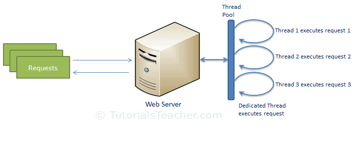
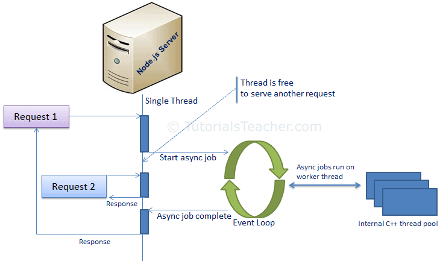
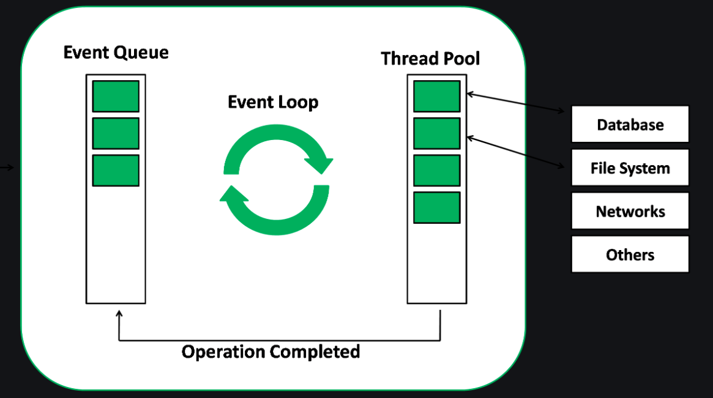

# Content from 1.Introduction to Node.pdf

## Page 1

Introduction 
to Node.js

Introduction to Nodejs

*(Extracted via OCR)*

### Images:

---

## Page 2

Learning 
Objectives:
2
MEAN/MERN Stack
Introduction to Node.js? 
Advantages of Node.js
Installing Node.js
Setting up Development Environment
Working with NPM
Web server model 
Node.js Process model

### Images:

---

## Page 3

Introduction to Node
/
3
Introduction/Why/Advantages of Node.js:
●
Node.js is a very powerful JavaScript-based platform built on Google Chrome's JavaScript V8 Engine.
●
It is used to develop I/O intensive web applications like video streaming sites, single-page applications, and other 
web applications.
●
Node.js is open source, completely free, and used by thousands of developers around the world.
●
As an asynchronous event-driven JavaScript runtime, Node.js is designed to build scalable network applications.
●
Node has a lot in common with other popular web servers, like Microsoft’s Internet Information Services (IIS) or 
Apache.
●
Another major difference between Node and more traditional web servers is that Node is single threaded.
●
At first blush, this may seem like a step backward. As it turns out, it is a stroke of genius. Single threading vastly 
simplifies the business of writing web apps, and if you need the performance of a multithreaded app, you can simply 
spin up more instances of Node, and you will effectively have the performance benefits of multi‐ threading.
●
Another compelling benefit of Node apps is that Node is incredibly platform independent
●
It’s the software that enables JavaScript to run on the server, uncoupled from a browser, which in turn allows 
frameworks written in JavaScript (like Express) to be used
●
Node.js has been regarded as a full-stack JavaScript for serving both the client and the server-side applications.
●
Therefore, the advantage is that you don’t have to hire separate developers for backend as well as the front-end 
development. It saves both your valuable money and time.

### Images:

---

## Page 4

4
Introduction to Node
Introduction/Why/Advantages of Node.js:
●
Node.js is blessed to have a large and active community of developers who keep on 
continuously contributing towards its further development and improvement.
●
In fact, the groups of developers are well supported by the JavaScript programmers providing 
ready-made and easy solutions and codes in GitHub.
●
The open-source runtime environment of the Node.js also provides the facility of caching 
single modules. Whenever there is any request for the first module, it gets cached in the 
application memory.
●
Similarly, if you want to identify and install the project dependencies, you can make use of 
npm, a powerful package manager. You can use grunt for task running of the project
●
Node.js = Runtime Environment + JavaScript Library

### Images:

---

## Page 5

Introduction to Node
/
5
Installing Node.js:
●
Getting Node installed on your system couldn’t be easier. The Node team has gone to great lengths to make sure the installation 
process is simple and straightforward on all major platforms.
●
The installation is so simple, as a matter of fact, that it can be summed up in three simple steps:
●
Go to the Node download page https://nodejs.org/en/download/.
●
For Windows and OS X, an installer will be downloaded that walks you through the process. For Linux, you will probably be up and 
running more quickly if you use a package manager.
●
You can also download a standalone installer, which can be helpful if you are distributing Node to your organization.
●
If you have trouble building Node, or for some reason you would like to build Node from scratch, please refer to the official 
installation instructions.
NVM:
●
The best way to install Node.js and npm is through Node.js Version Manager, or nvm.
●
With nvm, you can install multiple versions of both the Node.js runtime and npm, and they can all coexist, though you can only 
specify one active version of either at a time.
●
What I mean is, you don't have to uninstall one version of Node.js or npm to install another, just tell nvm which one you want to use.
●
It's great for compatibility testing and managing your Node.js environment in general.
●
For Windows users: nvm is officially supported only on MacOS and Linux, but there are 2 alternatives.
●
nvm-windows: https://github.com/coreybutler/nvm-windows
●
nodist: https://github.com/nullivex/nodist

### Images:

---

## Page 6

Introduction to Node
/
6
●
Installing nvm is a snap. Go to the creationix GitHub repo and scroll down to the Installation section (or go to the nvm GitHub page. 
Copy the install command and paste it into a Terminal window or command prompt:
curl -o- https://raw.githubusercontent.com/creationix/nvm/v0.39.0/install.sh | bash
●
Verify that nvm installed correctly by running the nvm --version command. You should see output like this:
●
To install Node.js and npm, run the nvm install --lts command, which tells nvm to install the LTS version
●
Once Node.js and npm are installed, verify that they are installed correctly:
node -v
npm -v
●
You should see output like this:
$ node -v
v10.4.0
$ npm -v
6.1.0

### Images:

---

## Page 7

Introduction to Node
/
7
Installing VS Code:
●
VS Code free, open source, and has an active user community with lots of extensions, which means you're likely to find lots of different extensions for 
your favorite language, platform, or file format.
●
Plus, VS Code is built on the Electron framework, which uses Node.js under the hood.
●
If you're running on Windows, the file is an installer. Instructions for installing it are on the VS Code Setup for Windows page.
●
If you're running Linux, you can find setup instructions VS Code Setup for Linux page.
●
VS Code plugs into the Node.js runtime, so you can run your code from within VS Code. Follow these steps:
●
Navigate to the directory where you cloned the code.
NPM:
●
One of the major factors of Node's success is npm - its popular package manager, which allows JavaScript developers to share useful 
packages like lodash and moment quickly and easily.
●
NPM – or "Node Package Manager" – is the default package manager for JavaScript's runtime Node.js.
●
NPM consists of two main parts:
●
a CLI (command-line interface) tool for publishing and downloading packages.
●
an online repository that hosts JavaScript packages.
●
package.json:
●
Every project in JavaScript – whether it's Node.js or a browser application – can be scoped as an npm package with its own package information and its 
package.json job to describe the project.
●
package.json will be generated when npm init is run to initialise a JavaScript/Node.js project, with these basic metadata provided by developers:
●
name: the name of your JavaScript library/project
●
version: the version of your project. Often times, for application development, this field is often neglected as there's no apparent need for versioning 
opensource libraies. But still, it can come handy as a source of the deployment's version.
●
description: the project's description
●
license: the project's license

### Images:

---

## Page 8

Introduction to Node
/
8
●
npm scripts:
●
package.json also supports a scripts property that can be defined to run command-line tools that are installed in the project's local context.
●
For example, the scripts portion of an npm project can look something like this:
{
    "scripts": {
      "build": "tsc",
      "format": "prettier --write **/*.ts",
      "format-check": "prettier --check **/*.ts",
      "lint": "eslint src/**/*.ts",
      "pack": "ncc build",
      "test": "jest",
      "all": "npm run build && npm run format && npm run lint && npm run pack && npm test"
    }
  }
●
with eslint, prettier, ncc, jest not necessarily installed as global executables but rather as local to your project inside node_modules/.bin/.
●
The recent introduction of npx allows us to run these node_modules project-scoped commands just like a globally installed program by prefixing npx ... 
(i.e. npx prettier --write **/*.ts). 
●
dependencies vs devDependencies:
●
These two come in form of key-value objects with npm libraries' names as the key and their semantic-formatted versions as the value. This is an example 
from Github's TypeScript Action template.

### Images:

---

## Page 9

Introduction to Node
/
9
{
    "dependencies": {
      "@actions/core": "^1.2.3",
      "@actions/github": "^2.1.1"
    },
    "devDependencies": {
      "@types/jest": "^25.1.4",
      "@types/node": "^13.9.0",
      "@typescript-eslint/parser": "^2.22.0",
      "@zeit/ncc": "^0.21.1",
      "eslint": "^6.8.0",
      "eslint-plugin-github": "^3.4.1",
      "eslint-plugin-jest": "^23.8.2",
      "jest": "^25.1.0",
      "jest-circus": "^25.1.0",
      "js-yaml": "^3.13.1",
      "prettier": "^1.19.1",
      "ts-jest": "^25.2.1",
      "typescript": "^3.8.3"
    }
  }

### Images:

---

## Page 10

Introduction to Node
/
10
●
These dependencies are installed via the npm install command with --save and --save-dev flags.
●
They're meant to be used for production and development/test environments respectively.
●
package-lock.json:
●
This file describes the exact versions of the dependencies used in an npm JavaScript project.
●
If package.json is a generic descriptive label, package-lock.json is an ingredient table.
●
And just like how we don't usually read the ingredient table of a product (unless you are too bored or need to know), package-
lock.json is not meant to be read line-by-line by developers (unless we're desperate to resolve "works in my machine" issues).
●
package-lock.json is usually generated by the npm install command, and is also read by our NPM CLI tool to ensure reproduction of 
build environments for the project with npm ci.
●
npm install:
●
By default, npm install <package-name> will install the latest version of a package with the ^ version sign.
●
An npm install within the context of an npm project will download packages into the project's node_modules folder according to 
package.json specifications, upgrading the package version (and in turn regenerating package-lock.json) wherever it can based on ^ 
and ~ version matching.
●
You can specify a global flag -g if you want to install a package in the global context which you can use anywhere across your 
machine (this is common for command-line tooling packages like live-server).
●
npm has made installing JavaScript packages so easy that this command is often used incorrectly. This is where the --production flag 
comes to the rescue.
●
This --production flag is how the differences in node_modules are made.
●
By attaching this flag to the npm install command, we will only install packages from dependencies, thus drastically reducing the 
size of our node_modules to whatever is absolutely necessary for our applications to be up and running.

### Images:

---

## Page 11

Introduction to Node
/
11
●
npm ci:
●
Just like how if package-lock.json doesn't already exist in the project it's generated whenever npm install is called, npm ci consumes 
this file to download the exact version of each individual package that the project depends on.
●
This is how we can make sure that the our project's context stays exactly the same across different machines, whether it's our laptops 
used for development or CI (Continuous Integration) build environments like Github Actions.
●
npm audit
●
With the humongous number of packages that have been published and can easily be installed, npm packages are susceptible to bad 
authors with malicious intentions.
●
Realising that there was an issue in the ecosystem, the npm.js organisation came up with the idea of npm audit.
●
They maintain a list of security loopholes that developers can audit their dependencies against using the npm audit command.
●
If the remediations are available in the next non-breaking version upgrades, npm audit fix can be used to upgrade the affected

### Images:

---

## Page 12

Introduction to Node
/
12
Node.js Model:
●
In the traditional web server model, each request is handled by a dedicated thread from the thread pool.
●
If no thread is available in the thread pool at any point of time then the request waits till the next available thread.
●
Dedicated thread executes a particular request and does not return to thread pool until it completes the execution and returns a 
response.

### Images:

---

## Page 13

13

13 Thread Pool Thread 1 executes request 1 Thread 2 executes request 2 Requests Thread 3 executes request 3 Web Server Dedicated Thread TutorialsTeacher com executes request

*(Extracted via OCR)*

### Images:

---

## Page 14

Introduction to Node
/
14
●
Node.js processes user requests differently when compared to a traditional web 
server model.
●
Node.js runs in a single process and the application code runs in a single thread 
and thereby needs less resources than other platforms.
●
All the user requests to your web application will be handled by a single thread 
and all the I/O work or long running job is performed asynchronously for a 
particular request.
●
So, this single thread doesn't have to wait for the request to complete and is free 
to handle the next request. When asynchronous I/O work completes then it 
processes the request further and sends the response.
●
An event loop is constantly watching for the events to be raised for an 
asynchronous job and executing callback function when the job completes.
●
Internally, Node.js uses libev for the event loop which in turn uses internal C++ 
thread pool to provide asynchronous I/O.
●
The following figure illustrates asynchronous web server model using Node.js.
●
Node.js process model increases the performance and scalability with a few 
caveats.
●
Node.js is not fit for an application which performs CPU-intensive operations 
like image processing or other heavy computation work because it takes time to 
process a request and thereby blocks the single thread.

### Images:

---

## Page 15

15

15 2 Threadis free to serve anotherrequest Single Thread Request 1 Atoria steachercom Start asyncjob Asyncjobsrun on workerthread Request 2 Response Async job complete Event Loop InternalC++ thread pool Response Server _ Node_

*(Extracted via OCR)*

### Images:

---

## Page 16

Node.js Fundamentals
MEAN/MERN STACK

Node js Fundamentals MEAN/MERN STACK

*(Extracted via OCR)*

---

## Page 17

Learning Objectives:
►Using Node.js Console Module
►Understanding Event Loop in Node.js
►What is callback? Why it is used?
►How we use Global Objects
►How utility objects are used and how are they helpful? 
MEAN/MERN STACK
17

---

## Page 18

Introduction to Node
MEAN/MERN STACK
18
Node.js Console:
●
Node.js provides a console module which provides tons of very useful ways to interact with the command line.
●
Node.js console module is a global object that provides a simple debugging console similar to JavaScript to display different levels of message.
●
It is basically the same as the console object you find in the browser.
●
It is provided by web browsers. The console module contains two components:
●
Console class: The console class methods are console.log(), console.error() and console.warn() to display Node.js stream.
●
global console: It is used without calling require(‘console’).
●
The most basic and most used method is console.log(), which prints the string you pass to it to the console.
const x = 'x';
const y = 'y';
console.log(x, y);
●
This is one example of global console. 
// It will display 'This is the first object example' to stdout
console.log('This is the first object example');
  
// It will display 'This is the second object example' to stdout
console.log('This is the %s example', 'second object');
  
// It will display 'Error: New Error has happened' to stderr
console.error(new Error('New Error has happened'));
  
const obj = 'third object';
  
// It will display 'This is the third object example' to stderr
console.warn(`This is the ${obj} example`);

---

## Page 19

Introduction to Node
MEAN/MERN STACK
19
●
If you observe above code, we are trying to write a messages to node.js stream by using global console object methods such as console.log(), 
console.error() and console.warn().
●
Here, we are accessing global console object without importing it using require directive.
●
Now, we will execute example_console_object.js file, for that open a command prompt (cmd) and navigate to the folder that contains this code in a file and 
write the command with node filename.js.
●
Now, we will execute example_console_object.js file, for that open a command prompt (cmd) and navigate to the folder that contains a 
example_console_object.js file and write the command node example_console_object.js and hit enter button like as shown below.
●
console.count(): It is used to count the number of times a specific label has been called.
const x = 1
const y = 2
const z = 3
console.count(
  'The value of x is ' + x + 
  ' and has been checked .. how many times?'
)
console.count(
  'The value of x is ' + x + 
  ' and has been checked .. how many times?'
)
console.count(
  'The value of y is ' + y + 
  ' and has been checked .. how many times?'
)

---

## Page 20

Introduction to Node
MEAN/MERN STACK
20
●
console.clear(): It is used to clear the console history.
●
console.info(): It is used to write a messages on console and it is an alias of console.log() method.
●
console.time(): It is used to get the starting time of an action.
const doSomething = () => console.log('test');
const measureDoingSomething = () => {
  console.time('doSomething()');
  // do something, and measure the time it takes
  doSomething();
  console.timeEnd('doSomething()');
};
measureDoingSomething();
●
console.timeEnd(): It is used to get the end time of specific action.
●
console.dir(): It use util.inspect() on object and prints the resulting string to stdout.
●
console.trace(): It is used to print the call stack trace of a function, maybe to answer the question how did you reach that part of the code?
const function2 = () => console.trace();
const function1 = () => function2();
function1();

---

## Page 21

Introduction to Node
MEAN/MERN STACK
21
Node.js Console:
●
Node.js is a single-threaded event-driven platform that is capable of running non-blocking, asynchronously 
programming.
●
The event loop allows Node.js to perform non-blocking I/O operations despite the fact that JavaScript is single-
threaded.
●
Most operating systems are multi-threaded and hence can handle multiple operations executing in the background.
●
When one of these operations is completed, the kernel tells Node.js and the respective callback assigned to that 
operation is added to the event queue which will eventually be executed.
●
Features of Event Loop:
●
Event loop is an endless loop, which waits for tasks, executes them and then sleeps until it receives more tasks.
●
The event loop executes tasks from the event queue only when the call stack is empty i.e. there is no ongoing task.
●
The event loop allows us to use callbacks and promises.
●
The event loop executes the tasks starting from the oldest first.
console.log("This is the first statement");
   
setTimeout(function(){
    console.log("This is the second statement");
}, 1000);
   
console.log("This is the third statement");

---

## Page 22

Introduction to Node
MEAN/MERN STACK
22
Output
●
In the above example, the first console log statement is pushed to the call stack and “This is the first statement” is logged on the console and the task is popped from the 
stack.
●
Next, the setTimeout is pushed to the queue and the task is sent to the Operating system and the timer is set for the task. This task is then popped from the stack.
●
Next, the third console log statement is pushed to the call stack and “This is the third statement” is logged on the console and the task is popped from the stack.
●
When the timer set by setTimeout function (in this case 1000 ms) runs out, the callback is sent to the event queue.
●
The event loop on finding the call stack empty takes the task at the top of the event queue and sends it to the call stack.
●
The callback function for setTimeout function runs the instruction and “This is the second statement” is logged on the console and the task is popped from the stack.
●
When Node.js starts, it initializes the event loop, processes the provided input script which may make async API calls, schedule timers, then begins processing the event 
loop.
●
In the previous example, the initial input script consisted of console.log() statements and a setTimeout() function which schedules a timer.
●
When using Node.js, a special library module called libuv is used to perform async operations.
●
This library is also used, together with the back logic of Node, to manage a special thread pool called the libuv thread pool.This thread pool is composed of four threads 
used to delegate operations that are too heavy for the event loop. I/O operations, Opening and closing connections, setTimeouts are the example of such operations.

### Images:

---

## Page 23

Introduction to Node
MEAN/MERN STACK
23
●
When the thread pool completes a task, a callback function is called which handles the error(if any) or does some 
other operation.
●
 This callback function is sent to the event queue. When the call stack is empty, the event goes through the event 
queue and sends the callback to the call stack
●
The following diagram is a proper representation of the event loop in a Node.js server:
●
The following diagram shows a simplified overview of the event loop order of operations:

### Images:

---

## Page 24

Introduction to Node
MEAN/MERN STACK
24
Callback Concept:
●
A callback is the equivalent of an asynchronous function.
●
Asynchronous functions are also known as non-blocking functions since they do not block the thread on which they are running on.
●
Node.js relies heavily on asynchronous functions.
●
This is because servers often receive many requests at a time; if the server was to be synchronous, requests would be processed one at a time which would 
lead to a bad user experience since the user might have to wait for a long time.
function processData () {
  var data = fetchData ();
  data += 1;
  return data;
}
●
This works just fine and is very typical in other development environments. However, if fetchData takes a long time to load the data (maybe it is streaming 
it off the drive or the internet), then this causes the whole program to 'block' - otherwise known as sitting still and waiting - until it loads the data.
●
Node.js, being an asynchronous platform, doesn't wait around for things like file I/O to finish - Node.js uses callbacks. A callback is a function called at the 
completion of a given task; this prevents any blocking, and allows other code to be run in the meantime.
●
The Node.js way to deal with the above would look a bit more like this:
function processData (callback) {
  fetchData(function (err, data) {
    if (err) {
      console.log("An error has occurred. Abort everything!");
      return callback(err);
    }
    data += 1;
    callback(data);
  });
}

---

## Page 25

Introduction to Node
MEAN/MERN STACK
25
●
At first glance, it may look unnecessarily complicated, but callbacks are the foundation of Node.js. Callbacks give you an interface with which to say, "and 
when you're done doing that, do all this." This allows you to have as many IO operations as your OS can handle happening at the same time.
●
For example, in a web server with hundreds or thousands of pending requests with multiple blocking queries, performing the blocking queries 
asynchronously gives you the ability to be able to continue working and not just sit still and wait until the blocking operations come back. This is a major 
improvement.
●
The typical convention with asynchronous functions (which almost all of your functions should be):
function asyncOperation ( a, b, c, callback ) {
  // ... lots of hard work ...
  if ( /* an error occurs */ ) {
    return callback(new Error("An error has occurred"));
  }
  // ... more work ...
  callback(null, d, e, f);
}
asyncOperation ( params.., function ( err, returnValues.. ) {
  //This code gets run after the async operation gets run
});
●
You will almost always want to follow the error callback convention, since most Node.js users will expect your project to follow them.
●
The general idea is that the callback is the last parameter. The callback gets called after the function is done with all of its operations. Traditionally, the first 
parameter of the callback is the error value. If the function hits an error, then they typically call the callback with the first parameter being an Error object.
●
If it cleanly exits, then they will call the callback with the first parameter being null and the rest being the return value(s).

---

## Page 26

Introduction to Node
MEAN/MERN STACK
26
Global Objects:
●
Node.js Global Objects are the objects that are available in all modules. We do not need to include these objects in our application, rather we can use them 
directly.
●
Global Objects are built-in objects that are part of the JavaScript and can be used directly in the application without importing any particular module.
●
The following variables may appear to be global but are not. They exist only in the scope of modules,
●
__dirname
●
__filename
●
exports
●
module
●
require()
●
Console is also part of Global objects but we have discussed in detail above.
●
You should also discuss buffer, timer, process. 
Utility Module:
●
There are various utility modules available in node.js module library. The modules are extremely useful in developing node based web applications.
●
Various utility modules present in node.js are as follows:
●
OS Module: Operating System based utility modules for node.js are provided by OS module.
var os = require("os"); 
  
// Display operating System type
 console.log('Operating System type : ' + os.type()); 
  
 // Display operating System platform
 console.log('platform : ' + os.platform()); 
  
 // Display total memory
 console.log('total memory : ' + os.totalmem() + " bytes."); 
  
 // Display available memory 
console.log('Available memory : ' + os.freemem() + " bytes.");

---

## Page 27

Introduction to Node
MEAN/MERN STACK
27
●
Path Module: Path module in node.js is used for transforming and handling various file paths.
var path = require('path');
  
// Display Resolve
console.log('resolve:' + path.resolve('paths.js')); 
  
// Display Extension
console.log('extension:' + path.extname('paths.js'));
●
DNS Module: DNS Module enables us to use the underlying Operating System name resolution functionalities. The actual DNS lookup is also performed 
by the DNS Module. This DNS Module provides an asynchronous network wrapper. The DNS Module can be imported using the below syntax.
// Require dns module
const dns = require('dns'); 
  
// Store the web address
const website = 'www.geeksforgeeks.org';
  
// Call lookup function of DNS
dns.lookup(website, (err, address, family) => { 
    console.log('Address of %s is %j family: IPv%s',
            website, address, family); 
});

---

## Page 28

Introduction to Node
MEAN/MERN STACK
28
●
Net Module: Net Module in node.js is used for the creation of both client and server. Similar to DNS Module this module also provides an asynchronous 
network wrapper.
const net = require('net');
const server = net.createServer((socket) => {
  console.log('New client connected');
  // Handle incoming data from the client
  socket.on('data', (data) => {    console.log(`Received data: ${data}`);  });
  // Handle client disconnect
  socket.on('end', () => {    console.log('Client disconnected');  });
});
// Start the server listening on port 3000
server.listen(3000, () => {  console.log('Server listening on port 3000');});
●
Domain Module: Domain module in node.js is used to intercept unhandled errors. The interception can be performed by either:
●
Internal Binding: Error emitter executes the code internally within the run method of a domain.
●
External Binding: Error emitter is added explicitly to the domain using the add method.
●
The domain class in the domain module provides a mechanism of routing the unhandled exceptions and errors to the active domain object. It is considered 
to be the child class of EventEmitter.

---

## Page 29

Questions ?
MEAN/MERN Stack
29

MEAN/MERN Stack Questions ? 29

*(Extracted via OCR)*

### Images:

---
