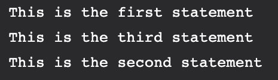

# Chapter: Node.js - Server-Side JavaScript Runtime

Node.js is a powerful JavaScript platform built on Chrome's V8 engine. It allows developers to use JavaScript to write server-side code, enabling "Full-stack JavaScript" development.

---

## 1. Core Principles
- **Asynchronous & Event-Driven**: All APIs of Node.js library are asynchronous (non-blocking). A Node-based server never waits for an API to return data.
- **Single-Threaded**: Node.js uses a single-threaded model with event looping. This makes it highly scalable for I/O intensive apps, though it's not ideal for CPU-intensive tasks.
- **Platform Independent**: Runs on Windows, Linux, and macOS.

---

## 2. The Node.js Event Loop
- **libuv**: A library that Node.js uses to perform asynchronous I/O and manage a thread pool.
- **Call Stack**: Where the code being executed lives.
- **Event Queue**: When an async task (like a timer or file read) completes, its callback is sent to this queue.
- **Event Loop**: Monitors the call stack and event queue. If the stack is empty, it pushes the first task from the queue to the stack for execution.

---

## 3. Node Package Manager (NPM)
NPM is the default package manager for Node.js.
- **`package.json`**: Holds metadata about the project and its dependencies.
- **`package-lock.json`**: Records the exact version of every installed dependency to ensure consistent builds across environments.
- **Commands**:
  - `npm init`: Initialize a new project.
  - `npm install <pkg>`: Install a package and add it to `dependencies`.
  - `npm ci`: A cleaner, faster install for automated environments (CI/CD).
  - `npm audit`: Checks for security vulnerabilities in dependencies.

---

## 4. Global Objects and Modules
- **`__dirname`**: Directory name of the current script.
- **`__filename`**: File name of the current script.
- **`process`**: Provides information about, and control over, the current Node.js process.
- **`console`**: Used for printing to stdout and stderr.

---

## 5. Built-in Utility Modules
1. **OS**: Provides information about the operating system (e.g., `os.type()`, `os.totalmem()`).
2. **Path**: Helps handle and transform file paths (e.g., `path.resolve()`, `path.extname()`).
3. **DNS**: Used for name resolution (e.g., `dns.lookup()`).
4. **Net**: Used to create TCP servers and clients.

---

## 6. Callback Pattern
Node.js follows an **"Error-First Callback"** convention:
```javascript
function myAsyncFunc(param, callback) {
  // perform some async work...
  if (error) {
    return callback(new Error("Failed"), null);
  }
  callback(null, result);
}
```

---

## Visual Aids from Slides
*(Refer to extracted images for Event Loop diagrams and NPM flow)*



